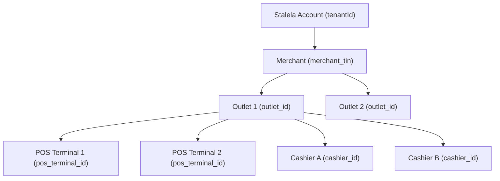

# Multi-Tenant Model

Both pillars of the Stalela Platform enforce strict tenant isolation. This page explains how identity scoping works across the Payments Nucleus and Fiscal Platform, and how the two map together.

---

## Identity Hierarchy

---

## Mapping Across Pillars

| Payments Nucleus | Fiscal Platform | Notes |
|---|---|---|
| `tenantId` | `merchant_tin` | 1:1 binding created during merchant onboarding |
| *(not scoped)* | `outlet_id` | Payments Nucleus operates at tenant level; fiscal numbering needs outlet-level scoping |
| *(not scoped)* | `pos_terminal_id` | CTS doesn't need terminal-level identity; fiscal audit trails do |
| *(not scoped)* | `cashier_id` | Same — fiscal only |
| `endUserRef` | `fiscal_number` | Cross-reference link: a transfer can carry the fiscal number of the invoice it settles |

---

## How the Binding Works

When a merchant signs up for the Stalela Platform:

1. **Account creation** → a `tenantId` is minted in the Payments Nucleus and a `merchant_tin` is registered in the Fiscal Platform.
2. **Outlet registration** → each physical location gets an `outlet_id` in the Fiscal Platform. The Payments Nucleus doesn't require outlet-level scoping, but the `outlet_id` can be passed as `metadata` on transfers for reconciliation.
3. **API keys** → each API key is scoped to both a `tenantId` (Payments) and a `merchant_tin` + `outlet_id` (Fiscal). A single Bearer token authenticates to both pillars.

---

## Request Headers

| Header | Payments Nucleus | Fiscal Platform |
|---|---|---|
| `Authorization: Bearer <token>` | Required | Required |
| `X-Stalela-Tenant-ID` | Required | *(derived from token)* |
| `X-Stalela-Merchant-ID` | *(optional, metadata)* | Required |
| `X-Stalela-Outlet-ID` | *(optional, metadata)* | Required |
| `X-Stalela-User-ID` | *(optional, audit trail)* | *(optional, audit trail)* |
| `X-Stalela-Source` | *(optional: dashboard, sdk, pos)* | *(optional: dashboard, api, sdk, pos)* |

---

## Data Isolation Guarantees

- **Payments Nucleus**: All CTS queries, GL Ledger postings, reconciliation matches, and compliance screenings are filtered by `tenantId`. No cross-tenant data leakage.
- **Fiscal Platform**: All fiscal numbers, ledger entries, reports, and tax authority sync bundles are scoped to `merchant_tin` + `outlet_id`. The Monotonic Counter Manager enforces per-outlet serialization.
- **Cross-pillar**: The `endUserRef` on a transfer may reference a `fiscal_number` from the Fiscal Platform, but the CTS treats it as opaque metadata — it never queries the Fiscal Ledger directly.
