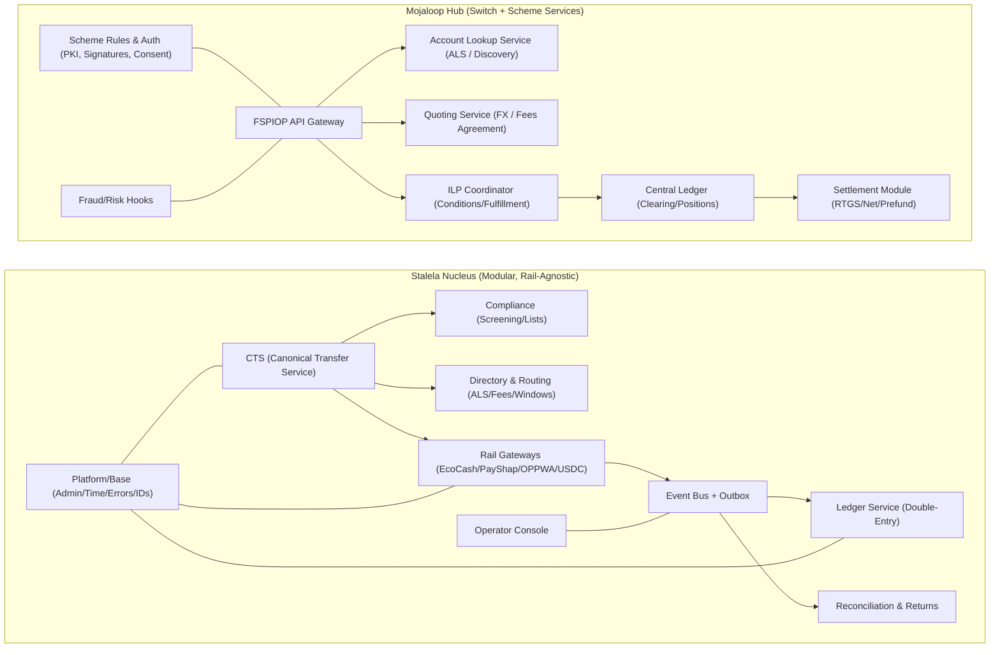
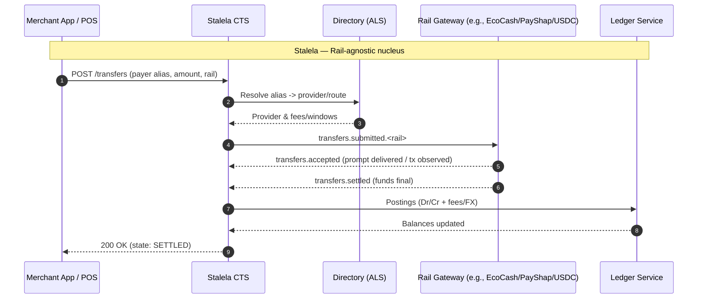
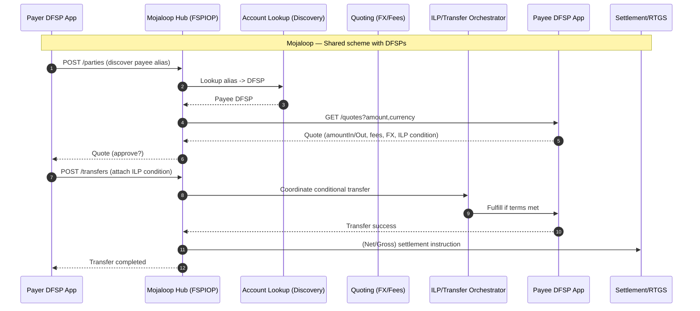

# Stalela Nucleus vs Mojaloop Hub - Visual Contrast

This note shows how **Stalela** is *inspired by* Mojaloop while keeping a **modular, rail-agnostic nucleus**. Two diagrams:
1) Component landscape comparison
2) Transaction flow (Request-to-Pay) mapped to each architecture

---

## 1) Component Landscape

**Key differences**  
- **Stalela** separates **rail adapters** (gateways) from the core; ledger is **internal SoT**.  
- **Mojaloop** is a **shared switch**: it offers discovery, quoting, clearing & settlement to **external DFSPs**.  
- Both use **directories (ALS)**, **FX/fees agreement**, **security (PKI)**, and **fraud hooks** — but Stalela keeps them inside its nucleus; Mojaloop exposes them as scheme services.

---

## 2) Request-to-Pay (R2P) Flow — Side-by-Side

**Interpretation**  
- **Stalela** treats R2P as an internal orchestration; **gateways** perform the last-mile prompt/observe/settle.  
- **Mojaloop** formalizes **Discovery -> Quote -> Transfer** across **multiple DFSPs**, with **ILP** ensuring atomicity and a separate **settlement layer**.

---

## When to use which ideas

- Use **Stalela’s modular gateways** when you must integrate diverse rails (EcoCash, PayShap, OPPWA, USDC) *and* keep a single internal ledger of record.  
- Use **Mojaloop patterns** (FSPIOP, ILP, ISO 20022 mapping, scheme rules) to standardize cross-institution flows and future-proof for **regional interop**.

---

*Draft v1 — for internal architecture review.*
