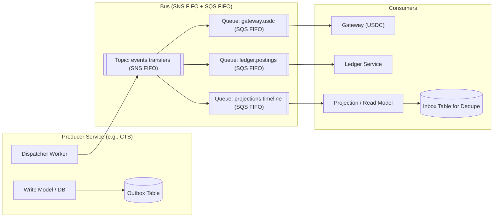
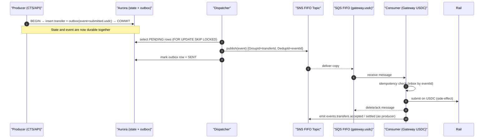
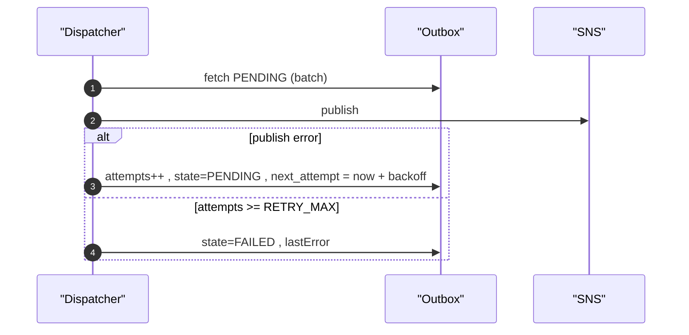
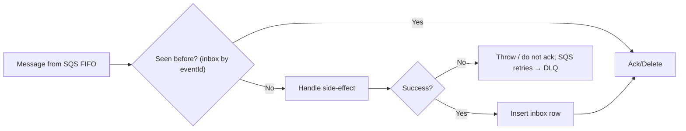

# Event Bus & Outbox — How It Works (Exactly)

> Target stack: **Aurora PostgreSQL + RDS Proxy + SNS FIFO + SQS FIFO** (Option A)

## The contract

* **Exactly-once at the producer boundary** via a **transactional outbox** (state **and** event row committed together).
* **At-least-once across the bus**: consumers must be **idempotent** and **dedupe** (`eventId`, optionally domain keys).

---

## Components & Roles



---

## Happy Path Sequence



**Arrow semantics**

* **Solid** arrows = synchronous calls (DB, publish, ack).
* **Events** flow via SNS/SQS FIFO; ordering per transfer enforced with `MessageGroupId = transferId`.

---

## Data Shapes

### Event envelope

```json
{
  "envelope": {
    "v": 1,
    "eventId": "uuid",
    "occurredAt": "2025-08-26T10:15:01Z",
    "tenantId": "tnt_123",
    "traceparent": "00-...",
    "type": "events.transfers.submitted.usdc"
  },
  "key": { "transferId": "tr_123" },
  "payload": {
    "amount": {"value":"100.00","currency":"USD"},
    "payer": {"type":"WALLET","id":"payer-abc"},
    "payee": {"type":"WALLET","id":"0x..."}
  }
}
```

**Bus mapping:** `MessageGroupId = key.transferId`, `MessageDeduplicationId = envelope.eventId`.

### Outbox table (producer DB)

| id   | eventType                         | payload (JSONB)          | state               | attempts | lastError | next\_attempt | createdAt | updatedAt |
| ---- | --------------------------------- | ------------------------ | ------------------- | -------- | --------- | ------------- | --------- | --------- |
| uuid | `events.transfers.submitted.usdc` | `{envelope,key,payload}` | PENDING/SENT/FAILED | int      | text      | ts            | ts        | ts        |

### Inbox table (consumer DB) — optional

| eventId (PK) | processedAt |
| ------------ | ----------- |
| uuid         | ts          |

---

## Failure & Retry Semantics

### Producer/Dispatcher



### Consumer



---

## Exactly-once boundary & responsibilities

* **Producer**: guarantees each event is **published once or fails visible** (SENT/FAILED). No duplicates marked SENT.
* **Bus**: may deliver duplicates or retries (at-least-once).
* **Consumer**: must be idempotent; dedupe via **inbox table** (or idempotent upsert by domain key).

---

## How other components use it

1. **CTS → Gateway(USDC)**: Gateway subscribes to `gateway.usdc` queue, dedupes, submits to AVAX, then emits `accepted/settled`.
2. **Gateway → CTS**: CTS inbound consumer updates transfer state and timeline.
3. **CTS → Ledger**: Ledger subscribes; posts journal entries idempotently by `(transferId,type)`.
4. **CTS → Projections**: updates read models for dashboards/webhooks.
5. **Directory → CTS**: publishes `directory.route.updated`; CTS invalidates route cache.

---

## Operational defaults (adopt now)

* **Dispatcher**: batch=50, concurrency=10; backoff: `1s,5s,30s,2m,10m,1h`; RETRY\_MAX=10.
* **SQS visibility timeout**: ≥ 2× handler p99.
* **Alarms**: `event_outbox_backlog`, `event_publish_lag_seconds`, `dead_letter_count`, `event_consumer_lag_seconds`.

---

## Wire Test (local/cloud sanity checks)

### 1) SQL — Outbox schema & seed

```sql
CREATE TABLE IF NOT EXISTS outbox (
  id uuid PRIMARY KEY,
  eventType text NOT NULL,
  payload jsonb NOT NULL,
  state text NOT NULL DEFAULT 'PENDING',
  attempts int NOT NULL DEFAULT 0,
  lastError text,
  next_attempt timestamptz NOT NULL DEFAULT now(),
  createdAt timestamptz NOT NULL DEFAULT now(),
  updatedAt timestamptz NOT NULL DEFAULT now()
);

-- Insert a fake submitted.usdc event
INSERT INTO outbox (id, eventType, payload)
VALUES (
  gen_random_uuid(),
  'events.transfers.submitted.usdc',
  jsonb_build_object(
    'envelope', jsonb_build_object('v',1,'eventId', gen_random_uuid()::text, 'occurredAt', now(), 'tenantId','tnt_demo','type','events.transfers.submitted.usdc'),
    'key', jsonb_build_object('transferId','tr_test_123'),
    'payload', jsonb_build_object('amount', jsonb_build_object('value','10.00','currency','USD'))
  )
);
```

### 2) AWS CLI — Bus quick setup (example)

```bash
# Create SNS FIFO topic
aws sns create-topic --name events.transfers.fifo --attributes FifoTopic=true,ContentBasedDeduplication=false

# Create SQS FIFO queue for gateway
aws sqs create-queue --queue-name gateway.usdc.fifo \
  --attributes FifoQueue=true,ContentBasedDeduplication=false,VisibilityTimeout=60

# Subscribe queue to topic
aws sns subscribe --topic-arn <SNS_ARN> --protocol sqs --notification-endpoint <SQS_ARN>

# Allow SNS to publish to SQS (set queue policy accordingly)
```

### 3) Dispatcher mock (Python)

```python
import os, json, time, uuid, psycopg2, boto3

SNS_ARN = os.environ['SNS_ARN']
conn = psycopg2.connect(os.environ['PG_DSN'])
sns = boto3.client('sns', region_name=os.environ.get('AWS_REGION','us-east-1'))

BACKOFF = [1,5,30,120,600,3600]

while True:
    with conn, conn.cursor() as cur:
        cur.execute("""
          SELECT id, payload\n          FROM outbox\n          WHERE state='PENDING' AND next_attempt <= now()\n          ORDER BY createdAt\n          FOR UPDATE SKIP LOCKED\n          LIMIT 50
        """)
        rows = cur.fetchall()
        for oid, payload in rows:
            env = payload['envelope']
            key = payload['key']
            try:
                sns.publish(
                  TopicArn=SNS_ARN,
                  Message=json.dumps(payload),
                  MessageGroupId=key['transferId'],
                  MessageDeduplicationId=env['eventId']
                )
                cur.execute("UPDATE outbox SET state='SENT', attempts=attempts+1, updatedAt=now() WHERE id=%s", (oid,))
            except Exception as e:
                cur.execute("""
                  UPDATE outbox
                     SET attempts=attempts+1,
                         lastError=%s,
                         next_attempt=now() + make_interval(secs => %s),
                         updatedAt=now(),
                         state = CASE WHEN attempts >= 10 THEN 'FAILED' ELSE 'PENDING' END
                   WHERE id=%s
                """, (str(e), BACKOFF[min(len(BACKOFF)-1, 0)], oid))
    time.sleep(1)
```

### 4) Consumer mock (Python)

```python
import os, json, boto3, datetime

sqs = boto3.client('sqs', region_name=os.environ.get('AWS_REGION','us-east-1'))
QUEUE_URL = os.environ['QUEUE_URL']

while True:
    resp = sqs.receive_message(QueueUrl=QUEUE_URL, MaxNumberOfMessages=1, WaitTimeSeconds=10)
    for m in resp.get('Messages', []):
        body = json.loads(m['Body'])
        payload = json.loads(body.get('Message', '{}'))
        evt = payload.get('envelope', {})
        print('Got event', evt.get('type'), evt.get('eventId'), datetime.datetime.utcnow().isoformat())
        # TODO: dedupe check by eventId in inbox table
        sqs.delete_message(QueueUrl=QUEUE_URL, ReceiptHandle=m['ReceiptHandle'])
```

> These mocks are for wiring/visibility; production code should use a proper worker framework, metrics, and inbox dedupe.

---

## Runbooks (condensed)

* **Outbox backlog rising** → check dispatcher logs; SNS/SQS publish errors; scale workers; review DLQ.
* **Consumer lag rising** → scale consumers; increase visibility timeout; profile handler.
* **Duplicate effects** → ensure inbox/dedupe; verify `MessageGroupId`/`DeduplicationId` mapping.
* **FAILED outbox rows** → fix cause; re-drive by `eventId` using admin tool.

---

## Security & PII

* Events contain IDs, not PII. Outbox payloads are encrypted at rest.
* IAM: producer can publish to the topic; consumers can read only their queues.
