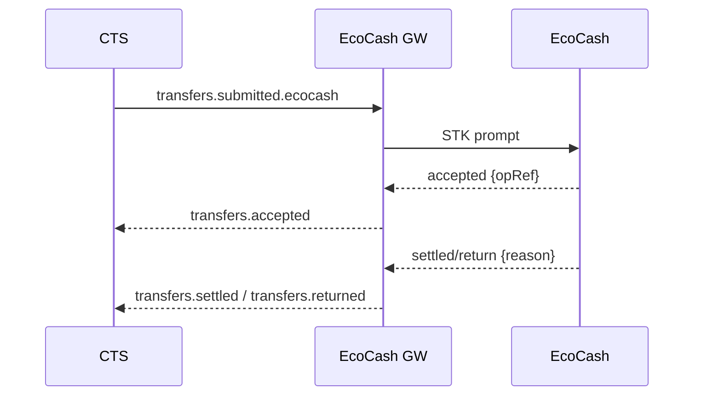

# Rail Gateway — EcoCash (Mobile Money, ZW)

**Purpose**  
Adapt canonical transfers to EcoCash mobile money flows (STK/USSD prompts), handle callbacks/statement ingest, and emit domain events.

## Responsibilities
- Subscribe to `transfers.submitted.ecocash` (PUSH primary).
- Trigger STK/USSD prompt, poll status, handle async callbacks.
- Map reason/return codes; emit `accepted/settled/returned/failed`.
- Persist artifacts (redacted) for audit/recon.

## Interfaces
### Inputs
- Events: `transfers.submitted.ecocash`
- HTTP: `POST /webhooks/ecocash` (signature verify)

### Outputs
- Events (envelope `v=1`): `transfers.accepted`, `transfers.settled`, `transfers.returned`, `transfers.failed`

## Data Model
- `ecocash_ops` (transferId, msisdn, amountMinor, currency, opRef, status, reasonCode?)
- `outbox_gateway`, blobs for requests/responses

## Algorithms / Rules
- STK prompt initiation; timeout & retry windows.
- Idempotency: `{tenantId}:{transferId}` as partner reference.
- Strict MSISDN validation and currency allowlist.

## Diagrams

## Failure Modes & Retries
- Prompt not delivered → retry/backoff, operator alert after N.
- Decline/timeout → `failed`/`returned` with mapped reason.

## Observability
- Metrics: prompt latency/success, returns rate.

## Security
- Webhook signature verification; PII redaction.

## Runbooks
- Replay webhook; quarantine poison messages; contact MNO if outage persists.

---

> See also: [Rail Gateway — Template](./rail-gateway-template.md) and Reason Code mappings in [../20-specs/error-codes.md](../20-specs/error-codes.md)
