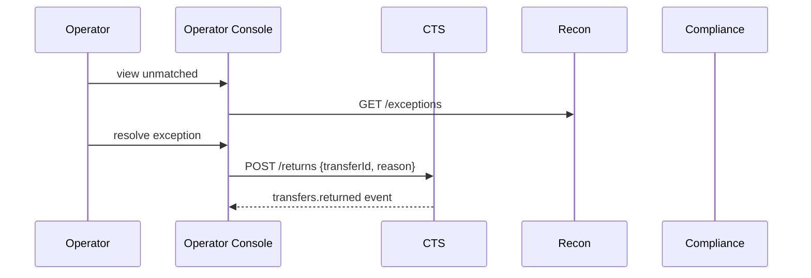

# Operator Console

The **Operator Console** is the human-facing interface for resolving exceptions, monitoring transfers, and acting on compliance/reconciliation workflows.

---

## 🎯 Purpose
- Provide operators with clear visibility into transfer timelines.  
- Enable manual intervention for returns, unmatched items, compliance flags.  
- Reduce need for engineers to access production systems.  

---

## 🛠 Responsibilities
- Display transfer timelines (events, postings).  
- Show queues: returns, reconciliation exceptions, compliance hits.  
- Allow manual resolution: assign unmatched, trigger return, freeze/unfreeze entity.  
- Surface system health and metrics dashboards.  

---

## 🔌 Interfaces
- Web UI (internal only, authenticated via SSO).  
- Reads from CTS, Ledger, Compliance, Recon.  
- Writes via APIs only (never direct DB):  
  - `POST /returns`  
  - `POST /entity/freeze`  
  - `POST /entity/unfreeze`  

---

## 📐 Sequence

---

## 🌍 Localization (i18n)
- Supported languages: English (en), Afrikaans (af), Zulu (zu), Xhosa (xh), Sotho (st), Tswana (tn).  
- Strategy: externalized message catalog with keys; locale switch per user.  
- PII: ensure translations do not expose sensitive data; placeholders only.  

---

## 🚨 Failure Modes
- **Stale data** → refresh from APIs, not cached snapshots.  
- **Unauthorized access** → enforce SSO + RBAC.  
- **Operator error** → require 4-eyes approval for destructive actions (returns, freezes).  

---

## 📊 Observability
- Audit log of every operator action (immutable).  
- Metrics: queue sizes, resolution times.  
- Alerts: backlog > SLA.

---

## 🔐 Security
- SSO + role-based access (OPS, COMPLIANCE, ADMIN).  
- Audit trail mandatory.  
- PII redacted where not necessary.  

---

## 🧭 Runbooks
- **Recon backlog** → assign extra operators.  
- **False compliance flag** → unfreeze with reason, record override.  
- **Frequent operator overrides** → escalate rule/threshold tuning.

---
