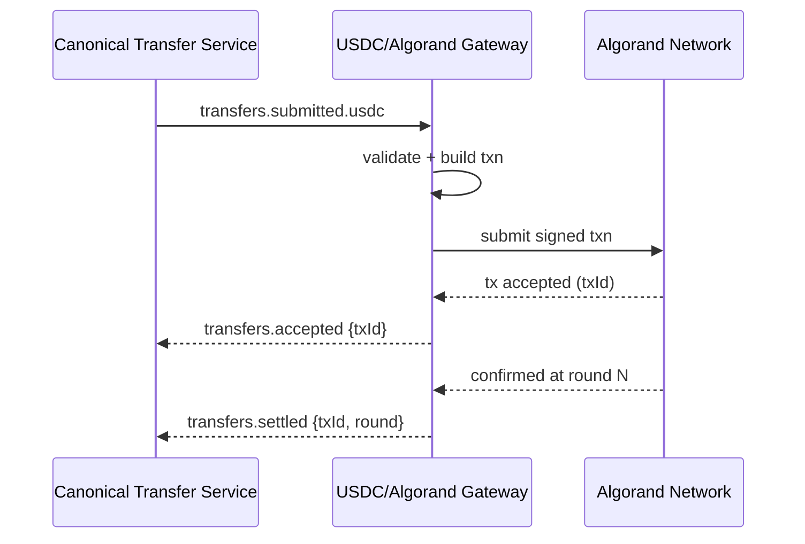

# Rail Gateway — USDC on Algorand

The **USDC/Algorand Gateway** adapts Stalela’s canonical transfers to on-chain USDC movements on the Algorand network. It validates requests, constructs transactions, submits to the network (via Algod/Indexer/provider), listens for confirmations, and emits domain events.

---

## 🎯 Purpose
- Translate canonical transfers into **Algorand transactions** (ASA transfers).
- Provide **strict validation** (asset, amounts, addresses, fees).
- Handle **submission and confirmation** with retries and reorg safety.
- Emit **transfers.accepted / transfers.settled / transfers.failed** as reality unfolds.
- Persist **raw tx metadata** for audit and reconciliation.

---

## 🛠 Responsibilities
- Subscribe to `transfers.submitted.usdc` events.
- Validate: payer/payee accounts, ASA ID (USDC), decimals, amount, memo fields, network params.
- Construct and sign transactions (online hot wallet or external signer/HSM).
- Submit to network; poll or subscribe for confirmations (N blocks).
- Emit outcome events and persist artifacts (txid, round, fees).
- Surface health (`/live`, `/ready`), metrics, version via Platform/Base.

---

## 🔌 Interfaces

### Events (consume)
- `transfers.submitted.usdc`
  - payload: `{ transferId, tenantId, amount{value,currency}, payer, payee, intent: "PUSH"|"PULL"|"CAPTURE"|"AUTH", metadata{} }`

### Events (emit; envelope `v=1`)
- `transfers.accepted` → `{ transferId, rail:"usdc-algo", txId, suggestedRound }`
- `transfers.settled` → `{ transferId, rail:"usdc-algo", txId, confirmedRound, feeMicroAlgos }`
- `transfers.failed` → `{ transferId, rail:"usdc-algo", reason, details }`

### HTTP (admin)
- `GET /live`, `GET /ready`, `GET /metrics`, `GET /version`

---

## 🗄 Data Model
- **table: `usdc_algo_tx`**
  - `id` (pk), `transferId`, `tenantId`
  - `txId`, `firstValid`, `lastValid`, `confirmedRound`
  - `payerAddr`, `payeeAddr`, `amountBaseUnits` (int)
  - `feeMicroAlgos`, `note` (base64), `network` (mainnet/testnet)
  - `status` (PENDING|CONFIRMED|FAILED), `error` (nullable)
  - `createdAt`, `updatedAt`
- **table: `outbox_gateway`** – standard outbox for event publishing

Raw payloads (signed txn, provider receipts) should be stored encrypted in blob storage with references here.

---

## 🔁 Transform & Validation

- **Currency** must be `USD` with **USDC ASA** mapped to `assetId` (config).
- **Decimals**: Convert from canonical decimal to base units (10^decimals).
- **Addresses**: Bech32/base32 Algorand addresses; ensure payer has opted-in to ASA.
- **Fees**: Enforce min fee; allow overpay for fast confirm (config).
- **Auth/Capture**: On-chain AUTH is simulated via **escrow account** or **timelocked** pattern (optional, roadmap). Default intent is **PUSH**.
- **Memo/Note**: Encode limited metadata in `note` (<= 1 KB best practice). Do **not** put PII in chain notes.

---

## 📐 Sequence (Happy Path)

---

## 🚨 Failure Modes
- **Invalid account / not opted-in** → `transfers.failed{reason:"NOT_OPTED_IN"}`
- **Insufficient balance / fee** → `...{"INSUFFICIENT_FUNDS"}`
- **RPC/provider timeout** → retry with backoff; surface `accepted` only after tx is seen
- **Chain reorg / orphan** (rare on Algorand) → re-check finality window, re-emit `failed` if dropped
- **Signer/HSM unavailable** → circuit break, keep events in DLQ

---

## 📊 Observability
- Metrics: submit latency, confirmation latency, success rate, DLQ size, provider error codes
- Logs: txId, transferId, address short-hash, round; **no PII**
- Traces: propagate `x-request-id` / `trace-id` from CTS

---

## 🔐 Security
- Keys in HSM or isolated signer; never log material
- Principle of least privilege on provider API keys
- Encrypt raw signed txn artifacts at rest
- Feature flag to disable on-chain `note`

---

## ⚙️ Config
- `ALGOD_URL`, `ALGOD_TOKEN`, `INDEXER_URL`
- `USDC_ASSET_ID`, `DECIMALS`
- `CONFIRMATIONS` (blocks), `SUBMIT_RETRY_MAX`
- `SIGNER_ENDPOINT` (optional), `NETWORK`

---

## 🧭 Runbooks
- **Stuck in PENDING**: check provider status; if mempool full, rebroadcast; verify fee
- **Frequent INSUFFICIENT_FUNDS**: inspect payer funding policy; enable preflight balance check
- **High confirmation latency**: increase fee or confirmation window temporarily
- **Signer down**: fail closed; drain DLQ after recovery

---

> See also: [Rail Gateway — Template](./rail-gateway-template.md) and Reason Code mappings in [../specs/error-codes.md](../specs/error-codes.md)
