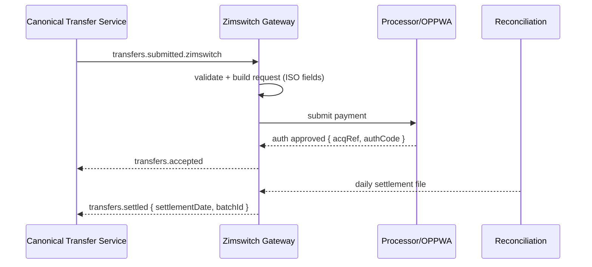

# Rail Gateway — Zimswitch (Card / ISO 8583 via OPPWA)

The **Zimswitch Gateway** adapts Stalela canonical transfers to Zimswitch-connected acquiring via OPPWA/ISO 8583 semantics. It validates messages, transforms to processor requests, handles callbacks/settlement files, and emits domain events.

> Note: Some Zimswitch integrations front with OPPWA JSON APIs while the underlying network uses **ISO 8583**. We model both: primary REST submission with strict **ISO field discipline** in validation and mapping.

---

## 🎯 Purpose
- Translate canonical transfers to **Zimswitch/OPPWA** requests with ISO-grade validation.
- Support **card-present** (tap-on-phone, online) and **card-not-present** (tokenized) flows where permitted.
- Handle **accept/settle/return** lifecycle + reconciliation with daily settlement files.
- Emit domain events with mapped reason codes and retain artifacts for audit.

---

## 🛠 Responsibilities
- Subscribe to `transfers.submitted.zimswitch`.
- Validate BIN/member routing via **Directory & Routing**.
- Construct request: amount, currency (ZWL/ZAR/USD), merchant data, token/PAN surrogate, terminal capabilities.
- Submit to processor; handle synchronous result and **async callbacks**.
- Ingest **settlement files** (daily) for reconciliation and late returns.
- Emit `accepted/settled/returned/failed` and store payloads (redacted).

---

## 🔌 Interfaces

### Events (consume)
- `transfers.submitted.zimswitch`
  - `{ transferId, tenantId, amount, currency, payer, payee, intent, metadata{ token|panRef, emv, terminal, merchantRef } }`

### Events (emit; envelope `v=1`)
- `transfers.accepted` → `{ transferId, rail:"zimswitch", acqRef, authCode }`
- `transfers.settled` → `{ transferId, rail:"zimswitch", settlementDate, batchId? }`
- `transfers.returned` → `{ transferId, rail:"zimswitch", reasonCode }`
- `transfers.failed` → `{ transferId, rail:"zimswitch", reason, details }`

### HTTP
- `POST /webhooks/zimswitch` (if using REST front-end)
- Admin: `GET /live`, `GET /ready`, `GET /metrics`, `GET /version`

### Files / Reconciliation
- Consume **settlement/return files** delivered by processor; normalize to `StatementLine` and emit `recon.statement.ingested`

---

## 🗄 Data Model
- **table: `zimswitch_ops`**
  - `id` (pk), `transferId`, `tenantId`, `acquirerId`, `merchantId`, `terminalId`
  - `acqRef`, `authCode`, `panBin`, `amountMinor`, `currency`
  - `status` (INIT|ACCEPTED|CAPTURED|SETTLED|RETURNED|FAILED)
  - `isoFields` (json redacted), `resultCode`, `reasonCode`
  - `createdAt`, `updatedAt`
- **table: `outbox_gateway`**
- **blob**: request/response artifacts, settlement files (encrypted)

---

## 🔁 Transform & Validation
- **BIN routing** via Directory: ensure card BIN is allowed and mapped to correct acquirer.
- **Currency rules** per merchant/acquirer (ZWL/ZAR/USD); enforce decimal places.
- **ISO fields** discipline:
  - F2 PAN → **token/surrogate only** (never store PAN)
  - F3 Processing Code → map from intent (00 purchase, 20 refund, etc.)
  - F4 Amount → minor units
  - F22 POS Entry Mode (tap-on-phone vs ecom), F25 POS Condition Code
  - F55 EMV data when present
- **3DS/CVM**: pass-through checks; reject inconsistent combinations.
- **Idempotency**: include `{tenantId}:{transferId}` in merchant reference; de-dupe repeats.

---

## 📐 Sequence (Tap-on-Phone Purchase)

---

## 🚨 Failure Modes
- **BIN not allowed / unknown member** → fail fast (routing)
- **Decline** → emit `transfers.failed` with mapped reason
- **Chargeback/return** (T+N) → from settlement files/webhooks → emit `transfers.returned`
- **Webhook signature mismatch** → reject and alert
- **File ingest failure** → pause recon pipeline; reprocess from last checkpoint

---

## 📊 Observability
- Metrics: approval rate, latency, returns rate, recon match %
- Error buckets by ISO result/return codes
- DLQ sizes for webhooks and file ingests

---

## 🔐 Security
- PCI containment in gateway; no PAN or full track data persisted
- Tokenization only; redact EMV tags except whitelisted fields
- Encrypt artifacts and settlement files at rest
- Rotate webhook/file-transfer credentials regularly

---

## ⚙️ Config
- Processor endpoints, per-merchant credentials
- `WEBHOOK_SECRET`, `FILE_PULL_SCHEDULE`
- `CURRENCY_ALLOWLIST`, `BIN_ALLOWLIST`
- `REASON_CODE_MAP`, `ISO_FIELD_WHITELIST`

---

## 🧭 Runbooks
- **Approval rate drop**: check acquirer status, BIN routing config, risk engine flags
- **Recon mismatches**: inspect mapping keys (acqRef, authCode, amount/date window)
- **Return spike**: analyze reason codes; notify CTS to throttle high-risk merchants

---

> See also: [Rail Gateway — Template](./rail-gateway-template.md) and Reason Code mappings in [../specs/error-codes.md](../specs/error-codes.md)
