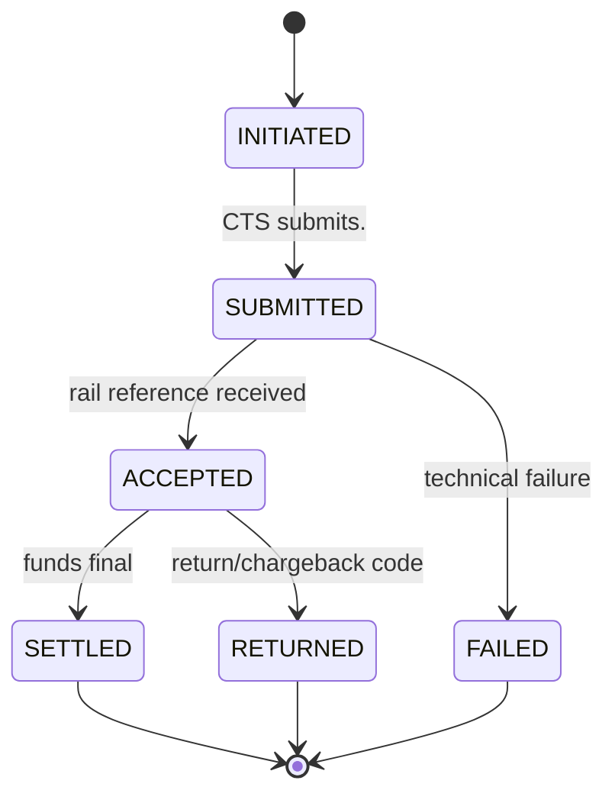

# Transfer Lifecycle

```mermaid
stateDiagram-v2
  [*] --> INITIATED
  INITIATED --> SUBMITTED: CTS submits.<rail>
  SUBMITTED --> ACCEPTED: rail reference received
  ACCEPTED --> SETTLED: funds final
  ACCEPTED --> RETURNED: return/chargeback code
  SUBMITTED --> FAILED: technical failure
  SETTLED --> [*]
  RETURNED --> [*]
  FAILED --> [*]
```

