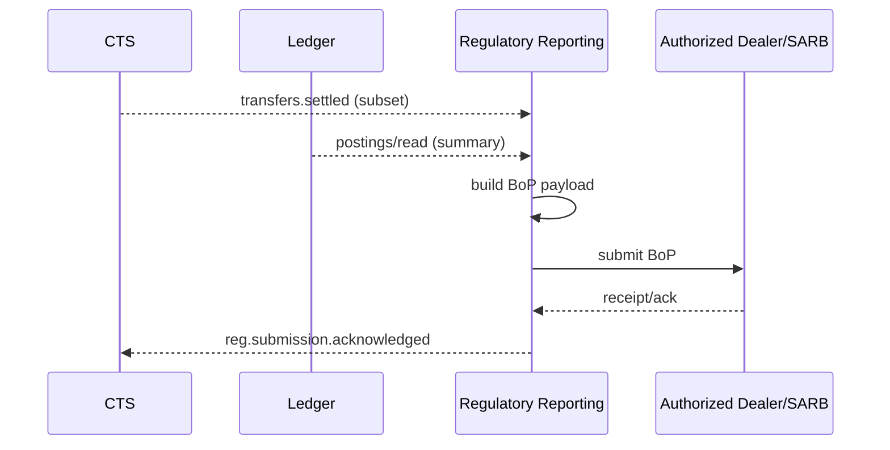

# Sequence: BoP Reporting Pipeline

```mermaid
sequenceDiagram
  participant CTS
  participant LED as Ledger
  participant REG as Regulatory Reporting
  participant AD as Authorized Dealer/SARB

  CTS-->>REG: transfers.settled (subset)
  LED-->>REG: postings/read (summary)
  REG->>REG: build BoP payload
  REG->>AD: submit BoP
  AD-->>REG: receipt/ack
  REG-->>CTS: reg.submission.acknowledged
```
