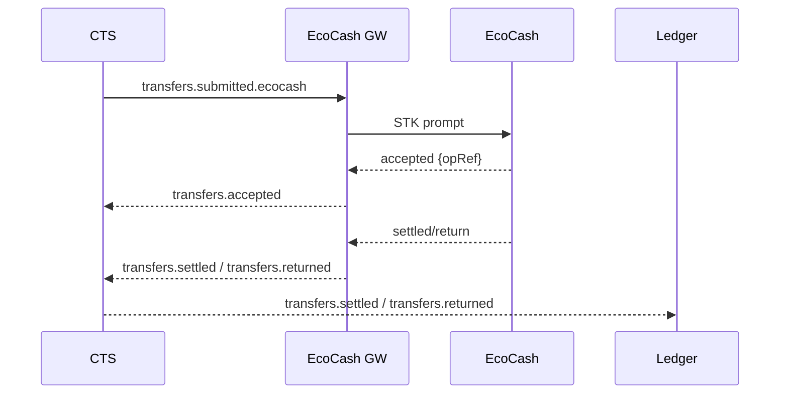

# Sequence: EcoCash STK Prompt

```mermaid
sequenceDiagram
  participant CTS
  participant GW as EcoCash GW
  participant MNO as EcoCash
  participant L as Ledger

  CTS->>GW: transfers.submitted.ecocash
  GW->>MNO: STK prompt
  MNO-->>GW: accepted {opRef}
  GW-->>CTS: transfers.accepted
  MNO-->>GW: settled/return
  GW-->>CTS: transfers.settled / transfers.returned
  CTS-->>L: transfers.settled / transfers.returned
```
