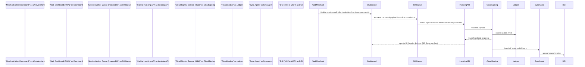
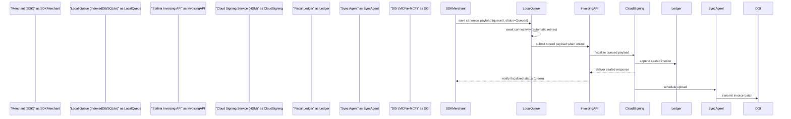
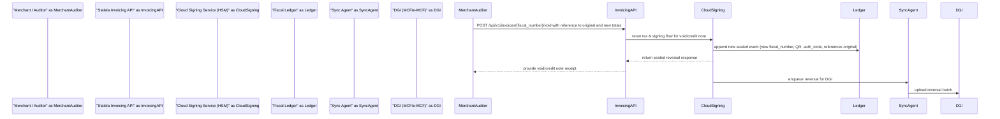
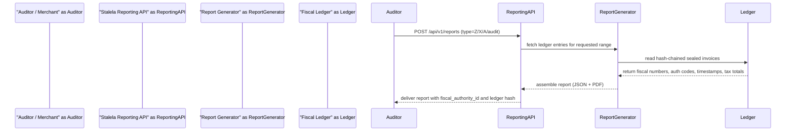
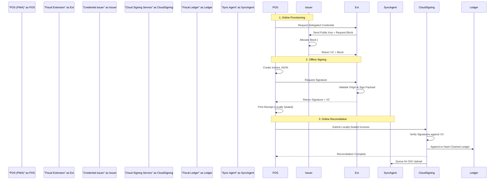

# Data Flow Diagrams

Stalela paths prioritize a cloud-first fiscal authority. Every canonical payload (merchant_nif, outlet_id, pos_terminal_id, cashier_id, client, items, tax_groups, totals, payments, timestamp) flows through the Cloud Signing Service (HSM) before any fiscal number, signature, timestamp, or QR payload leaves the trusted zone. The diagrams below trace five operational flows described in the architecture specification and highlight how the fiscal ledger, tax engine, and sync agent collaborate with clients.

!!! info "Canonical payload & trust boundary"
    - Clients (web dashboard users, API consumers, SDKs, future POS terminals) remain untrusted; they only present canonical JSON with deterministic field ordering.
    - The Cloud Signing Service (HSM) is the sole authority that assigns fiscal numbers, generates authentication codes, timestamps, and QR payloads, and persists the hash-chained fiscal ledger.
    - Sync Agent uploads sealed invoices to the DGI (MCF/e-MCF); clients may display the security elements but may **never** fabricate or mutate them.

## 1. API invoice creation (happy path)

Developers and automation systems call `POST /api/v1/invoices` to fiscalize a sale. The Stalela Invoicing API validates the payload, runs the 14-group tax engine, and forwards the result to the Cloud Signing Service. The signed response returns to the client immediately while the Sync Agent enqueues the ledger entry for the DGI.

```mermaid
sequenceDiagram
    participant "Merchant / Developer" as Merchant
    participant "Stalela Invoicing API" as InvoicingAPI
    participant "Tax Engine" as TaxEngine
    participant "Cloud Signing Service (HSM)" as CloudSigning
    participant "Fiscal Ledger" as Ledger
    participant "Sync Agent" as SyncAgent
    participant "DGI (MCF/e-MCF)" as DGI
    participant "Client App" as ClientApp

    Merchant->>InvoicingAPI: POST /api/v1/invoices with canonical payload (merchant_nif, outlet_id, pos_terminal_id, cashier_id, client, items, tax_groups, totals, payments, timestamp)
    InvoicingAPI->>TaxEngine: validate schema + compute all 14 DGI tax groups
    TaxEngine->>CloudSigning: forward validated payload for fiscal number + signature
    CloudSigning->>Ledger: persist sealed invoice (fiscal_number, auth_code, timestamp, qr_payload) in hash-chained ledger
    CloudSigning-->>InvoicingAPI: return sealed response with fiscal data
    InvoicingAPI-->>ClientApp: deliver fiscalized invoice + security elements
    CloudSigning->>SyncAgent: queue ledger entry for upload
    SyncAgent->>DGI: transmit sealed invoice batch
```

## 2. Web dashboard invoice creation (browser flow)

Stalela's PWA dashboard mirrors the API flow while adding UX touches for touchscreen terminals. The dashboard still builds the canonical payload, invokes the Invoicing API, and surfaces sealed invoices and delivery options without ever touching fiscal numbers.

## 3. Offline client flow (SDK or dashboard)

Offline clients queue invoices locally (IndexedDB for dashboard, SQLite for SDKs) and retry automatic submission when they reconnect. Fiscalization happens only after the payload reaches the Cloud Signing Service, ensuring no sealed invoice is issued while the client remains offline.

## 4. Void & credit note fiscal events

Voids and refunds are always new fiscal events that reference the original fiscal number. The same tax engine and signing flow produce a fresh fiscal number, ledger entry, and sealed response so auditors can trace both the original and reversal.

## 5. Report generation (auditor view)

Report requests hit Stalela's reporting endpoints that query the Fiscal Ledger for the mandated Z, X, A, and audit export views. Each response includes fiscal_number ranges, auth codes, timestamps, and ledger hashes sourced from the cloud ledger so every report matches the same sealed invoices the Sync Agent uploads.

## 6. Delegated Offline Signing (Phase 1.5)

To comply with Arrêté 033 in physical retail environments, POS terminals equipped with the Stalela Fiscal Extension can request a Delegated Credential while online. When offline, the extension signs invoices locally within its allocated block. When connectivity returns, the locally-sealed invoices are submitted to the Cloud for reconciliation.

