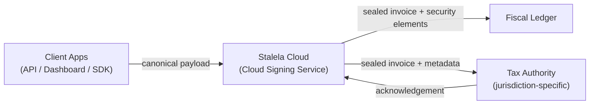
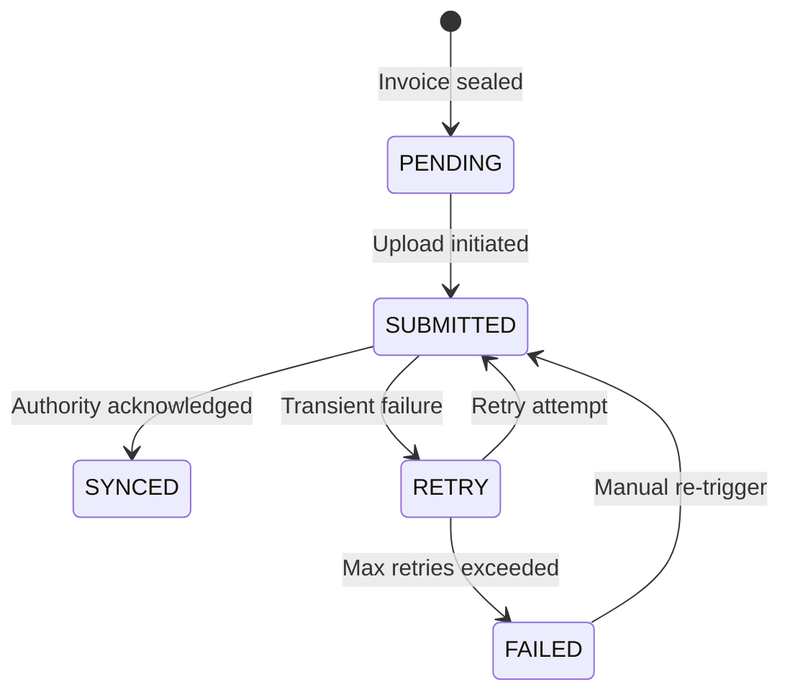

# Tax Authority Sync Agent

The Tax Authority Sync Agent is the generic component that uploads sealed invoices from the Fiscal Ledger to the jurisdiction's tax authority. Each jurisdiction defines its own sync protocol, endpoint, and authentication method in its [country profile](../../40-jurisdictions/index.md).

---

## Generic Sync Pattern

Regardless of the jurisdiction, the sync pipeline follows the same architecture:



The Cloud Signing Service **generates** the security elements (fiscal number, auth code, timestamp, QR) — it does not merely relay them. The Sync Agent handles the upstream delivery to the tax authority using the jurisdiction-specific protocol.

---

## Sync Pipeline Steps

The Tax Authority Sync Agent runs as a background service within the Stalela Cloud:

1. **Poll the Fiscal Ledger** for newly sealed invoices where `authority_sync_status` is `PENDING`.
2. **Load the jurisdiction's sync configuration** — protocol, endpoint URL, authentication method, payload format.
3. **Format the submission** with the required security elements and identifiers (`fiscal_authority_id`, `outlet_id`, `merchant_tin`, `cashier_id` / `api_key_id`).
4. **Upload to the authority's endpoint** via the configured protocol (HTTPS, SOAP, etc.).
5. **Record the acknowledgement** (or failure) in the Fiscal Ledger and update the invoice's `authority_sync_status`.
6. **Retry with exponential backoff** on transient failures; escalate to `FAILED` after max retries.
7. **Surface dashboards and alerts** for operators when uploads are pending or failing.

---

## Sync Status Lifecycle



| Status | Meaning |
|---|---|
| `PENDING` | Invoice sealed in Fiscal Ledger, awaiting upload |
| `SUBMITTED` | Upload sent to tax authority, awaiting acknowledgement |
| `SYNCED` | Authority acknowledged receipt |
| `RETRY` | Transient failure, will retry with backoff |
| `FAILED` | Max retries exceeded — operator intervention required |

---

## Jurisdiction-Specific Protocols

Each jurisdiction implements its own sync protocol through the Tax Authority Sync Agent:

| Jurisdiction | Authority | Protocol | Status | Profile |
|---|---|---|---|---|
| **DRC (CD)** | DGI | MCF / e-MCF | Partially documented — API unpublished | [DGI Integration →](../../40-jurisdictions/cd/authority-integration.md) |
| **Kenya (KE)** | KRA | eTIMS API (Type C — ESD) | Publicly documented | [Planned →](../../40-jurisdictions/ke/index.md) |
| **Rwanda (RW)** | RRA | V-EBM / VSDC | Documented | [Planned →](../../40-jurisdictions/rw/index.md) |
| **Tanzania (TZ)** | TRA | VFD API | Documented | [Planned →](../../40-jurisdictions/tz/index.md) |
| **Nigeria (NG)** | FIRS | TaxPro Max | Under development | [Planned →](../../40-jurisdictions/ng/index.md) |
| **Zimbabwe (ZW)** | ZIMRA | EFD Protocol | Under research | [Planned →](../../40-jurisdictions/zw/index.md) |
| **South Africa (ZA)** | SARS | eFiling | No mandate yet | [Planned →](../../40-jurisdictions/za/index.md) |

---

## Offline Behavior

The specification for most jurisdictions emphasizes that offline operation is normal. The Sync Agent handles this gracefully:

- Client applications queue unsigned draft payloads locally (IndexedDB / SQLite) when the cloud is unreachable.
- Once connectivity returns, drafts are submitted to the Cloud Signing Service for sealing.
- The Sync Agent then uploads sealed invoices to the tax authority.
- See [Offline Sync](offline-sync.md) for the full state machine.

---

## Configuration Model

Each jurisdiction's sync configuration is loaded at runtime:

```yaml
# Example: DRC jurisdiction sync config
jurisdiction: CD
authority:
  name: DGI
  protocol: https
  endpoint: "https://mcf.dgi.gouv.cd/api/v1/invoices"  # placeholder
  auth_method: certificate  # placeholder — unknown
  retry_max: 5
  retry_backoff_base_ms: 1000
  batch_size: 50
  grace_period_hours: 72
```

!!! info "Phase 3 — Hardware Trust Anchor"
    In Phase 3, jurisdictions with hardware fiscal device mandates (e.g., DRC DEF, Tanzania EFD) can use a local device as the trusted signer. The Sync Agent still uploads sealed invoices from the device through the cloud to the tax authority using the same pipeline.
