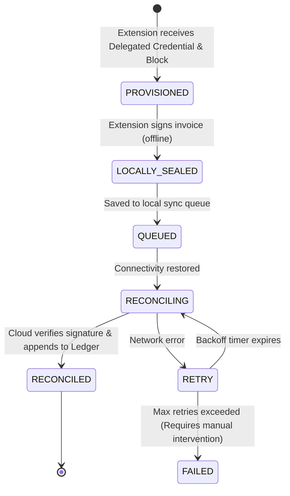

# Offline-First Sync Design

Every invoice issued in the DRC must survive hostile networks. However, Arrêté 033 strictly prohibits issuing "unsigned drafts" to customers. Stalela solves this using the **Delegated Offline Token Architecture (Phase 1.5)**. 

When online, the POS terminal's **Fiscal Extension** requests a short-lived Delegated Credential and a block of fiscal numbers from the Cloud. When offline, the extension signs invoices locally within its allocated block, allowing the merchant to print legally valid receipts. When connectivity returns, these locally-sealed invoices are synchronized back to the Cloud for reconciliation.

## Offline model overview

!!! warning "Unsigned drafts are illegal"
    Previous designs allowed clients to queue unsigned drafts. This is a compliance violation. Under the Delegated Offline Token model, **every printed receipt must be cryptographically sealed**. If the Fiscal Extension exhausts its allocated block or its credential expires, the POS **must halt sales** until it can reconnect and provision a new block.

## Client-side queue architecture

The POS application maintains a local queue of locally-sealed invoices. Each entry stores:

- **canonical payload** — the full invoice payload.
- **local signature** — the ECDSA signature generated by the Fiscal Extension.
- **delegated credential** — the Verifiable Credential proving the extension's authority to sign.
- **queue position** — the local slot referenced by the sync state machine.

### Storage backends

| Client type | Storage | Notes |
|-------------|---------|-------|
| Web POS | IndexedDB | The POS PWA stores locally-sealed invoices in IndexedDB and replays them to the Cloud when online. |
| Fiscal Extension | Extension Storage | The extension securely stores the Delegated Private Key and tracks the current counter within the allocated block. |

## Reconciliation flow

When connectivity returns, the POS sync worker submits queued payloads **in sequential order** to the Stalela Cloud API:

1. **Pick the oldest QUEUED entry** and transition it to RECONCILING.
2. **POST the sealed payload** to `/api/v1/invoices/reconcile`.
3. **On success (201):** The Cloud verifies the signature against the Delegated Credential, verifies the fiscal number is within the allocated block, appends it to the Fiscal Ledger, and returns a success response. Transition to RECONCILED.
4. **On transient failure (5xx, timeout):** Transition to RETRY with exponential backoff.
5. **On validation failure (4xx):** This indicates a severe security event (e.g., signature mismatch, block exhaustion fraud). Log the error, transition to FAILED, and raise a critical security alert.

!!! tip "Idempotency"
    Each submission includes the `fiscal_number` and `signature`. If the cloud has already reconciled this exact invoice, it returns a 200 OK instead of creating a duplicate ledger entry.

## Grace period & audit logging

The DGI expects "guaranteed eventual transmission." As soon as a client regains connectivity, the queue flushes payloads in order. The Delegated Credential has a strict Time-To-Live (TTL), typically 12 hours. If the POS does not reconnect within this grace period, the credential expires, and offline signing is disabled.

## Client UI offline indicators

The POS UI must clearly indicate the sync status of the current block:

1. **Online / Provisioned** (Green) — Connected to Cloud, block is well-provisioned.
2. **Offline / Signing Locally** (Amber) — Disconnected, but signing using the Delegated Credential. Shows remaining block capacity (e.g., "45 invoices remaining").
3. **Syncing** (Blue) — Reconnecting and reconciling locally-sealed invoices with the Cloud.
4. **Blocked** (Red) — Credential expired or block exhausted. Sales halted until connection is restored.

## Security and Fraud Prevention

By allocating strict blocks (e.g., #1000 to #1500), the Cloud knows exactly which invoices to expect during reconciliation. If a POS reconciles #1000, #1001, and #1003, the Cloud immediately detects that #1002 is missing (potential database deletion fraud) and flags the outlet for audit.
