# AI & Natural Language Capabilities

Stalela embeds AI and natural language processing directly into its fiscal invoicing infrastructure so merchants, cashiers, and compliance teams interact with the platform in the language they already speak — French, Lingala, Swahili, or Tshiluba — rather than through forms and dropdowns. This page specifies every AI surface, its data flow, trust boundary rules, and phased rollout.

## Design principles

- **AI assists, the Cloud Signing Service decides.** AI models suggest tax groups, parse natural language, and flag anomalies, but the Cloud Signing Service (HSM) remains the sole authority for fiscal numbers, signatures, timestamps, and QR codes. No AI output bypasses the trust boundary.
- **Human-in-the-loop by default.** AI suggestions (tax classification, anomaly flags, compliance alerts) are presented for review before becoming fiscal events. Confidence thresholds gate auto-approval.
- **Multilingual-first.** All NLP models support French (primary), Lingala, Swahili, and Tshiluba. English is supported for international clients and developers.
- **Privacy-preserving.** Invoice data fed to AI models stays within Stalela's cloud boundary. No customer data is sent to third-party model providers unless the merchant explicitly opts in and a data processing agreement is signed.

## Capability map


---

## 1. Natural Language Invoice Creation

### Problem
Merchants in DRC markets — small traders, school bursars, wholesale distributors — don't want to fill in 15 form fields. They want to say or type what happened ("Vendez 3 sacs de ciment à 45 000 FC chacun à Établissement Kabila, payé moitié mobile money moitié cash") and get a sealed invoice back.

### Specification

| Attribute | Detail |
|-----------|--------|
| **Input channels** | WhatsApp Business API, Web dashboard chat widget, REST API (`/api/v1/invoices/natural`), Voice (speech-to-text pipeline) |
| **Languages** | French, Lingala, Swahili, Tshiluba, English |
| **Output** | Canonical JSON payload ready for the Tax Engine and Cloud Signing Service |
| **Confidence threshold** | ≥ 0.85 → auto-submit for signing; < 0.85 → present draft for review |
| **Fallback** | If confidence < 0.60, prompt the user for clarification ("Quel est le NIF du client?") |

### Data flow

```mermaid
sequenceDiagram
    participant M as Merchant (WhatsApp / Chat)
    participant NLP as NL Invoice Parser
    participant CAT as Product Catalog
    participant TAX as Tax Engine
    participant CSS as Cloud Signing Service (HSM)

    M->>NLP: "Vends 3 sacs ciment 45000 FC à Ets Kabila, moitié MoMo moitié cash"
    NLP->>CAT: Resolve "sacs ciment" → SKU, unit price, tax group
    CAT-->>NLP: SKU-0042, TG01 (TVA 16%)
    NLP->>NLP: Extract: qty=3, unit_price=45000, client="Ets Kabila", payments=[mobile_money: 67500, cash: 67500]
    NLP-->>M: Draft preview (confidence 0.91) — "Confirm or edit?"
    M->>NLP: ✅ Confirm
    NLP->>TAX: Canonical payload
    TAX->>CSS: Validated payload
    CSS-->>M: Sealed invoice (fiscal_number, QR, auth_code)
```



### Entity extraction targets

| Entity | Examples | Required |
|--------|----------|----------|
| **Items** | "3 sacs ciment", "10 cahiers" | Yes |
| **Unit price** | "45 000 FC", "$12.50" | Yes |
| **Client** | "Ets Kabila", "M. Tshisekedi" | No (defaults to anonymous individual) |
| **Payment methods** | "cash", "MoMo", "moitié-moitié" | No (defaults to cash) |
| **Currency** | "FC", "USD", "dollars" | No (defaults to CDF) |
| **Tax group override** | "exonéré", "export" | No (auto-classified from catalog) |

### Implementation notes

- Use a fine-tuned multilingual LLM (e.g., mT5 or Mistral-based) for entity extraction, with a retrieval-augmented generation (RAG) layer backed by the merchant's product catalog.
- Catalog matching uses fuzzy search (Levenshtein + embedding similarity) so "ciment" matches "Ciment Portland CPA 42.5 50kg".
- The parser outputs a confidence score per field plus an aggregate score. Fields below 0.70 confidence are highlighted in the draft preview.
- Voice input runs through Whisper (multilingual) → text → same NLP pipeline.

### Phase: **Phase 2** (initial WhatsApp bot) / **Phase 4** (voice, advanced NLU)

---

## 2. WhatsApp Invoice Bot

### Problem
WhatsApp is the dominant communication channel in DRC. Merchants already discuss transactions over WhatsApp — Stalela should meet them there.

### Specification

| Attribute | Detail |
|-----------|--------|
| **Platform** | WhatsApp Business API (Cloud API) |
| **Capabilities** | Create invoices, query invoice status, download receipts (PDF), request Z/X reports, check DGI sync status, **verify invoices** (text or QR photo) |
| **Authentication** | Phone number linked to merchant account + OTP verification on first use |
| **Languages** | French, Lingala (others via NL pipeline) |

### Conversation flows

**Invoice creation:**

```
Merchant: Facture pour Ets Mwamba, 5 cartons savon 12000 FC
Bot: 📝 Brouillon créé:
     Client: Ets Mwamba
     - 5× Savon Multi-Usage (TG01 TVA 16%) — 60 000 FC
     - TVA: 9 600 FC
     - Total: 69 600 FC
     Paiement: Cash
     ✅ Confirmer | ✏️ Modifier | ❌ Annuler
Merchant: ✅
Bot: ✅ Facture scellée — N° Fiscal: 001-2026-004821
     📎 [Télécharger PDF] | 📱 [Voir QR]
```

**Status query:**

```
Merchant: Statut facture 004821
Bot: ✅ Facture 001-2026-004821
     Scellée: 2026-06-15 14:32 UTC
     DGI: Synchronisé ✅
     Client: Ets Mwamba — 69 600 FC
```

**Report request:**

```
Merchant: Rapport Z aujourd'hui
Bot: 📊 Rapport Z — 15 juin 2026
     Factures: 47 | Total HT: 3 240 000 FC | TVA: 518 400 FC
     📎 [Télécharger PDF] | 📊 [Voir détails]
```

### Security constraints

- The bot never displays or transmits signing keys, HSM credentials, or raw auth codes in conversation.
- Receipts sent as PDF attachments include the QR code and fiscal number but the bot does not render the raw cryptographic signature.
- Session timeout: 15 minutes of inactivity.
- All bot interactions are logged in the audit trail with `source: "whatsapp_bot"`.

### Phase: **Phase 2**

---

## 3. Tax Auto-Classification

### Problem
DRC's 14 DGI tax groups are nuanced. Merchants frequently mis-classify items, leading to tax errors, compliance risk, and rejected returns. AI can suggest the correct tax group from the item description or HS code.

### Specification

| Attribute | Detail |
|-----------|--------|
| **Input** | Item description (free text), HS code (optional), product category |
| **Output** | Suggested tax group (TG01–TG14), confidence score, explanation |
| **Model** | Classification model trained on DRC customs tariff schedule, DGI circulars, and historical Stalela transaction data |
| **Threshold** | ≥ 0.90 → auto-apply; 0.70–0.90 → suggest with explanation; < 0.70 → manual classification required |

### Tax group mapping examples

| Item description | Suggested TG | Confidence | Explanation |
|-----------------|--------------|------------|-------------|
| "Ciment Portland 50kg" | TG01 (TVA 16%) | 0.97 | Construction materials — standard rate |
| "Cahiers scolaires A4" | TG04 (TVA 0% — exonéré) | 0.94 | School supplies — exempt per DGI circular 2024/03 |
| "Bière Primus 72cl" | TG07 (Accise + TVA) | 0.96 | Alcoholic beverages — excise + VAT |
| "Consulting juridique" | TG01 (TVA 16%) | 0.88 | Professional services — standard rate |
| "Matériel médical importé" | TG05 (TVA 0% — exonéré) | 0.72 | Medical equipment — review needed, exemption depends on end-use certificate |

### Training data sources

1. **DRC customs tariff schedule** (tarif douanier) — thousands of HS code → duty/tax mappings.
2. **DGI circulars and arrêtés** — exemptions, special rates, and reclassifications.
3. **Stalela transaction history** — real-world item descriptions with confirmed tax groups (post-Phase 1 pilot).
4. **Merchant product catalogs** — uploaded during onboarding.

### Integration point

The Tax Auto-Classifier sits between the canonical payload builder and the Tax Engine. It runs during invoice creation (API, dashboard, or NL pipeline) and is also available as a standalone endpoint:

```
POST /api/v1/tax/classify
{
  "items": [
    { "description": "Ciment Portland 50kg", "hs_code": "2523.29" },
    { "description": "Service de nettoyage" }
  ]
}

Response:
{
  "classifications": [
    { "description": "Ciment Portland 50kg", "tax_group": "TG01", "confidence": 0.97, "explanation": "Construction materials — standard VAT rate" },
    { "description": "Service de nettoyage", "tax_group": "TG01", "confidence": 0.91, "explanation": "Cleaning services — standard VAT rate" }
  ]
}
```

### Phase: **Phase 2** (model training begins with Phase 1 pilot data)

---

## 4. Anomaly Detection

### Problem
Fiscal fraud, numbering irregularities, and operational errors are difficult to catch manually at scale. AI monitors the Fiscal Ledger for patterns that indicate problems.

### Specification

| Attribute | Detail |
|-----------|--------|
| **Data source** | Fiscal Ledger (append-only, hash-chained), invoice metadata, sync logs |
| **Detection types** | See table below |
| **Alert channels** | Dashboard alert center, email, webhook (`anomaly.detected` event), WhatsApp bot |
| **Response** | Alert → human review → flag/dismiss/investigate |

### Detection categories

| Category | Pattern | Severity | Example |
|----------|---------|----------|---------|
| **Numbering anomaly** | Gap in fiscal number sequence, duplicate fiscal numbers, counter rollback | Critical | Fiscal number jumps from 004821 to 004823 — missing 004822 |
| **Velocity anomaly** | Unusual spike or drop in invoice volume for an outlet | High | Outlet invoiced 500 items in 1 hour vs. daily average of 50 |
| **Amount anomaly** | Invoice total significantly exceeds historical norms | High | Single invoice for 50M FC when outlet's max is typically 500K FC |
| **Timing anomaly** | Invoices generated outside business hours or in suspicious patterns | Medium | 200 invoices sealed between 02:00–03:00 AM |
| **Tax group anomaly** | Sudden shift in tax group distribution suggesting mis-classification | Medium | Outlet switches 80% of items from TG01 to TG04 (exempt) in one week |
| **Void/refund anomaly** | Excessive void or refund rate relative to sales | High | 40% void rate in a single shift |
| **Sync delay anomaly** | Invoices stuck in offline queue beyond grace period | Medium | 500 drafts queued for 72+ hours without sync |

### Model approach

- **Statistical baselines:** Establish per-outlet, per-cashier, and per-time-period baselines using rolling 30-day windows.
- **Isolation Forest / Autoencoder:** Unsupervised anomaly detection on multivariate features (invoice count, total, tax group distribution, void rate, sync latency).
- **Rule-based triggers:** Hard rules for critical anomalies (numbering gaps, duplicate fiscal numbers) that bypass ML and alert immediately.

### Phase: **Phase 2** (rule-based) / **Phase 4** (ML-based)

---

## 5. Predictive Analytics

### Problem
Finance teams need forward-looking insights — projected tax liability, revenue trends, seasonal patterns — not just backward-looking reports.

### Specification

| Report | Description | Model |
|--------|-------------|-------|
| **Tax liability forecast** | Projected monthly/quarterly tax obligations based on current invoicing velocity and seasonal patterns | Time-series forecasting (Prophet / ARIMA) |
| **Revenue projection** | Revenue forecast by outlet, product category, and client segment | Time-series + regression |
| **Seasonal demand** | Identify peak/trough periods for inventory and staffing | Seasonal decomposition |
| **Cash flow prediction** | Predict when mobile money vs. cash payments will be collected | Classification + time-series |
| **Compliance risk score** | Per-outlet risk score based on anomaly history, sync reliability, and tax classification accuracy | Logistic regression / gradient boosting |

### Dashboard integration

Predictive insights surface in the web dashboard as:

- **Forecast cards** — "Estimated TVA liability for March: 2.4M FC (±8%)" on the dashboard home.
- **Trend charts** — Revenue and tax projections overlaid on historical data with confidence intervals.
- **Risk indicators** — Color-coded compliance risk scores per outlet in the fleet view.
- **Alerts** — "Tax liability projected to exceed 10M FC this quarter — review TG distribution" in the alert center.

### API access

```
GET /api/v1/analytics/forecast?outlet_id=OUT-001&metric=tax_liability&period=quarterly
```

### Phase: **Phase 4** (requires sufficient historical data from Phases 1–3)

---

## 6. OCR & Document Digitization

### Problem
Many DRC businesses have years of paper invoices that are not in any digital system. Stalela can ingest these as historical records (not fiscally sealed — they're already issued) or convert incoming paper invoices from suppliers into structured data.

### Specification

| Attribute | Detail |
|-----------|--------|
| **Input** | Camera photo, scanned PDF, uploaded image |
| **Output** | Structured invoice data (items, amounts, tax groups, client info) |
| **Languages** | French, English |
| **Accuracy target** | ≥ 95% character accuracy, ≥ 90% field extraction accuracy |
| **Use cases** | (1) Digitize historical paper invoices for record-keeping. (2) Extract data from supplier invoices for purchase ledger entry. |

### Processing pipeline


### Constraints

- OCR-digitized invoices are stored as `source: "ocr_scan"` and are **not** fiscally sealed unless the merchant explicitly requests a new fiscal event.
- The system never fabricates fiscal numbers for scanned historical invoices — they are informational records only.
- Low-quality scans (blurry, torn, partial) are flagged for manual entry.

### Phase: **Phase 4**

---

## 7. Compliance Monitoring

### Problem
DRC tax regulations change — new arrêtés, updated tax rates, revised exemption lists. Merchants need to know when changes affect their invoicing.

### Specification

| Attribute | Detail |
|-----------|--------|
| **Sources** | DGI website, official gazette (Journal Officiel), ministry circulars, partner legal advisors |
| **Detection** | NLP-based document analysis that identifies changes to tax rates, exemptions, invoicing requirements, and reporting obligations |
| **Output** | Alert with summary, affected tax groups, recommended action, and link to source document |
| **Review** | Stalela compliance team reviews and confirms before pushing to merchants |

### Alert examples

| Change detected | Affected TG | Recommended action |
|----------------|-------------|-------------------|
| New arrêté exempts agricultural inputs from TVA | TG01 → TG04 for qualifying items | Review product catalog and reclassify agricultural inputs |
| DGI increases TVA rate from 16% to 18% | TG01 | Update tax engine rate; effective date: 2027-01-01 |
| New reporting requirement: monthly electronic submission mandatory | All | Update Sync Agent schedule from weekly to daily batch |

### Phase: **Phase 4** (monitoring) / **Ongoing** (manual review by compliance team from Phase 1)

---

## 8. Smart Search & Insights

### Problem
Finance teams and auditors ask questions like "How much TVA did we collect on cement sales in Q3?" or "Show me all invoices for Ets Mwamba over 500,000 FC." Today they export data and use spreadsheets. Natural language search lets them ask directly.

### Specification

| Attribute | Detail |
|-----------|--------|
| **Input** | Natural language query in the dashboard search bar or via API |
| **Languages** | French, English |
| **Data source** | Fiscal Ledger, invoice metadata, reports, analytics |
| **Output** | Structured answer (table, chart, or summary) with source citations |

### Query examples

| Natural language query | Structured interpretation | Result type |
|-----------------------|--------------------------|-------------|
| "Total TVA pour ciment en Q3 2026" | `SUM(tax_amount) WHERE item LIKE 'ciment%' AND tax_group='TG01' AND date BETWEEN '2026-07-01' AND '2026-09-30'` | Number + breakdown table |
| "Factures Ets Mwamba > 500 000 FC" | `SELECT * FROM invoices WHERE client='Ets Mwamba' AND total > 500000` | Invoice list |
| "Quel caissier a le plus de factures annulées ce mois?" | `SELECT cashier_id, COUNT(*) FROM invoices WHERE type='void' AND month=current GROUP BY cashier_id ORDER BY count DESC LIMIT 1` | Ranked list |
| "Compare revenue outlet Gombe vs Limete this quarter" | Multi-outlet revenue comparison | Bar chart |

### Architecture

- **Text-to-SQL / Text-to-Query** layer translates natural language into structured queries against the Fiscal Ledger read replica.
- **Guardrails** prevent queries that could expose raw signing keys, HSM credentials, or other merchants' data.
- Queries are scoped to the authenticated merchant's data and respect role-based access control.
- Complex queries that would scan more than 1M rows are queued and run async with progress indication.

### Phase: **Phase 4**

---

## API surface summary

| Endpoint | Method | Description | Phase |
|----------|--------|-------------|-------|
| `/api/v1/invoices/natural` | POST | Create invoice from natural language text | Phase 2 |
| `/api/v1/tax/classify` | POST | Classify items into tax groups | Phase 2 |
| `/api/v1/analytics/forecast` | GET | Retrieve predictive forecasts | Phase 4 |
| `/api/v1/analytics/anomalies` | GET | List detected anomalies | Phase 2 |
| `/api/v1/ocr/scan` | POST | Upload document for OCR extraction | Phase 4 |
| `/api/v1/search/query` | POST | Natural language search over fiscal data | Phase 4 |

All AI endpoints inherit the same authentication (Bearer token), rate limiting, and tenant isolation as the core invoicing API.

## Model hosting & infrastructure

| Component | Technology | Notes |
|-----------|-----------|-------|
| **NL Invoice Parser** | Fine-tuned multilingual LLM (mT5 / Mistral) + RAG | Hosted within Stalela cloud boundary |
| **Tax Auto-Classifier** | Gradient-boosted classifier + embedding similarity | Trained on DRC tariff schedule + transaction history |
| **Anomaly Detection** | Isolation Forest + rule engine | Statistical baselines per outlet |
| **Predictive Analytics** | Prophet / ARIMA time-series models | Runs on Fiscal Ledger read replica |
| **OCR** | Tesseract + Cloud Vision API (opt-in) | Image preprocessing pipeline |
| **Smart Search** | Text-to-SQL (fine-tuned CodeLlama / StarCoder) | Sandboxed query execution |
| **Compliance Monitor** | NLP document classifier + change detector | Semi-automated with human review |

All models run on dedicated compute within the Stalela cloud boundary. Inference latency targets: < 2 s for NL parsing, < 500 ms for tax classification, < 1 s for search queries.

## Privacy & data governance

- **Data residency:** All training data and model weights stay within the Stalela cloud boundary (same region as the Fiscal Ledger).
- **No cross-tenant training:** Models are fine-tuned per merchant or on anonymized aggregate data. One merchant's invoice data never trains another merchant's model.
- **Audit trail:** Every AI suggestion, confidence score, and human override is logged with `ai_suggestion_id`, `model_version`, and `accepted: true/false`.
- **Opt-in for cloud AI:** Merchants who prefer not to use AI features can disable them at the outlet level. Tax classification falls back to manual selection.
- **Data retention for training:** Transaction data used for model training follows the same 10-year regulatory retention requirement as the Fiscal Ledger.

## Phasing summary

| Capability | Phase 1 | Phase 2 | Phase 4 |
|-----------|---------|---------|---------|
| Natural Language Invoice Creation | — | WhatsApp bot + chat widget | Voice input, advanced NLU |
| WhatsApp Invoice Bot | — | Core flows (create, status, reports) | Extended (analytics, alerts) |
| Tax Auto-Classification | — | Model training + API | Auto-apply with high confidence |
| Anomaly Detection | — | Rule-based alerts | ML-based + compliance scoring |
| Predictive Analytics | — | — | Full forecasting suite |
| OCR & Document Digitization | — | — | Camera + PDF pipeline |
| Compliance Monitoring | Manual review | Manual review | NLP-assisted monitoring |
| Smart Search & Insights | — | — | Text-to-SQL search |
