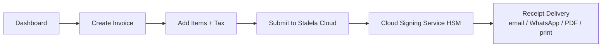

# Web Dashboard

The Stalela Web Dashboard is a Progressive Web App layer that sits in the untrusted client zone. It loads in any modern browser, caches product/customer catalogs, and builds canonical payloads that are sent to the Cloud Signing Service (HSM-backed) for sequential fiscal numbering, signature generation, and QR payload creation. Every fiscalized invoice is then mirrored back to the UI for receipts, reports, and DGI sync status, while the UI keeps a secondary queue of uploads that still need confirmation from the cloud.

## Architecture

- **PWA + Service Worker.** The dashboard is a single-page Progressive Web App. This design means the UI assets (HTML, CSS, JS, fonts, icons) are cached by a Service Worker, so even the cheapest Android tablet boots instantly after the first visit.
- **IndexedDB cache & queue.** Product catalogs, customer lists, tax group manifests, and queued uploads live in IndexedDB so the UI can search instantly even while offline. The queue stores canonical invoices (deterministic field order) and tracks whether they have been uploaded to the cloud or are waiting for acknowledgement.
- **Fiscal Extension Integration (Phase 1.5).** For offline retail environments, the dashboard communicates with the Stalela Fiscal Extension. The extension holds a Delegated Credential and signs invoices locally when the Cloud is unreachable, allowing the dashboard to print legally valid receipts immediately.
- **Background sync for reconciliation.** The UI drafts invoices locally. If online, it sends `POST /api/v1/invoices` to Stalela Cloud. If offline, it requests a signature from the Fiscal Extension, stores the locally-sealed invoice in IndexedDB, and later syncs it via `POST /api/v1/invoices/reconcile` when connectivity returns.

!!! note "Lessons from Odoo"
    We reuse Odoo’s single-screen checkout, IndexedDB caching, and offline resilience but overlay fiscal-status indicators, dual-currency displays, and mobile money-native chips. The dashboard feels familiar to merchants while respecting the trust boundary: the UI never fabricates fiscal numbers or tamper-resistant hashes.

## Key Screens

### Invoice creation

Single-screen checkout, inspired by Odoo, keeps the product grid, order summary, and numpad visible together. Large tap targets, instant search-as-you-type, barcode scanning, and favorites speed entry. Each line item shows its DGI tax group badge and updates dual-currency totals (CDF + USD) in real time. A mandatory client classification selector (individual, company, commercial individual, professional, embassy) enables the Submit button.

### Invoice list & search

Filters for date range, client NIF, fiscal number, and status (fiscalized / queued / error) help cashiers retrieve past sales. Each row highlights the fiscal number, auth code snippet, QR preview, and a Delivery column that lists emailed, WhatsApp, PDF, or thermal print copies. Queued invoices display a yellow badge until the cloud confirms receipt.

### Client & classification management

This screen houses DRC client metadata (classification, tax ID, contact information) and lets finance teams update tax group defaults, multi-currency pricing, or mobile money preferences. Every client record is referenced when building canonical payloads that the Cloud Signing Service validates.

### Reports & reconciliation

Session dashboards show Z/X/A totals, tax-group breakdowns, offline queue depth, and DGI sync status. When a cashier closes a session, the UI calls `POST /api/v1/reports` (Z report) and displays the device signature, ledger hash, and audit export links. A “Report ready” badge stays on until DGI acknowledges the batch.

### Settings & access controls

Outlets, API keys, and roles (admin, invoicer, viewer, auditor) are managed here. Each API key is scoped to an outlet, and the UI surfaces the `outlet_id`, `user_id`/`api_key_id`, and `source` (dashboard, API, SDK, POS) so the Monotonic Counter Manager in Stalela Cloud can serialize numbering without conflicts.

## UX Principles

1. **Offline-first & responsive.** Service Worker + IndexedDB cache the catalog, assets, and queue so the UI renders instantly on a $50 tablet even when connectivity drops.
2. **Single-screen workflow.** Product grid → order summary → numpad: no page refreshes required. Instant product search, barcode scans, and favorites keep interactions snappy.
3. **Minimal typing.** Tap, drag, and numpad entry replace keyboards. Customer selection, classification, and notes remain the only required text inputs.
4. **Fiscal status ribbon.** A persistent banner reports Device connected/disconnected/error with green/yellow/red states. It shows the latest fiscal number, the last auth code, and any blocking compliance warnings. Receipt printing is disabled until the Ribbon confirms fiscalization.
5. **Dual-currency totals.** Subtotals, VAT, and grand totals display both CDF and USD so merchants can compare against their reference rate while the canonical payload records every currency field for the Cloud Signing Service.
6. **Mobile money-first payments.** Payment chips for Airtel Money, M-Pesa, Orange Money, cash, and bank transfer show currency, available balance, and split-payment stacking. Payment icons stay legible even at smaller sizes.
7. **Localized & accessible.** Language toggles (French / Lingala), high-contrast badges, and text-scaling controls keep the dashboard WCAG-friendly, especially around fiscal status and offline warnings.

## Offline-first operations

Fiscalization always happens before a receipt is printed. When connectivity disappears, the dashboard requests a signature from the **Fiscal Extension**, which uses its Delegated Credential to sign the invoice locally. The invoice is now legally valid and can be printed. The offline queue widget sits in the footer and shows “X invoices pending reconciliation.” When connectivity returns, the Service Worker wakes up, flushes pending payloads to the Cloud for verification and ledger appending, and updates each row’s sync badge.

!!! tip "Offline queue vs. fiscal status"
    Fiscal status uses green/amber/red badges. Green = Online/Provisioned. Amber = Offline but signing locally via Fiscal Extension (shows remaining block capacity). Red = Block exhausted or credential expired (sales halted). The offline queue widget tracks reconciliation uploads to the Cloud.

## Delivery & fiscal confirmation

After the Cloud Signing Service replies, the UI shows a success toast with the fiscal number, auth code, timestamp, and QR preview. Receipt delivery options include email, WhatsApp share, PDF download, and browser print (thermal print via printer APIs). The dashboard also stores the ledger hash and DGI sync status for audit requests and exposes `POST /api/v1/reports` links (Z, X, A, audit export) so auditors can download sealed data without touching the USB device.

## Mermaid wireframe flow

