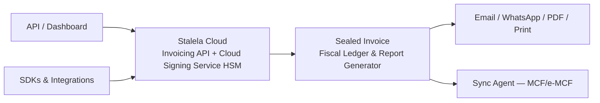

# Platform Overview

## What is Stalela?
Stalela is fiscal invoicing infrastructure for the DRC—think Stripe Invoices for compliance teams that need canonical payloads, trusted fiscal numbers, and HSM-backed signing without shipping any hardware.

## How Stalela works
1. Client apps (web dashboard, REST API consumers, and SDKs) prepare canonical JSON invoices with deterministic field ordering (`merchant_id`, `outlet_id`, `pos_terminal_id`, `cashier_id`, `client`, `items`, `tax_groups`, `totals`, `payments`, `timestamp`) and queue drafts in IndexedDB/SQLite when offline.
2. The Invoicing API validates schema, enforces the 14 DGI tax groups and client classifications (Individual, Company, CommercialIndividual, Professional, Embassy), applies rounding rules, and forwards the sanitized payload to the Cloud Signing Service.
3. The Cloud Signing Service (HSM) requests the next sequential fiscal number from the Monotonic Counter Manager, signs the payload, timestamps the event, generates the QR payload, and anchors the sealed invoice inside the append-only Fiscal Ledger while the Report Generator refreshes Z/X/A/audit summaries.
4. The sealed invoice (fiscal number, auth code, timestamp, QR, fiscal authority ID, ledger hash) flows back to the caller so receipts can be delivered via email, WhatsApp, PDF, or thermal print; ledger entries are also accessible to auditors and API consumers.
5. The Sync Agent ships the sealed payload to the DGI’s MCF/e-MCF control modules, tracks the `dgi_status` (`queued`, `synced`, `failed`), and surfaces acknowledgments through dashboards, webhooks, and SDK callbacks.

## Platform Flow

## Design principles
- **Cloud-first trust boundary:** The Cloud Signing Service (HSM) is the only authority for fiscal numbers, auth codes, timestamps, and QR payloads; client apps never fabricate or mutate security elements.
- **Offline resilience:** Inspired by the Odoo lessons, the PWA caches catalogs and customers in IndexedDB, keeps service workers alive, shows fiscal device status badges, and flushes IndexedDB/SQLite queues only after the canonical payload is sealed.
- **Deterministic canonical payloads:** Field ordering, tax group metadata, and payment records are never reshuffled so the Fiscal Ledger and QR payloads remain verifiable.
- **Multi-user, multi-tenant scale:** Each invoice tags `outlet_id`, `pos_terminal_id`, `cashier_id`, and API key scopes so the Monotonic Counter Manager serializes numbering per outlet while roles and quotas protect tenants.
- **Mobile money + multi-currency support:** Airtel Money, M-Pesa, Orange Money, and USD/CDF split payments are front and center so traders and schools can use cash and mobile instruments simultaneously.
- **AI-assisted, human-confirmed:** Natural language invoice creation, tax auto-classification, anomaly detection, and predictive analytics are embedded across the platform — but the Cloud Signing Service remains the sole fiscal authority. AI suggests; the HSM decides. See [AI & Natural Language Capabilities](ai-capabilities.md).

## Target users
- Finance teams and comptrollers who need sealed invoices, Z/X/A/audit reports, and instant receipts (email, WhatsApp, PDF, print) without managing hardware.
- **Merchants and cashiers** who create invoices by typing a natural language message — in French, Lingala, or Swahili — via WhatsApp or the dashboard chat widget, and receive a sealed fiscal invoice in seconds. See [Natural Language Invoice Creation](ai-capabilities.md#1-natural-language-invoice-creation).
- Developers building integrations, SDKs, ERP connectors, or webhook consumers who expect Stripe-like payloads, rate limits, and deterministic behavior.
- POS vendors and retailers preparing for Phase 2 multi-terminal deployment with local fiscal services that mediate access to the cloud signer.
- Auditors, regulators, and the DGI who demand append-only ledgers, canonical security elements, and verified QR codes for every invoice.

## Security & compliance
Stalela satisfies the SFE specifications: all five invoice types plus the 14 DGI tax groups run through the tax engine, client classification is mandatory, and every sealed invoice includes the fiscal number, fiscal authority ID, cryptographic auth code, trusted timestamp, and QR payload produced by the Cloud Signing Service (HSM). The Fiscal Ledger remains append-only, the Report Generator emits Z/X/A/audit exports, and voids/refunds become new fiscal events instead of deletions.

Anyone — customers, auditors, DGI inspectors — can verify that an invoice is genuine by scanning the QR code on the receipt or entering the fiscal number at the **public verification portal** (`verify.stalela.cd`). The verification service checks the ECDSA signature against the HSM's public key, confirms hash-chain integrity in the Fiscal Ledger, and reports DGI sync status — all without requiring login. See [Invoice Verification](../fiscal/invoice-verification.md).

## Delivery & reporting
Receipt delivery is multi-channel (email, WhatsApp, PDF, thermal print) and always includes the fiscal number plus QR payload while the ledger and Report Generator power Z, X, A, and audit export data for inspectors and finance teams. The [WhatsApp Invoice Bot](ai-capabilities.md#2-whatsapp-invoice-bot) also serves as a delivery and query channel — merchants can check invoice status, download receipts, and request Z reports directly in their WhatsApp conversation. Offline-first clients queue invoices locally, surface queue depth indicators, and retry until Stalela Cloud seals the payload. The Sync Agent handles DGI integration (MCF/e-MCF) so authorized invoices and ledger hashes reach the ministry even when connectivity is intermittent.

[Anomaly detection](ai-capabilities.md#4-anomaly-detection) continuously monitors the Fiscal Ledger for numbering gaps, velocity spikes, and suspicious patterns, surfacing alerts through the dashboard, email, and webhooks. [Predictive analytics](ai-capabilities.md#5-predictive-analytics) project tax liability and revenue trends so finance teams plan ahead rather than react.

## Phasing summary
1. **Phase 1 — Software Invoicing (current):** Cloud Signing Service (HSM) is the trusted authority, the Invoicing API/web dashboard/SDK ecosystem produce canonical payloads, and sealed invoices stream to delivery channels while the Sync Agent uploads to the DGI.
2. **Phase 2 — POS & Retail:** Multi-terminal POS apps reuse the same cloud fiscal signer, add local fiscal services for shared USB devices, and keep the offline/PWA lessons (service worker, IndexedDB, fiscal status badges) for tablets and phones.
3. **Phase 3 — USB Hardware (optional):** The archived USB Fiscal Memory device can become an optional trust anchor for DEF-homologated outlets; its documentation lives in `design/docs-archive/hardware/` while the cloud still mirrors every sealed event for reporting and audits.
