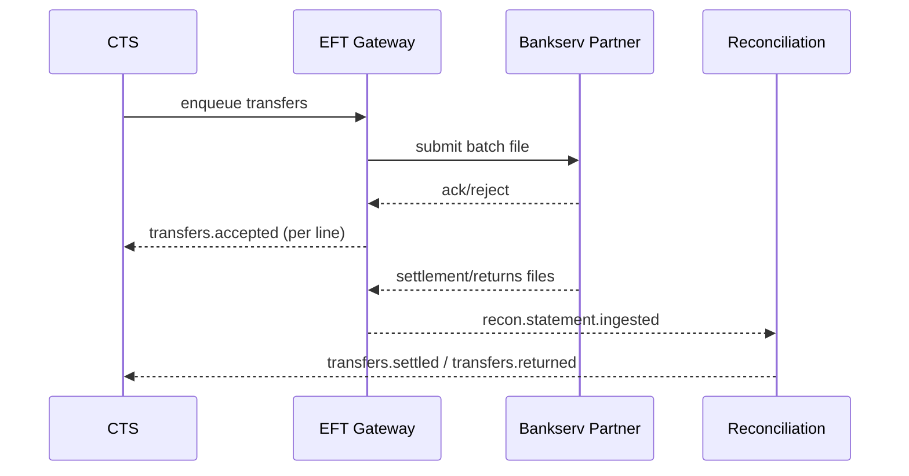

# Sequence: EFT Batch

```mermaid
sequenceDiagram
  participant CTS
  participant EFT as EFT Gateway
  participant PARTNER as Bankserv Partner
  participant R as Reconciliation

  CTS->>EFT: enqueue transfers
  EFT->>PARTNER: submit batch file
  PARTNER-->>EFT: ack/reject
  EFT-->>CTS: transfers.accepted (per line)
  PARTNER-->>EFT: settlement/returns files
  EFT-->>R: recon.statement.ingested
  R-->>CTS: transfers.settled / transfers.returned
```
