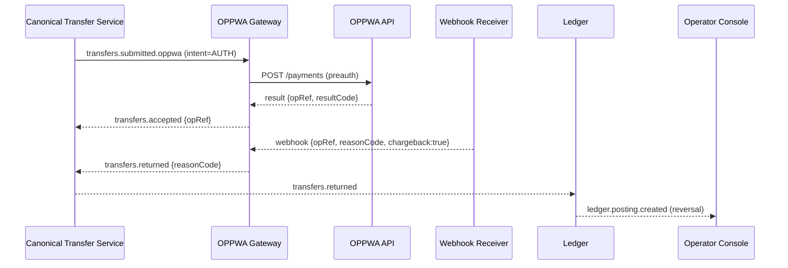

# Sequence: Return (OPPWA)

```mermaid
sequenceDiagram
  participant CTS as Canonical Transfer Service
  participant GW as OPPWA Gateway
  participant OPP as OPPWA API
  participant WH as Webhook Receiver
  participant L as Ledger
  participant OC as Operator Console

  CTS->>GW: transfers.submitted.oppwa (intent=AUTH)
  GW->>OPP: POST /payments (preauth)
  OPP-->>GW: result {opRef, resultCode}
  GW-->>CTS: transfers.accepted {opRef}

  %% Later, dispute/return arrives
  WH-->>GW: webhook {opRef, reasonCode, chargeback:true}
  GW-->>CTS: transfers.returned {reasonCode}
  CTS-->>L: transfers.returned
  L-->>OC: ledger.posting.created (reversal)
```
