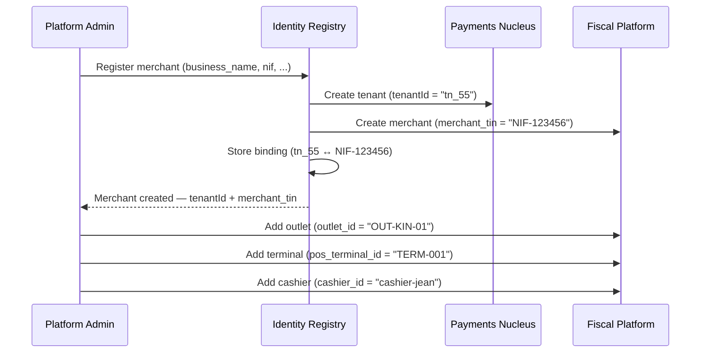

# Merchant Identity Mapping

This page documents how merchant identity is established and mapped across the two pillars of the Stalela Platform.

---

## Identity Models

Each pillar defines its own identity hierarchy optimized for its domain:

### Payments Nucleus

```
tenantId (top-level account — maps to a business entity)
```

The Payments Nucleus is flat by design. All CTS operations, GL Ledger postings, and compliance screenings are scoped by `tenantId`. There is no concept of outlet, terminal, or cashier at the payment layer.

### Fiscal Platform

```
merchant_tin (taxpayer identification number — maps to a business entity)
  └── outlet_id (physical location — fiscal numbering is per-outlet)
        ├── pos_terminal_id (device identifier)
        └── cashier_id (operator identity)
```

The Fiscal Platform requires outlet-level granularity because fiscal regulations in most jurisdictions mandate sequential numbering per outlet and per-cashier audit trails.

---

## Binding Table

| Payments Nucleus | Fiscal Platform | Created During | Notes |
|---|---|---|---|
| `tenantId` | `merchant_tin` | Merchant onboarding | 1:1 binding. Stored in a shared identity registry. |
| — | `outlet_id` | Outlet registration | Payments doesn't need this but it can be passed as `metadata.outlet_id` on transfers. |
| — | `pos_terminal_id` | Terminal provisioning | Irrelevant to Payments. |
| — | `cashier_id` | Staff management | Irrelevant to Payments. |

---

## Onboarding Flow



---

## API Key Scoping

A single API key (Bearer token) encodes both identities:

```json
{
  "sub": "tn_55",
  "merchant_tin": "NIF-123456",
  "outlets": ["OUT-KIN-01", "OUT-KIN-02"],
  "roles": ["merchant_admin"],
  "iat": 1750000000,
  "exp": 1750003600
}
```

- **Payments Nucleus** reads `sub` (= `tenantId`) to scope all operations.
- **Fiscal Platform** reads `merchant_tin` and `outlets` to scope fiscal operations.
- A POS terminal's token may include an additional `terminal_id` claim to narrow the fiscal scope to a single terminal.

---

## Resolution at Runtime

When a POS client creates an invoice and then initiates a payment:

1. The Fiscal Platform validates `merchant_tin` + `outlet_id` from the token.
2. The POS client calls `POST /transfers` on CTS. The token's `sub` claim provides `tenantId`.
3. The POS client sets `endUserRef` = `fiscal_number` and optionally `metadata.outlet_id` = `OUT-KIN-01`.
4. Neither service queries the other's identity store. The shared identity registry is consulted only during onboarding and token issuance.
