# Integration Layer

The Payments Nucleus and Fiscal Platform are **decoupled by design**. They share no databases, no synchronous RPC calls, and no transactional boundaries. This section documents the narrow, well-defined touchpoints where the two pillars interact.

---

## Decoupling Philosophy

```mermaid
flowchart LR
    subgraph "Fiscal Platform"
        INV["Invoice API"]
        FL["Fiscal Ledger"]
    end

    subgraph "Payments Nucleus"
        CTS["Canonical Transfer Service"]
        GL["GL Ledger"]
    end

    INV -.->|"endUserRef = fiscal_number\n(async, client-initiated)"| CTS
    CTS -.->|"transfer.settled event\n(Event Bus)"| INV

    style INV fill:#2d2d2d,stroke:#3FFF00
    style CTS fill:#2d2d2d,stroke:#3FFF00
```

**Key principles:**

1. **No shared state.** The Fiscal Ledger and GL Ledger are separate data stores with different semantics (hash-chained audit trail vs. double-entry accounting).
2. **Client-initiated linking.** The POS or API client decides when to request payment after fiscal sealing. The Fiscal Platform never calls the CTS directly.
3. **Async event correlation.** When a transfer settles, the CTS emits `transfer.settled` on the Event Bus. An optional listener on the Fiscal Platform side can update the invoice's payment status.
4. **Opaque references.** The CTS treats `endUserRef` as opaque metadata — it never queries the Fiscal Ledger. The Fiscal Platform treats CTS `transferId` the same way.

---

## Integration Pages

| Page | Description |
|---|---|
| [Payment on Invoice](payment-on-invoice.md) | How the `payments` array on an invoice relates to actual money movement through CTS |
| [Merchant Identity](merchant-identity.md) | How `tenantId` (Payments) maps to `merchant_tin` + `outlet_id` (Fiscal) |
| [End-to-End: Invoice → Pay](sequence-invoice-then-pay.md) | Full Mermaid sequence diagram showing the POS cashier flow from sale to settlement |

---

## When to Use Which API

| I want to… | Call… | Pillar |
|---|---|---|
| Create a sealed invoice | `POST /api/v1/invoices` | Fiscal Platform |
| Collect payment for an invoice | `POST /transfers` | Payments Nucleus |
| Check if an invoice has been paid | `GET /api/v1/invoices/{id}` → `payment_status` | Fiscal Platform (updated by event listener) |
| Check transfer settlement status | `GET /transfers/{id}` | Payments Nucleus |
| Reconcile payments against invoices | Custom reconciliation logic using `endUserRef` | Client / integration layer |
