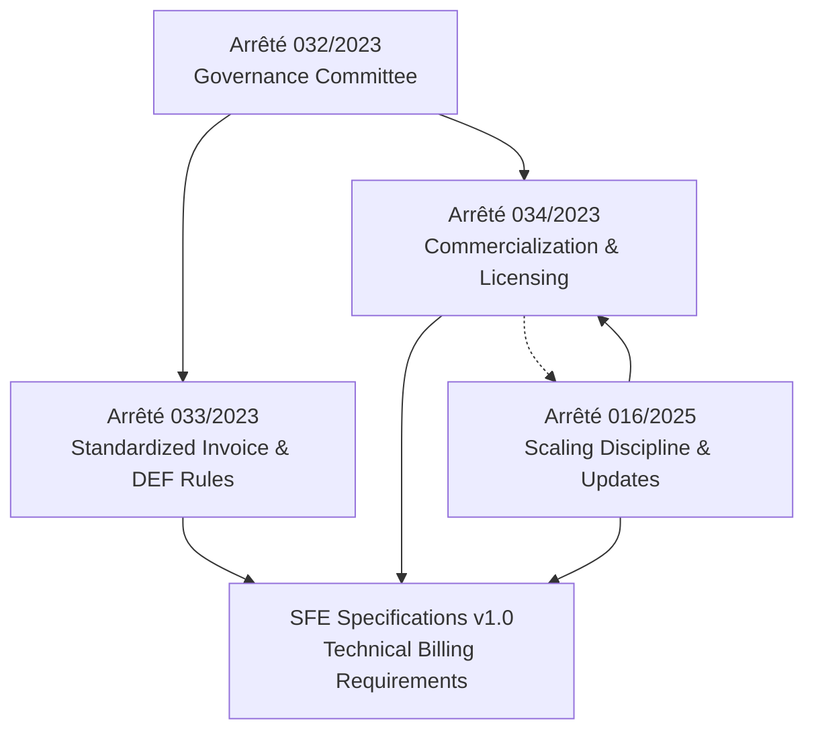

# DRC Fiscal Compliance Legal Framework

The Democratic Republic of Congo layers multiple ministerial orders and technical specifications to move every transaction through a **trusted fiscal control stack**. Stalela must navigate that stack: the governance machine that approves strategy, the operational rules that ban deleted invoices, the commercialization controls that limit who may sell hardware, the amendments easing scaling, and the SFE technical specification that defines what every compliant billing system must emit.

## Regulatory hierarchy

## Document summaries

| Document | Scope | Stalela impact |
| --- | --- | --- |
| **Arrêté 032/2023** | Creates the Comité de Suivi with Steering Committee, Technical Committee, and Secretariat that own governance, procurement, and documentation for the standardized invoicing reform. | Stay aligned with the committees, treat governance decisions as authoritative, keep documentation up to date, and position Stalela as a staffed technical partner rather than a pure vendor. |
| **Arrêté 033/2023** | Defines the mandatory issuance of standardized invoices, the dual (physical DEF + e-DEF) enforcement paths, device/fallback requirements, and the operational discipline every VAT-registered merchant must maintain. | Design Stalela so every sale is a fiscal event, support offline-first issuance with trusted security elements, include fallback hardware (USB device per outlet), and make error reporting realtime; expect inspectors everywhere. |
| **Arrêté 034/2023** | Regulates who may commercialize DEF and SFE products through pre-qualification, homologation, and distribution pipelines, with certified suppliers, distributors, and price transparency obligations. | Plan for a regulated sales channel: seek homologation, partner with distributors for installation/support, disclose pricing, and maintain spare parts / stock for at least three years. |
| **Arrêté 016/2025** | Adjusts commercialization rules by removing supply caps, adding two-year approval windows, clarifying which updates require re-homologation, and reinforcing distributor accountability. | Treat regulatory approvals as renewable (every two years), declare minor IMS updates instead of full re-cert, honor consistent pricing, and ensure distributors can cover training/support/territory responsibilities. |
| **SFE Specifications v1.0** | DGI technical requirements for certified enterprise billing systems: layered SFE → DEF → MCF → DGI architecture plus 14 tax groups, five invoice types, mandatory security elements, reports, offline behavior, and immutable storage. | Embed all five invoice types, implement every tax group/client classification, enforce security element generation in the hardware layer, produce Z/X/A/audit outputs, and respect immutability/offline expectations before any cloud sync. |

## Adoption timeline

| Date | Regulation | Milestone |
| --- | --- | --- |
| **2023-10-23** | Arrêté 032/033/034 | Governance body formed, standardized invoice rules enforced, and commercialization controls put in place; merchants had a three-month compliance window (extendable two months) and must keep approved hardware active. |
| **2025-02-27** | Arrêté 016/2025 | Supplier cap removed, approval validity capped at two years, minor software updates declarable, pricing discipline strengthened, and distributor obligations clarified to improve throughput. |
| **2023 (DGI)** | SFE Specifications v1.0 | Living technical reference for every billing system to integrate with DEF/MCF, enforce 14 tax groups, 5 invoice types, security elements, and mandated reports; treat as evergreen until superseded. |

## Key compliance deadlines & expectations

- **Rapid compliance window (Arrêté 033):** VAT-registered merchants had three months (plus two-month extension) to transition to approved invoicing systems. Stalela’s rollout must be fast because regulators expect no gaps.
- **Approval cadence (Arrêté 034 & 016/2025):** Pre-qualification and homologation reviews each take up to 30 working days; major modifications trigger re-homologation, while minor updates require declarations. Plan firmware/system changes with these gating periods in mind.
- **Renewal rhythm (Arrêté 016/2025):** Every homologated DEF/SFE approval lasts two years, so renewal processes must be resourced and scheduled before expiry.
- **Distribution commitments (Arrêté 034 & 016/2025):** Maintain 60-day replenishment pledges, three-year spare-part guarantees, consistent pricing disclosures, and accountable distributors covering onboarding and after-sales.
- **Technical observability (SFE spec):** Archives must retain invoices for at least one year, report outputs (Z/X/A/audit) must be generated locally, and every invoice must carry sequential fiscal number, device ID, signature, timestamp, and QR code before syncing; offline issuance remains normal operation.
- **Fallback & resilience (Arrêté 033):** Hardware failure is not an excuse—fallback systems must stay powered; replacement devices and offline queues must be ready immediately whenever connectivity or device issues occur.

## Phased compliance strategy

| Phase | Scope | Compliance approach |
|-------|-------|--------------------|
| **Phase 1 — Software Invoicing** | API-first invoicing platform with Cloud Signing Service (HSM) | Cloud HSM generates all security elements. Meets SFE requirements via software. Manual DGI submissions until MCF/e-MCF API is published. |
| **Phase 2 — POS & Retail** | POS SDK, multi-terminal, mobile money | POS terminals connect as API consumers. Cloud remains fiscal authority. |
| **Phase 3 — USB Hardware** | USB Fiscal Memory device (DEF) for DEF homologation | Optional USB device signs invoices locally. Cloud syncs sealed data to DGI. Full hardware homologation path. |
| **Phase 4 — Enterprise** | ERP connectors, fleet management, analytics | Enterprise integrations built on the established fiscal platform. |

## Implications for Stalela

1. **Governance alignment**: Treat the Steering and Technical Committees as the ultimate arbiters — submit architecture and compliance reports, engage politically, and log every decision for the Secretariat.
2. **Operational discipline**: The invoicing platform and Cloud Signing Service must enforce the layered mandate (SFE → trusted signer → MCF → DGI) with the append-only Fiscal Ledger, security elements, and per-outlet serialized numbering.
3. **Commercial readiness**: Homologation, distributor partnerships, pricing disclosures, spare parts, and two-year renewal plans are as critical as software delivery.
4. **Technical completeness**: Support all 14 tax groups, five invoice types, offline-first behavior, and mandated reports before reaching DGI; treat the SFE spec as a living contract even as regulatory details (e.g., QR payloads) evolve.

