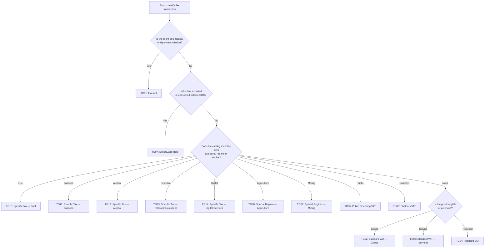

# DRC Tax Groups (TG01–TG14)

**Jurisdiction:** DR Congo (`CD`)  
**Authority:** DGI (Direction Générale des Impôts)  
**Manifest source:** DGI SFE Specifications v1.0  
**Canonical spec:** `spec/schema-tax-engine-1.md`

---

## Tax Group Matrix

| Code | Name | Default Rate | Typical Usage |
|------|------|--------------|---------------|
| TG01 | Exempt | 0% | Embassies, diplomatic transfers, NGOs |
| TG02 | Standard VAT — Goods | 16% | Domestic merchandise |
| TG03 | Standard VAT — Services | 16% | Professional and intangible services |
| TG04 | Reduced VAT | 9% | Essential food, medicine, medical devices |
| TG05 | Public Financing VAT | 16% | State-sponsored programs or subsidies |
| TG06 | Customs VAT | 16% | Import deliveries billed in CDF |
| TG07 | Export Zero Rate | 0% | Export invoices, cross-border services |
| TG08 | Special Regime — Agriculture | 5% | Agriculture supply chain participants |
| TG09 | Special Regime — Mining | 10% | Mining operators with an active license |
| TG10 | Specific Tax — Fuel | 25% | Gasoline, diesel, aviation fuel |
| TG11 | Specific Tax — Tobacco | 30% | Cigarettes, cigars, tobacco sheets |
| TG12 | Specific Tax — Alcohol | 20% | Distilled spirits, beer, wine |
| TG13 | Specific Tax — Telecommunications | 15% | Mobile voice, data, SMS bundles |
| TG14 | Specific Tax — Digital Services | 12% | SaaS, streaming, digital ads consumed in DRC |

The manifest version must travel with every invoice via `tax_group_manifest_version` so that audits can map totals to the rate set that was active at issuance.

---

## Decision Tree — Which Tax Group Applies?

This flowchart should be embedded into the product catalog taxonomy. At each branch, the catalog metadata must flag the appropriate tax group so that the invoicing platform never guesses a code. The `special` branch also checks for catalogue flags such as `is_excise`, `use_customs_rate`, or `special_regime_code`.

---

## Worked Examples

| Example | Item | Client Classification | Tax Group | Base (CDF) | Rate | Tax (CDF) | Notes |
|---------|------|-----------------------|-----------|------------|------|-----------|-------|
| 1 | Solar panels sold to a retailer | company | TG02 | 100,000 | 16% | 16,000 | Standard domestic goods. |
| 2 | Galenic medicine sold to a clinic | company | TG04 | 150,000 | 9% | 13,500 | Reduced regime (`is_essential` flag). |
| 3 | Digital consultancy to customer in Brussels | company | TG07 | 200,000 | 0% | 0 | Export zero-rate. |

---

## Implementation Guidance

1. Reference `spec/schema-tax-engine-1.md` for the authoritative TG## definitions and canonical schema fields before adding a new tax group code.
2. Drive the taxonomy (export vs. local, special regime, excise) through catalog metadata and client classification.
3. When the Cloud Signing Service returns the sealed fiscal response, persist `tax_summary` so you can regenerate Z/X/A reports that align with the manifest version.
4. Update `tax_group_manifest_version` whenever DGI publishes a new rate or adds a group; the spec file mirrors the latest manifest and should be the source of truth.
