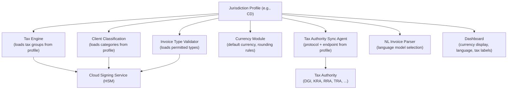

# Jurisdictions

The Stalela Fiscal Platform is **country-configurable**. Every piece of country-specific logic — tax groups, client classifications, invoice types, currencies, languages, regulatory frameworks, and tax authority sync protocols — is encapsulated in a **jurisdiction profile** identified by an [ISO 3166-1 alpha-2](https://en.wikipedia.org/wiki/ISO_3166-1_alpha-2) country code.

---

## What a Jurisdiction Defines

Each jurisdiction profile specifies:

| Layer | What's Configured | Example (DRC — `CD`) |
|---|---|---|
| **Tax Groups** | The set of tax group codes, names, default rates, and decision trees | TG01–TG14 (14 groups, rates from 0% to 30%) |
| **Client Classifications** | Buyer categories that drive tax behavior | individual, company, commercial_individual, professional, embassy |
| **Invoice Types** | Permitted invoice document types | sale, advance, credit_note, export, export_credit |
| **Currencies** | Default and accepted currencies, rounding rules | CDF (primary), USD (secondary), half-up to 0.01 |
| **Tax Authority** | Name, sync protocol, endpoint, authentication method | DGI — MCF/e-MCF protocol |
| **Regulatory Framework** | Legal mandates, compliance deadlines, certifications | Arrêtés 032/033/034, Arrêté 016/2025, SFE Specifications v1.0 |
| **Languages** | Supported UI/NLP languages | French, Lingala, Swahili, Tshiluba |
| **Fiscal ID Format** | The country's taxpayer identification number format | NIF (Numéro d'Identification Fiscale) |

---

## How Jurisdiction Flows Through the Platform



The `jurisdiction` field travels with every canonical invoice. The Tax Engine, Client Classification validator, and Invoice Type validator all load their rules from the jurisdiction profile before processing an invoice.

---

## Canonical Invoice — Jurisdiction Field

Every canonical invoice includes a top-level `jurisdiction` field:

```json
{
  "jurisdiction": "CD",
  "merchant_tin": "NIF-123456",
  "outlet_id": "outlet-001",
  ...
}
```

The `jurisdiction` code determines which tax group manifest, client classifications, invoice types, and rounding rules apply. See [Canonical Payloads](../00-foundation/canonical-payloads.md) for the full schema.

---

## Supported Jurisdictions

| Code | Country | Tax Authority | Status | Profile |
|---|---|---|---|---|
| `CD` | DR Congo | DGI (Direction Générale des Impôts) | **Active — reference implementation** | [DRC Profile →](cd/index.md) |
| `ZW` | Zimbabwe | ZIMRA (Zimbabwe Revenue Authority) | Planned | [Zimbabwe →](zw/index.md) |
| `KE` | Kenya | KRA (Kenya Revenue Authority) | Planned | [Kenya →](ke/index.md) |
| `RW` | Rwanda | RRA (Rwanda Revenue Authority) | Planned | [Rwanda →](rw/index.md) |
| `TZ` | Tanzania | TRA (Tanzania Revenue Authority) | Planned | [Tanzania →](tz/index.md) |
| `NG` | Nigeria | FIRS (Federal Inland Revenue Service) | Planned | [Nigeria →](ng/index.md) |
| `ZA` | South Africa | SARS (South African Revenue Service) | Planned | [South Africa →](za/index.md) |

---

## Adding a New Jurisdiction

To add support for a new country:

1. **Create a folder** at `40-jurisdictions/{country_code}/` using the [Country Profile Template](country-profile-template.md).
2. **Define the tax group manifest** — codes, names, rates, and a decision tree.
3. **Define client classifications** — buyer categories and their tax behavior.
4. **Define invoice types** — permitted document types with labels in the local language.
5. **Document the currency model** — default currency, secondary currencies, rounding rules.
6. **Document the tax authority integration** — protocol, endpoints, authentication, sync pipeline.
7. **Document the regulatory framework** — laws, mandates, compliance deadlines.
8. **Register the jurisdiction** in the `mkdocs.yml` navigation and the table above.
9. **Map the fiscal ID format** — what the country calls its taxpayer identification number and how it maps to `merchant_tin`.

Each jurisdiction is self-contained. The core Fiscal Platform engine (tax engine, signing service, ledger, sync agent) remains unchanged — only the configuration varies.
