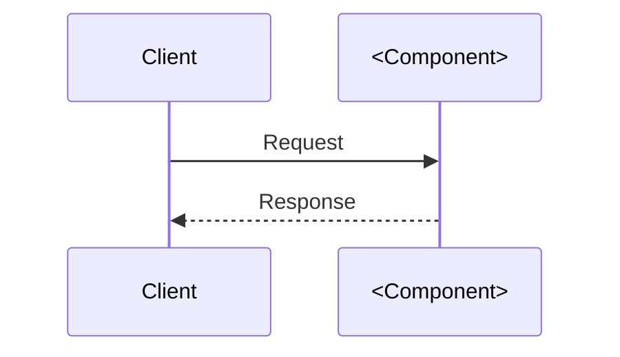

# <Component Name>

**Purpose**  
One sentence on why this exists.

## Responsibilities
- ...

## Interfaces
### Inputs
- Events: ...
- HTTP: ...

### Outputs
- Events: ...
- HTTP: ...

## Data Model
- Tables / storage / retention / PII

## Algorithms / Rules
- Key flows and validation logic

## Diagrams

## Failure Modes & Retries
- ...

## Observability
- Metrics / logs / traces

## Security
- Secrets / authn/z / PII / PCI

## Runbooks
- ...

