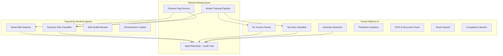

# AI Capabilities

The Stalela Platform embeds AI across both product pillars. This page provides a unified view of all AI capabilities, their ownership, shared infrastructure, and phased rollout.

---

## Design Principles (Shared)

1. **AI assists, humans (and HSMs) decide.** AI agents suggest, classify, and monitor. The Cloud Signing Service remains the sole fiscal authority; the CTS deterministic orchestration pipeline has final say on routing.
2. **Human-in-the-loop by default.** AI suggestions are presented for review before becoming fiscal events or routing overrides. Confidence thresholds gate auto-approval.
3. **Multilingual-first.** NLP models support French (primary), Lingala, Swahili, Tshiluba, and English. Payment agents are language-agnostic (structured JSON only).
4. **Privacy-preserving.** Training data stays within the Stalela cloud boundary. No cross-tenant training. Models are fine-tuned per merchant or on anonymized aggregate data.
5. **Observable.** Every AI suggestion, confidence score, and human override is logged with `ai_suggestion_id`, `model_version`, and `accepted: true/false`. OpenTelemetry traces span agent calls.

---

## Capability Map



---

## Payments Nucleus Agents

These agents are documented in full at [Orchestration AI Agents](../10-payments-nucleus/components/orchestration-ai-agents.md). Summary:

| Agent | Purpose | Invocation | Phase |
|---|---|---|---|
| **Smart Rail Selector** | Rank available rails against policy weights and runtime health. Optimizes for cost, reliability, or speed. | Synchronous — CTS orchestration pipeline, pre-Directory | Sprint 1+ |
| **Dynamic Risk Classifier** | Assign adaptive compliance tiers based on payer/payee metadata, device signals, and historical incidents. | Synchronous — CTS compliance step | Sprint 2+ |
| **Rail Health Monitor** | Track infrastructure health per rail (latency, failure rate, uptime). Emits `rail.flagged.degraded` when thresholds are breached. | Continuous streaming microservice on Event Bus | Sprint 1+ |
| **Orchestration Copilot** | Human-friendly explanations of routing decisions, diagnostics, and remediation guidance. | On-demand via CLI (`stalela ctl orchestration explain`) or Operator Console | Sprint 3+ |

**Fallback pattern:** If an agent call times out or errors, CTS reverts to deterministic Directory routing rules. `orchestration.fallback.used` is recorded with reason codes.

---

## Fiscal Platform AI

These capabilities are documented in full at [AI & NL Capabilities](../20-fiscal-platform/platform/ai-capabilities.md). Summary:

| Capability | Purpose | Input | Phase |
|---|---|---|---|
| **NL Invoice Parser** | Create sealed invoices from natural language (French, Lingala, Swahili, Tshiluba). | WhatsApp, Chat, REST API, Voice | Phase 2 (text) / Phase 4 (voice) |
| **Tax Auto-Classifier** | Suggest DGI tax group (TG01–TG14) from item description or HS code. | Item text, optional HS code | Phase 2 |
| **Anomaly Detection** | Monitor Fiscal Ledger for numbering gaps, velocity spikes, void/refund anomalies, and tax group distribution shifts. | Fiscal Ledger events | Phase 2 (rules) / Phase 4 (ML) |
| **Predictive Analytics** | Tax liability forecast, revenue projection, seasonal demand, compliance risk scoring. | Historical fiscal data | Phase 4 |
| **OCR & Document Digitization** | Ingest paper invoices as structured data for record-keeping or purchase ledger entry. | Camera photo, scanned PDF | Phase 4 |
| **Smart Search & Insights** | Natural language queries over fiscal data ("Total TVA pour ciment en Q3 2026"). | Free-text search bar | Phase 4 |
| **Compliance Monitor** | NLP-based detection of regulatory changes (new arrêtés, rate changes, exemption updates). | DGI website, official gazette | Phase 4 |

---

## Cross-Pillar Interactions

The AI layers of each pillar are **decoupled** — they do not call each other directly. Where their outputs relate:

| Scenario | Payments Agent | Fiscal AI | Integration Point |
|---|---|---|---|
| **Invoice-then-pay** | Smart Rail Selector picks optimal rail | NL Invoice Parser creates the invoice | POS/client calls CTS after fiscal sealing; `endUserRef` = `fiscal_number` |
| **Risk + Compliance** | Dynamic Risk Classifier assigns risk tier to transfer | Anomaly Detection flags suspicious invoice patterns | Both publish to Event Bus; Operator Console shows correlated alerts per merchant |
| **Health monitoring** | Rail Health Monitor flags degraded mobile money rail | — | POS can warn cashier before attempting mobile money collection |

---

## Model Hosting & Infrastructure

| Component | Technology | Pillar | Latency Target |
|---|---|---|---|
| Smart Rail Selector | Policy-weighted scoring + optional ML re-ranking | Payments | < 200 ms |
| Dynamic Risk Classifier | Gradient-boosted classifier on entity features | Payments | < 300 ms |
| NL Invoice Parser | Fine-tuned multilingual LLM (mT5 / Mistral) + RAG | Fiscal | < 2 s |
| Tax Auto-Classifier | Gradient-boosted classifier + embedding similarity | Fiscal | < 500 ms |
| Anomaly Detection | Isolation Forest + rule engine | Fiscal | Near-real-time (streaming) |
| Predictive Analytics | Prophet / ARIMA time-series | Fiscal | Batch (< 30 s per forecast) |
| Smart Search | Text-to-SQL (CodeLlama / StarCoder) | Fiscal | < 1 s |

All models run on dedicated compute within the Stalela cloud boundary. No customer data is sent to third-party providers unless the merchant opts in with a DPA.

---

## API Surface

### Payments Nucleus

Agents are invoked internally by the CTS pipeline. The Orchestration Copilot is accessible via:

```
stalela ctl orchestration explain --transfer-id=tr_789
```

### Fiscal Platform

| Endpoint | Method | Description | Phase |
|---|---|---|---|
| `/api/v1/invoices/natural` | POST | Create invoice from NL text | Phase 2 |
| `/api/v1/tax/classify` | POST | Classify items into DGI tax groups | Phase 2 |
| `/api/v1/analytics/anomalies` | GET | List detected anomalies | Phase 2 |
| `/api/v1/analytics/forecast` | GET | Retrieve predictive forecasts | Phase 4 |
| `/api/v1/ocr/scan` | POST | Upload document for OCR extraction | Phase 4 |
| `/api/v1/search/query` | POST | Natural language search over fiscal data | Phase 4 |

All endpoints inherit the same authentication (Bearer token), rate limiting, and tenant isolation as the core APIs.
