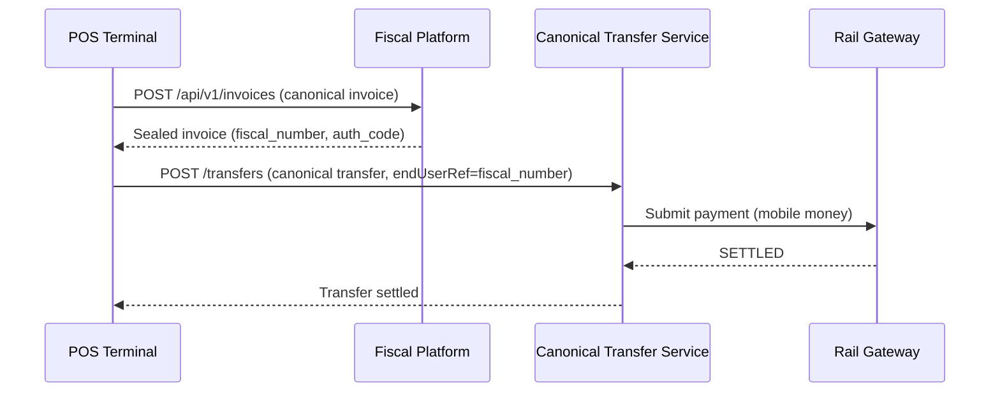

# Canonical Payloads

Both pillars of the Stalela Platform use a **contract-first, deterministic payload** as their core abstraction. The two schemas serve entirely different domains and are never merged — their separation is the architectural guarantee of decoupling.

---

## Side-by-Side Comparison

| Aspect | Canonical Transfer (Payments) | Canonical Invoice (Fiscal) |
|---|---|---|
| **Purpose** | Move money between accounts across rails | Create a sealed, fiscally compliant invoice |
| **Submitted to** | Canonical Transfer Service (CTS) | Cloud Signing Service (HSM) via Invoicing API |
| **Result** | Transfer lifecycle (INITIATED → SETTLED) | Sealed invoice with fiscal number + signature |
| **Identity scope** | `tenantId` + `cisEntityId` (payer/payee) | `merchant_tin` + `outlet_id` + `jurisdiction` |
| **Idempotency** | `idempotencyKey` (36h TTL) | Fiscal number (monotonic, never reused) |
| **Offline behavior** | Outbox + DLQ retry | IndexedDB queue → flush on reconnect |
| **Append-only** | GL Ledger postings (double-entry) | Hash-chained Fiscal Ledger (prev-hash linked) |
| **Deletion** | Never — corrections via return/reversal events | Never — corrections via credit note fiscal events |

---

## Canonical Transfer Schema (Payments Nucleus)

```json
{
  "tenantId": "tenant_abc",
  "idempotencyKey": "uuid-v4",
  "intent": "PUSH",
  "amount": { "value": "100.00", "currency": "USD" },
  "sourceCurrency": "USD",
  "targetCurrency": "ZAR",
  "fxStrategy": "AT_SOURCE",
  "payer": {
    "accountId": "acc_sender",
    "name": "Sender Corp",
    "institutionId": "inst_001",
    "cisEntityId": "id_abc123"
  },
  "payee": {
    "accountId": "acc_receiver",
    "name": "Receiver Ltd",
    "institutionId": "inst_002",
    "cisEntityId": "id_xyz789"
  },
  "railHints": ["payshap", "eft"],
  "feeModel": "SENDER_PAYS",
  "endUserRef": "INV-2026-001",
  "externalRef": "erp-ref-123",
  "metadata": {},
  "traceparent": "00-trace-id-span-id-01"
}
```

**Intents:** `AUTH` | `CAPTURE` | `PUSH` | `PULL`

**Lifecycle:** `INITIATED → SUBMITTED → ACCEPTED → SETTLED → (RETURNED | FAILED)`

---

## Canonical Invoice Schema (Fiscal Platform)

The invoice schema is jurisdiction-aware. The `jurisdiction` field (ISO 3166-1 alpha-2) determines which tax groups, client classifications, invoice types, and rounding rules apply. The example below shows a DRC (`CD`) invoice:

```json
{
  "jurisdiction": "CD",
  "merchant_tin": "NIF-123456",
  "outlet_id": "outlet-kinshasa-01",
  "pos_terminal_id": "term-001",
  "cashier_id": "cashier-jean",
  "invoice_type": "sale",
  "timestamp": "2026-02-23T14:30:00Z",
  "client": {
    "name": "Acme SARL",
    "tin": "NIF-789012",
    "classification": "company"
  },
  "items": [
    {
      "description": "Office supplies",
      "quantity": 10,
      "unit_price": "5.00",
      "tax_group": "TG01",
      "total": "50.00"
    }
  ],
  "tax_groups": [
    { "code": "TG01", "base": "50.00", "rate": "0.16", "amount": "8.00" }
  ],
  "totals": {
    "subtotal": "50.00",
    "tax": "8.00",
    "total": "58.00"
  },
  "payments": [
    { "method": "mobile_money", "provider": "airtel_money", "amount": "58.00", "currency": "CDF" }
  ]
}
```

!!! note "Jurisdiction-specific fields"
    The `tax_group` codes (e.g., `TG01`), `classification` values, `invoice_type` options, and `currency` are all defined by the active jurisdiction's [country profile](../40-jurisdictions/index.md). The schema structure is universal; the allowed values are jurisdiction-specific.

**Invoice types:** `sale` | `advance` | `credit_note` | `export` | `export_credit`

**Sealed response adds:** `fiscal_number`, `auth_code`, `signature`, `qr_payload`, `prev_hash`, `device_id`

---

## How They Interact

When a POS sale triggers both a fiscal event and a payment:



The key decoupling: the invoice is sealed **before** the payment is initiated. The fiscal event does not depend on payment success, and the payment does not depend on the invoice being sealed. The `endUserRef` field on the transfer links back to the `fiscal_number` for reconciliation, but neither system blocks on the other.

See [Integration: Invoice-then-Pay Sequence](../30-integration/sequence-invoice-then-pay.md) for the full flow.
