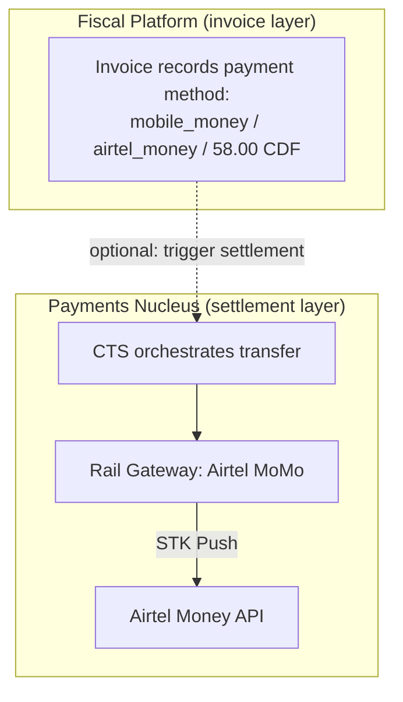

# Mobile Money

Mobile money is present in both pillars of the Stalela Platform, but at different layers. This page clarifies the distinction.

---

## Two Layers, One Payment Method

| Layer | What happens | When |
|---|---|---|
| **Fiscal Platform** | Records `mobile_money` as the payment instrument on a sealed invoice. No money moves — this is fiscal metadata. | Always (every invoice with a mobile money payment) |
| **Payments Nucleus** | Orchestrates actual money movement: initiates STK Push, tracks lifecycle (INITIATED → SETTLED), posts to GL Ledger. | When the merchant wants Stalela to settle the payment (not just record it) |

---

## Supported Providers

| Provider | Payments Nucleus Rail | Fiscal Platform Instrument | Markets |
|---|---|---|---|
| **Airtel Money** | `rail-gateway-airtel-momo` | `airtel_money` | DRC, ZW |
| **MTN MoMo** | `rail-gateway-mtn-momo` | `mtn_momo` | DRC |
| **M-Pesa (Vodacom)** | `rail-gateway-mpesa` (planned) | `mpesa` | DRC |
| **Orange Money** | `rail-gateway-orange` (planned) | `orange_money` | DRC |
| **EcoCash** | `rail-gateway-ecocash` | `ecocash` | ZW |

---

## Integration Pattern

When a POS sale uses mobile money, the two layers interact:

1. **POS** builds a canonical invoice with `payments: [{ method: "mobile_money", provider: "airtel_money", amount: "58.00", currency: "CDF" }]`
2. **Fiscal Platform** seals the invoice → returns fiscal number + auth code
3. **POS** (optionally) calls `POST /transfers` on the CTS with `endUserRef` = fiscal number, `railHints: ["airtel_momo"]`
4. **CTS** routes to the Airtel MoMo rail gateway → STK Push to customer's phone
5. Customer approves → rail confirms SETTLED → CTS emits `transfer.settled` event
6. POS updates the invoice record with the payment confirmation reference

Step 3 is **optional**. Many DRC merchants accept mobile money payments out-of-band (customer pays directly from their phone app) and the POS simply records the transaction reference on the invoice. The CTS integration is for merchants who want Stalela to initiate and track the payment.

---

## USD / CDF Dual Currency

DRC businesses routinely price in USD and accept payment in CDF at the daily exchange rate. Both pillars handle this:

- **Fiscal Platform**: The invoice records `totals` in the transaction currency (USD) and the `payments` array records the actual amount tendered in CDF. The tax engine computes tax in the invoicing currency.
- **Payments Nucleus**: The CTS supports `sourceCurrency` / `targetCurrency` with `fxStrategy` to handle cross-currency settlement.

Split payments (part USD cash, part CDF mobile money) are a Phase 1 requirement for the Fiscal Platform and are supported natively in the `payments` array.
