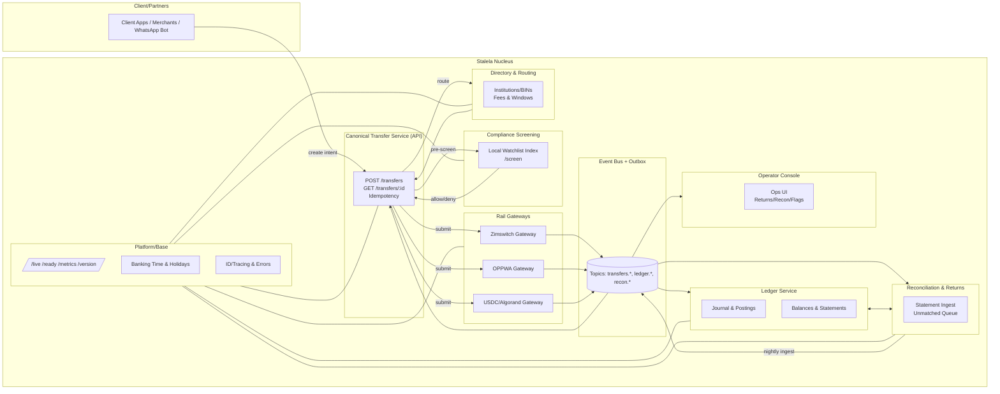
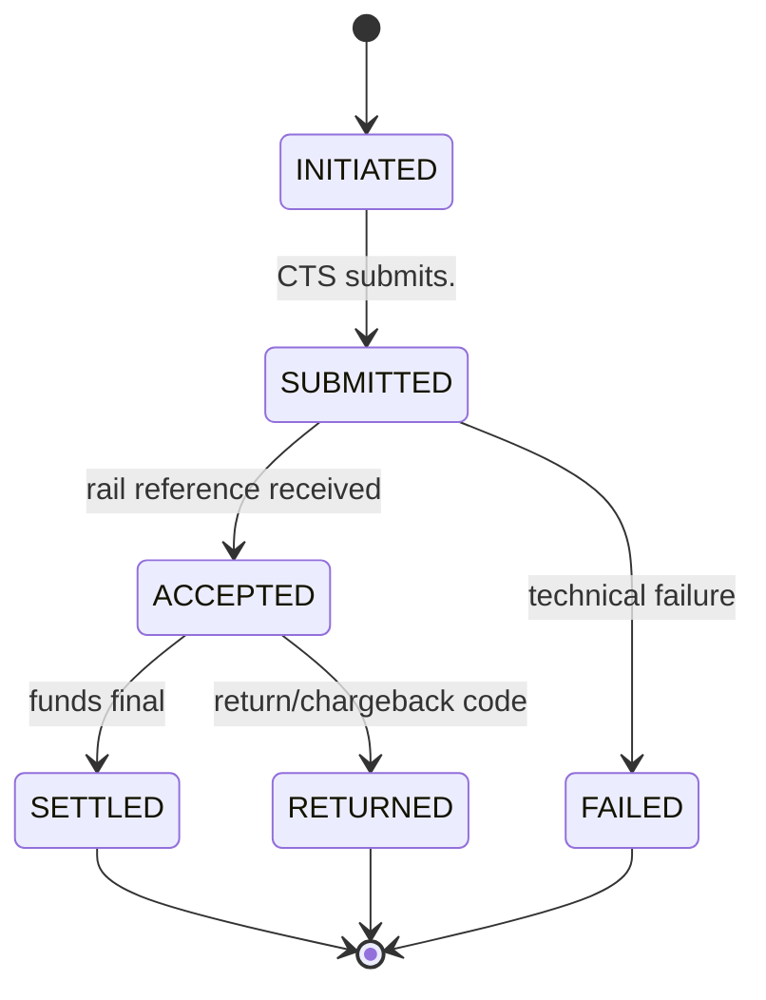

# Stalela Nucleus

The **Stalela nucleus** is the boring, strict, event-driven core of the platform.  
It orchestrates all money movement across rails (USDC/Algorand, Zimswitch/OPPWA, EFT, mobile money) while enforcing compliance, ledger discipline, and reconciliation.

---

## 🎯 Purpose

The nucleus exists to:
- Provide a **single canonical model** for all transfers.  
- Keep rail-specific logic isolated in **gateways**.  
- Guarantee **double-entry correctness** via the ledger.  
- Ensure **compliance and reconciliation** are first-class, not bolted on.  
- Emit **domain events** so every change is observable and auditable.  

---

## 🧩 Components at a Glance

- **Canonical Transfer Service (CTS)** → orchestrates transfer lifecycle, idempotency, emits events.  
- **Rail Gateways** → adapters for each rail, strict spec validation, submit & emit rail outcomes.  
- **Ledger Service** → double-entry postings, balances, statements.  
- **Compliance Screening** → fast local allow/deny; pre-submit & delta re-screens.  
- **Directory & Routing** → institutions, BINs, fees, settlement windows.  
- **Reconciliation & Returns** → ingest statements, match transfers, manage returns/exceptions.  
- **Event Bus + Outbox** → exactly-once event delivery; glue between services.  
- **Platform/Base** → shared utilities (admin, time, IDs, error handling, migrations).  
- **Operator Console** → human control surface for exceptions, flags, returns.  

---

## 🏗️ Component Diagram



---

## 🔄 Transfer Lifecycle (State Machine)



---

## 📜 Contracts

### Event Envelope
```json
{
  "eventId": "uuid",
  "type": "transfers.settled",
  "occurredAt": "2025-08-26T10:15:01Z",
  "transferId": "tr_12345",
  "tenantId": "tn_67890",
  "payload": { "amount": { "value": 100, "currency": "ZAR" }, "rail": "zimswitch" }
}
```

### Canonical Transfer
```json
{
  "transferId": "tr_12345",
  "tenantId": "tn_67890",
  "payer": { "accountId": "acct_001" },
  "payee": { "accountId": "acct_999" },
  "amount": { "value": 1000, "currency": "USD" },
  "rail": "usdc-algo",
  "intent": "PUSH",
  "externalRef": "ext_abc123",
  "metadata": { "invoiceId": "inv_555" },
  "state": "SUBMITTED"
}
```

### Posting
```json
{
  "postingId": "pst_001",
  "transferId": "tr_12345",
  "debitAccountId": "acct_001",
  "creditAccountId": "acct_999",
  "amount": { "value": 1000, "currency": "USD" },
  "memo": "Payment settlement",
  "occurredAt": "2025-08-26T10:15:01Z"
}
```

---

## ✅ Non-Negotiables

- Strict validation at rail gateways (no malformed messages pass).  
- Exactly-once events (via outbox + idempotent consumers).  
- Double-entry always balanced.  
- Compliance pre-screen mandatory before submission.  
- Reconciliation nightly, exceptions reviewed before books close.  
- Operator console required for human resolution.  

---

## 📈 SLOs

- API latency (P99, `POST /transfers`): ≤ 250 ms (excluding rail response).  
- Event publish lag (P99): ≤ 1 s.  
- Ledger posting latency (P99): ≤ 1 s after `settled`.  
- Reconciliation match rate: ≥ 99.8% same day, 100% by T+1.  
- Idempotency collision rate: 0%.  

---

**Next step:** See [../10-components/canonical-transfer-service.md](../10-components/canonical-transfer-service.md) for detailed pages on each service.
