## Canonical Transfer Service (CTS) — System Design Document

The Canonical Transfer Service (CTS) is the front door and conductor of Storo. It provides a single API for creating and managing transfers, normalizes requests into a canonical format, enforces idempotency, screens entities, routes transfers, and emits domain events.

---

### 1. Introduction

- Purpose: Define an actionable, auditable, and operable System Design for CTS.
- Scope: CTS handles submission and tracking of transfers; it does not execute rail-specific protocols directly, compute ledger postings, or perform KYC—those are delegated to Gateways, Ledger, and Compliance.
- Audience: Backend engineers, SRE/Platform, Security/Compliance, Product.

---

### 2. Background & Context

- Multi-tenant, regulated data, event-driven architecture with transactional outbox and eventual consistency for downstream consumers.
- CTS upstream: clients/integrators. Downstream: Compliance, Directory & Routing, Rail Gateways, Ledger (via events), Observability stack.

Mermaid Context (C4 Level 1)


Assumptions/Constraints
- Eventual consistency for downstream consumers; synchronous path returns latest known state.
- Per-tenant authentication and authorization.
- Exactly-once event publishing via transactional outbox.
- PII encrypted at rest; PII exclusion in logs.

---

### 3. Functional Requirements

- Accept API requests: `POST /transfers`, `GET /transfers`, `GET /transfers/:id`.
- Deduplicate via idempotency key + request body hash.
- Validate and normalize into canonical schema.
- Pre-screen entities with Compliance.
- Route via Directory & Routing.
- Persist transfers and lifecycle state.
- Emit events: `transfers.initiated`, `transfers.submitted.<rail>` and consume `accepted/settled/returned/failed`.

API contracts (summary)

| Method | Path | Required Headers | Success | Notes |
|---|---|---|---|---|
| POST | /transfers | Authorization, Idempotency-Key, X-Canonical-Version | 201 with resource or 200 on idempotent replay | Request validated against canonical model |
| GET | /transfers/:id | Authorization | 200 | Returns transfer details + timeline |

Canonical Request (excerpt)
```json
{
  "tenantId": "tnt_123",
  "intent": "PUSH",
  "amount": { "value": "100.00", "currency": "USD" },
  "sourceCurrency": "USD",
  "targetCurrency": "USD",
  "fxStrategy": "NOT_APPLICABLE",
  "payer": { "type": "WALLET", "id": "payer-abc" },
  "payee": { "type": "BANK", "id": "payee-xyz" },
  "railHints": ["usdc-algo"],
  "feeModel": "STORO_STANDARD",
  "endUserRef": "end-user-55",
  "externalRef": "client-789",
  "metadata": { "purpose": "invoice-42" },
  "traceparent": "00-4bf92f3577b34da6a3ce929d0e0e4736-00f067aa0ba902b7-00"
}
```

---

### 4. Non-Functional Requirements

Prod targets

| Category | Target | Notes |
|---|---|---|
| Performance | Total p99 ≤ 2.5s; ingress→screen (≤800ms), screen→route (≤400ms), route→submit (≤1.5s) | Timeouts enforced per integration |
| Availability | 99.95% monthly SLO; error budget 21.6m/mo | Excludes third-party outages beyond retry budget |
| Throughput | Baseline 200 TPS; burst 1,000 TPS (5 min) | HPA + queue smoothing |
| Scalability | Horizontal scale by stateless API; partition by tenantId/transferId | Stickiness not required |
| Security & Privacy | OAuth2 client-cred or HMAC per tenant; TLS 1.2+; PII encrypted at rest | Logs redact PII |
| Reliability | Idempotency (36h TTL); transactional outbox with retries; DLQ | Exactly-once publish semantics |
| Compliance/Audit | Immutable events; correlation IDs; retention ≥ 7 years (configurable) | WORM storage optional |

Pilot targets (20 merchants, 100 tx/merchant/day ≈ 2k/day)

| Category | Target | Notes |
|---|---|---|
| Performance | p95 ≤ 2.5s at ≤ 10 TPS burst | Serverless/Lambda timeouts sized accordingly |
| Availability | 99.9% monthly SLO | Single-region acceptable for pilot |
| Throughput | ≈ 0.023 TPS avg (2k/day); bursts ≤ 10 TPS | Sized for lunchtime peaks |

---

### 5. Architecture & Design

5.1 Container (C4 Level 2)


Sync vs Async and Backpressure
- Sync: API→Compliance, API→Directory, DB writes.
- Async: Outbox→Event Bus→Gateways; inbound events→STATE.
- Backpressure: rate limiting at API, bounded outbox worker concurrency, consumer lag alerts.

Amount precision and rounding
- Store monetary values as `NUMERIC(20,8)`; define per-currency scale (e.g., USD scale=2).
- Rounding mode: bankers rounding (round half to even) when converting to rail decimals.
- Validate min/max per currency; reject out-of-range with 400.

End-user considerations (double/triple entry)
- Each merchant transfer often involves an end user (payer). Model end-user references (`endUserRef`) in the canonical payload where applicable.
- For accounting that affects multiple ledgers (merchant wallet, end-user wallet, fees/taxes), ensure events carry sufficient references to support downstream double/triple-entry postings in the Ledger service.
- CTS remains canon/orchestrator and does not compute postings, but must not drop identifiers necessary for downstream accounting integrity.

5.2 Component (C4 Level 3) — Inside CTS


5.3 Sequence Diagrams

Happy Path (USDC) — non-blocking settlement

```mermaid
sequenceDiagram
  autonumber
  participant Client
  participant API as CTS/API
  participant Cmp as Compliance
  participant Dir as Directory
  participant DB as CTS/DB
  participant OB as OutboxWorker
  participant Bus as EventBus
  participant GW as Gateway(USDC)

  Client->>API: POST /transfers {Idempotency-Key, Authorization}
  API->>API: validate + canonicalize (hash, X-Canonical-Version)
  API->>Cmp: screen(payer,payee) [timeout 800ms, 2x retry]
  Cmp-->>API: allow
  API->>Dir: route(intent, payee) [timeout 400ms]
  Dir-->>API: rail=usdc, endpoint
  API->>DB: begin tx
  DB-->>API: insert transfer(state=SUBMITTED)
  DB-->>API: insert outbox(event=submitted.usdc)
  API-->>DB: commit
  API-->>Client: 201 Location:/transfers/:id {transferId, state: SUBMITTED, requestId}
  OB->>Bus: publish events.transfers.submitted.usdc (exp backoff)
  Bus-->>GW: deliver
  GW-->>Bus: events.transfers.accepted
  Bus-->>API: accepted → update state
  GW-->>Bus: events.transfers.settled
  Bus-->>API: settled → update projections

```


Duplicate Submission


Compliance Deny


Routing Unavailable


- When Directory reports a closed settlement window (e.g., EFT cutoff), propagate `retryAfter` aligned with the next open window. Clients must back off until that timestamp; CTS logs the incident for analytics.

Outbox Retry & DLQ

```mermaid
sequenceDiagram
  participant OB as OutboxWorker
  participant Bus as EventBus
  OB->>Bus: publish
  alt failure
    OB->>OB: attempts++ backoff(1s→5s→30s→2m→10m→1h→2h→4h→8h→16h)
  else success
    OB->>OB: mark SENT
  end
  note over OB: DLQ after N=10 attempts (poison)
```


5.4 State Machine


5.5 Data Flow


**Read-model list semantics**
- Backed by a denormalized `transfer_summaries` projection populated from lifecycle events and command writes.
- Cursor pagination uses `(tenantId, createdAt DESC, transferId)` encoded inside `pageToken` to avoid skipping rows during concurrent inserts.
- Filters: `state[]`, `intent[]`, `rail[]`, `fxStrategy[]`, `createdAtFrom/To`, `updatedAtFrom/To`, `externalRef`, `endUserRef`; default window capped to 90 days of hot storage.
- Response omits encrypted payer/payee blobs; only stable references (`payerRef`, `payeeRef`) and operational metadata are exposed.
- Consistency: eventual—projections catch up within seconds; POST/GET-by-id remain the authoritative source immediately after writes.
- Authorization and throttling enforced per-tenant; list endpoint has stricter rate limits to protect OLTP workloads.

5.6 Deployment View


5.7 Key Design Topics (ADR-style)

| Topic | Decision | Alternatives | Rationale | Consequences |
|---|---|---|---|---|
| Idempotency | `Idempotency-Key` + SHA256(normalized body) unique per tenant; TTL 36h | Key-only; body-only | Prevents divergent bodies on same key; aligns with retention window | Store hash; shard hot tenants |
| Outbox Pattern | Same-DB transactional outbox; ordered per `transferId`; backoff 1s→5s→30s→2m→10m→1h→2h→4h→8h→16h; DLQ at 10 | Dedicated streaming bus (Kafka) | Simpler atomicity; avoids dual-write | Worker lag can grow → monitor/autoscale |
| Routing | Cache TTL 5m; negative cache 45s; deterministic rules; quirks in gateways | Longer TTL | Balanced freshness vs cost | Possible staleness → admin bust |
| Multitenancy | Row-level scope by `tenantId`; per-tenant quotas; per-tenant secrets | DB schemas per tenant | Simpler ops; shared pool | Strong tenancy guard required |
| Schema Evolution | Canonical SemVer; `X-Canonical-Version`; events `envelope.v` (BACKWARD) | Ad-hoc | Predictable upgrades | Maintain registry and migrations |
| Consistency | Non-blocking settlement; POST 201/200 with `state=SUBMITTED` + Location | Synchronous settlement | Lower latency; simpler SLAs | Clients must poll/subscribe |
| Concurrency (OCC) | `transfers.version` BIGINT; `WHERE transferId AND version`; bump version | Pessimistic locks | Avoids locks; suits serverless | 409s/retries on conflicts |
| Observability | W3C traceparent; metrics by `tenantId`,`rail`,`state`; PII-safe logs | None | Traceability and SLOs | Watch label cardinality |
| Backpressure | Token-bucket per tenant; bounded workers; circuit breakers | Unlimited | Protects core systems | Graceful shedding under load |
| Error Taxonomy | 4xx (validation/deny), 409 (idempotency/OCC), 429 (rate limits), 5xx (internal/502 routing) | Loose mapping | Clear client behavior | Easier debugging and SLAs |

---

### 6. Data Model

Tables

#### Transfers

| Column | Type | Nullable | Notes |
|---|---|---|---|
| transferId | UUID | no | PK |
| tenantId | TEXT | no | partition key |
| payer | JSONB | no | PII encrypted-at-rest |
| payee | JSONB | no | PII encrypted-at-rest |
| amount_value | NUMERIC(20,8) | no | |
| amount_currency | CHAR(3) | no | ISO-4217 or pseudo |
| source_currency | CHAR(3) | yes | defaults to amount currency |
| target_currency | CHAR(3) | yes | set for FX conversions |
| fx_strategy | TEXT | yes | NOT_APPLICABLE \| QUOTE_AT_SUBMIT \| PASS_THROUGH |
| rail | TEXT | no | e.g., usdc, zimswitch |
| intent | TEXT | no | AUTH|CAPTURE|PUSH|PULL |
| externalRef | TEXT | yes | client reference |
| feeModel | TEXT | yes | tariff applied to calculate fees |
| endUserRef | TEXT | yes | downstream end-user correlation |
| state | TEXT | no | INITIATED|SUBMITTED|... |
| createdAt | TIMESTAMP WITH TZ | no | |
| updatedAt | TIMESTAMP WITH TZ | no | |
| version | BIGINT | no | optimistic locking counter (default 0) |

Indexes/Constraints
- PK: `(transferId)`
- IDX: `(tenantId, createdAt)`
- Unique: `(tenantId, externalRef)` nullable unique

#### Transfer Events

| Column | Type | Nullable | Notes |
|---|---|---|---|
| eventId | UUID | no | PK |
| transferId | UUID | no | FK → transfers |
| type | TEXT | no | initiated/submitted/accepted/... |
| payload | JSONB | no | envelope v=1 |
| occurredAt | TIMESTAMP WITH TZ | no | event time |

Indexes
- PK: `(eventId)`
- IDX: `(transferId, occurredAt)`
- Unique: `(transferId, type)` for lifecycle uniqueness

#### Transfer Summaries (Read Model)

| Column | Type | Nullable | Notes |
|---|---|---|---|
| tenantId | TEXT | no | partition key |
| transferId | UUID | no | PK with tenant |
| state | TEXT | no | latest lifecycle state |
| intent | TEXT | no | AUTH\|CAPTURE\|PUSH\|PULL |
| rail | TEXT | no | routed rail |
| amount_value | NUMERIC(20,8) | no | denormalized from transfer |
| amount_currency | CHAR(3) | no | |
| source_currency | CHAR(3) | yes | |
| target_currency | CHAR(3) | yes | |
| fx_strategy | TEXT | yes | |
| externalRef | TEXT | yes | |
| endUserRef | TEXT | yes | |
| payerRef | TEXT | yes | stable reference only |
| payeeRef | TEXT | yes | stable reference only |
| version | BIGINT | no | mirrors write model version |
| createdAt | TIMESTAMP WITH TZ | no | for cursor pagination |
| updatedAt | TIMESTAMP WITH TZ | no | |
| latestEventType | TEXT | yes | audit of final lifecycle event |
| latestEventAt | TIMESTAMP WITH TZ | yes | |

Indexes
- PK: `(tenantId, transferId)`
- IDX: `(tenantId, createdAt DESC, transferId)` for cursor pagination
- IDX: `(tenantId, state, createdAt DESC, transferId)` for backlog filtering
- IDX: `(tenantId, externalRef)` partial on non-null

#### Outbox Transfers

| Column | Type | Nullable | Notes |
|---|---|---|---|
| id | UUID | no | PK |
| eventType | TEXT | no | e.g., transfers.submitted.usdc |
| payload | JSONB | no | event data |
| state | TEXT | no | PENDING|SENT|FAILED |
| attempts | INT | no | default 0 |
| lastError | TEXT | yes | latest error |
| createdAt | TIMESTAMP WITH TZ | no | |
| updatedAt | TIMESTAMP WITH TZ | no | |

Indexes
- IDX: `(state, createdAt)`
- IDX: `(eventType)`

#### Idempotency

| Column | Type | Nullable | Notes |
|---|---|---|---|
| tenantId | TEXT | no | |
| idempotencyKey | TEXT | no | |
| bodyHash | CHAR(64) | no | sha256 |
| transferId | UUID | no | |
| createdAt | TIMESTAMP WITH TZ | no | TTL policy ≥ 36h |

Indexes
- Unique: `(tenantId, idempotencyKey, bodyHash)`

#### Routing Cache (optional)

| Column | Type | Nullable | Notes |
|---|---|---|---|
| key | TEXT | no | hashed routing tuple |
| value | JSONB | no | route details |
| expiresAt | TIMESTAMP WITH TZ | no | ttl |

Sample Rows (illustrative)
```json
{
  "transfers": [
    {"transferId":"a1b2","tenantId":"t1","amount_value":"100.00","amount_currency":"USD","rail":"usdc","intent":"PUSH","state":"SUBMITTED"}
  ],
  "outbox_transfers": [
    {"id":"o1","eventType":"transfers.submitted.usdc","state":"PENDING","attempts":0}
  ]
}
```

Retention
- `idempotency`: TTL 36h (GC job)
- `transfer_events`: hot in OLTP 90 days; archive to object store thereafter
- `outbox_transfers`: keep SENT 7 days; FAILED until resolved

Indexes and constraints (additions)

- Idempotency
```sql
CREATE UNIQUE INDEX ux_idempotency
  ON idempotency(tenantId, idempotencyKey, bodyHash);
-- Optional partial unique within 36h window
CREATE UNIQUE INDEX ux_idempotency_window
  ON idempotency(tenantId, idempotencyKey, bodyHash)
  WHERE createdAt > now() - interval '36 hours';
```

- ExternalRef
```sql
CREATE UNIQUE INDEX ux_transfers_externalref
  ON transfers(tenantId, externalRef)
  WHERE externalRef IS NOT NULL;

-- Optionally include intent to reduce collisions
CREATE UNIQUE INDEX ux_transfers_externalref_intent
  ON transfers(tenantId, intent, externalRef)
  WHERE externalRef IS NOT NULL;
```

- Events uniqueness
```sql
CREATE UNIQUE INDEX ux_events_lifecycle
  ON transfer_events(transferId, type);
-- If a rail can emit multiple of the same type
CREATE UNIQUE INDEX ux_events_seq
  ON transfer_events(transferId, type, seq);
```

- Optimistic locking
```sql
-- Column already defined: version BIGINT NOT NULL DEFAULT 0
-- Guarded update example
UPDATE transfers
SET state = $1, version = version + 1, updatedAt = now()
WHERE transferId = $2 AND version = $3;
```
Behavior: return 409/Retry on no-row-updated for external callers; internal workers retry with jitter/backoff.

---

### 7. Interfaces & Contracts

HTTP APIs

POST /transfers
```http
POST /transfers HTTP/1.1
Authorization: Bearer <token>
Idempotency-Key: 6f1e2...
X-Canonical-Version: 1
Content-Type: application/json
```
Request
```json
{
  "tenantId":"t1",
  "intent":"PUSH",
  "amount":{"value":"100.00","currency":"USD"},
  "payer":{"type":"WALLET","id":"payer-1"},
  "payee":{"type":"WALLET","id":"payee-9"},
  "externalRef":"inv-42"
}
```
Responses
```json
// 201 Created (first time)
{"transferId":"a1b2","state":"SUBMITTED","rail":"usdc"}
```
```json
// 200 OK (duplicate)
{"transferId":"a1b2","state":"SUBMITTED","rail":"usdc"}
```
```json
// 409 IdempotencyConflict (same key, different body)
{"code":"IdempotencyConflict","priorTransferId":"a1b2","priorBodyHash":"sha256:..."}
```
Errors
```json
// 422 EntityDenied
{"code":"EntityDenied","reason":"watchlist_hit","requestId":"r-123"}
```
```json
// 502 RoutingUnavailable
{"code":"RoutingUnavailable","retryAfter":"5s"}
```

Decision tree (POST /transfers)

1. Validate request (schema, authZ)
   - On failure: 400/401/403
2. Idempotency lookup
   - Key+hash match: 200 (return existing resource)
   - Key exists, hash differs: 409 IdempotencyConflict
3. Compliance screening
   - Deny: 422 EntityDenied
4. Routing
   - Timeout/5xx: 502 RoutingUnavailable
5. Persist write model + outbox (single DB tx)
   - Success: 201 Created with `Location: /transfers/:id` and `state=SUBMITTED`
6. Concurrency (optimistic lock)
   - External mutating APIs: 409 Conflict
   - Internal workers: retry with jitter/backoff

GET /transfers/:id
```http
GET /transfers/a1b2 HTTP/1.1
Authorization: Bearer <token>
```
Response
```json
{
  "transferId":"a1b2",
  "state":"SETTLED",
  "timeline":[
    {"type":"initiated","at":"2025-01-01T10:00:00Z"},
    {"type":"submitted.usdc","at":"2025-01-01T10:00:01Z"},
    {"type":"accepted","at":"2025-01-01T10:00:02Z"},
    {"type":"settled","at":"2025-01-01T10:03:00Z"}
  ]
}
```

Event Contracts
```json
{
  "envelope": {
    "v": 1,
    "eventId": "uuid",
    "occurredAt": "ts",
    "tenantId": "t1",
    "transferId": "a1b2",
    "type": "transfers.submitted.usdc",
    "traceparent": "00-..."
  },
  "payload": { "amount": {"value":"100.00","currency":"USD"}, "payer": {"id":"..."}, "payee": {"id":"..."} }
}
```
Canonicalization and body hash

Algorithm (v1):
- Normalize JSON per canonical schema version.
- Trim strings; lowercase ISO currency codes; normalize country/phone formats.
- Sort object keys lexicographically; arrays kept in submitted order unless schema defines ordering.
- Amounts: parse to decimal, scale to currency decimals (see Amount precision), serialize as string.
- Serialize with no insignificant whitespace.
- Compute `bodyHash = sha256(serialized)` and store with idempotency record.

Sample vector:
```json
// input
{"amount":{"value":"100.0","currency":"usd"},"payer":{"id":" A "}}
// normalized
{"amount":{"value":"100.00","currency":"USD"},"payer":{"id":"A"}}
// sha256
"b0b6..."
```
Topics
- `events.transfers.initiated`
- `events.transfers.submitted.<rail>` (e.g., `events.transfers.submitted.usdc`)
- Inbound: `events.transfers.accepted|settled|returned|failed`

Ordering and dedupe
- For SNS/SQS FIFO: `MessageGroupId = transferId` to guarantee per-transfer ordering; `MessageDeduplicationId = eventId`.
- Consumers must dedupe by `eventId` and `(transferId,type)` to handle retries/replays.

Timeouts/SLAs
| Integration | Timeout | Retry | SLA |
|---|---|---|---|
| Compliance | 800ms | 2 with jitter | 99.9% |
| Directory | 400ms | 1 with jitter | 99.9% |
| Gateway Publish | async | backoff 1s..1h | N/A |

Tenant isolation & quotas
- Per-tenant token-bucket rate limits (defaults: 50 rps burst, 5 rps sustained for pilot).
- Authorization scopes restrict access to `tenantId`; all queries filter by `tenantId`.
- Quota override process via config store with change audit.

Threat model (mini)
- IDOR on GET `/transfers/:id` → enforce tenant scope; verify `tenantId` ownership per row.
- Replay with stolen `Idempotency-Key` → pair key with bodyHash and TTL; require Authorization; optionally sign requests (HMAC).
- Message tampering on bus → server-side signing/envelope checksum; least-privilege topics; DLQ visibility restricted.

PII strategy
- Events carry `payer_ref`/`payee_ref` only; PII stored in encrypted columns/tables (KMS key rotation annually).
- POPIA/GDPR: support erasure by tombstoning PII fields while preserving event integrity (refs remain).

Schema registry & compatibility
- Event envelope and payloads registered in Schema Registry; policy BACKWARD for events.
- Breaking-change process: bump `envelope.v`, dual-publish during migration window, communicate to consumers.

Replay & re-drive
- Controlled replay from outbox or archived events; idempotent updates ensured by `(transferId,type)` uniqueness.
- Time-boxed replays with audit log entries for who/when/why.
- Requires dual approval (engineering + compliance/ops) before marking events for re-drive; store signed reason alongside the `SENT` transition.

---

### 8. Operational Considerations

- Deployment: Blue/Green or Canary via ingress weights; feature flags for risky paths.
- Config: Environment + central config store; secret rotation via Secrets Manager.
- Runbooks (expanded)
  - High Latency: check `compliance_client_latency_p95`, `directory_client_latency_p95`, DB CPU/IO, thread pools.
  - Stuck SUBMITTED: inspect outbox lag, worker health, DLQ; reprocess by id.
  - Idempotency Collisions: audit client keys, compare bodyHash mismatches.
- Alerts
  - `rate(cts_outbox_failures_total[5m]) / rate(cts_outbox_attempts_total[5m]) > 0.001 for 5m`
  - `histogram_quantile(0.95, sum(rate(http_server_duration_seconds_bucket{route="/transfers"}[5m])) by (le)) > 1.5`
  - `cts_consumer_lag{topic="events.transfers.*"} > 5000 for 10m`
  - `rate(http_5xx_total[5m]) > 0.01`
  - SLO burn alerts: 2% budget burn over 1h, 5% over 6h for availability/latency SLOs
- Capacity
  - Scale API by QPS and p95 latency; scale workers by outbox depth and publish rate; 1 partition per expected 50 TPS.

Migrations
- Tooling: Flyway or Liquibase.
- Zero-downtime: expand (add nullable columns/indexes) → dual-write if needed → backfill → contract.
- Rollback: feature-flag writes; maintain backward compatible reads; revert via migrations down.

Runbooks (deepening)
- Poison message: locate `eventId`, inspect `lastError`, retry N with backoff, if still failing park to DLQ and open ticket; optional manual mark-SENT with **dual approval** and signed reason attached to the record.
- Hot tenant: reduce tenant-specific rate limit, shard outbox processing by `tenantId`, notify tenant of temporary caps.

---

### 9. Testing Strategy

- **Unit**: canonical normalizer (trimming, casing, currency scale table), bodyHash calculator vectors, idempotency repository, error mapper, routing cache TTL math.
- **Contract**: Pact for Compliance `/screen` and Directory `/route` clients; JSON Schema validation on emitted events (`canonical.transfer.v1`).
- **Integration**: Testcontainers Postgres 15 + LocalStack SNS/SQS FIFO; fake Compliance/Directory services with latency/deny toggles; verify outbox backoff ladder + DLQ placement after 10 attempts.
- **E2E**:
  - Happy path USDC submit → gateway ack → settlement event.
  - Duplicate submission returns `200` replay.
  - Idempotency conflict (same key, different hash) → `409`.
  - Compliance deny → `422` with reason.
  - Directory window closed → `502` with accurate `retryAfter`.
  - Outbox DLQ + dual-approval re-drive flow.
- **Chaos**: inject DB failover, SNS publish failure (>3 attempts), Directory latency spikes; assert no unscreened submit escapes.
- **Load**: 200 TPS synthetic traffic (90% POST, 10% GET) with 1% duplicates; target POST p95 < 1.5s and zero lost events.

---

### 10. Risks, Trade-offs, and Open Questions

- Outbox saturation → publish lag; mitigate via autoscale and partitioning.
- Routing flaps → increased 5xx; mitigate with negative caching and backoff.
- Tenant spikes → noisy neighbor; enforce per-tenant rate limits.
- Schema drift → consumer breakage; enforce versioning and schema registry.

Open questions and decisions are summarized at the end.

---

### 11. Appendix

- Glossary: CTS (Canonical Transfer Service), OLTP, DLQ, SAGA, RPO/RTO.
- References: `docs/00-overview/architecture-decisions/ADR-0001-events-outbox.md`, `docs/20-specs/api-canonical-transfer.md`, `docs/30-diagrams/lifecycle-state.md`.

---

### 12. Pilot Requirements & AWS Serverless Option

Pilot scope and sizing (20 merchants)
- Volume: 100 transfers/merchant/day → ~2,000 transfers/day (avg ~0.023 TPS), anticipate bursts during business hours (assume 5–10 TPS peaks for 10–30 minutes).
- Reliability: ≥ 99% transfers reach terminal state with complete event trail.
- Latency: p95 ≤ 2.5s end-to-end for submit; p99 ≤ 4s under burst.
- Cost: minimize infra cost; prefer pay-per-use; keep auditability and outbox guarantees.

Derived sizing (pilot)
- Outbound events/transfer: ~3–4 typical → ≤ 8,000 events/day.
- Storage growth (pilot): Transfers ≤ 2k rows/day, Events ≤ 8k rows/day; negligible for 90-day hot retention.
- Network: << 1 Mbps steady; minimal.

Serverless deployment (AWS) — Pilot option


Data store options and recommendation

| Option | Infra | How it maps to SDD | Pros | Cons | Pilot recommendation |
|---|---|---|---|---|---|
| A. Aurora Serverless v2 + RDS Proxy | API Gateway + Lambda + RDS Proxy + Aurora Pg | Keeps OLTP DB and transactional outbox exactly as designed (same-DB tx). | Minimal code changes; strong ACID; SQL familiarity; easy path to prod scale. | Aurora min ACU cost even when idle; Lambda needs RDS Proxy to avoid connection storms. | Selected for pilot. |
| B. DynamoDB + Streams + EventBridge | API Gateway + Lambda + DynamoDB | Use conditional writes for idempotency; store transfer and event items; publish via Streams→Lambda; dedupe at consumers. | Pay-per-use; very low cost at 1k tx/day; scales automatically; no connections. | Outbox shifts to at-least-once via Streams; must implement idempotent publisher and consumer dedupe; relational queries harder. | Viable low-cost alternative if we accept at-least-once with dedupe and keep schema simple. |
| C. EC2 or Lightsail + Postgres | Nginx + app on EC2/Lightsail + Postgres | Traditional deployment; identical semantics to SDD. | Simple mental model; predictable performance; cheapest if always-on and tiny. | Ops overhead (patching, scaling); less elastic; need HA for SLOs. | Acceptable for a throwaway pilot; less aligned with serverless strategy. |

Notes on Option B (DynamoDB)
- Idempotency: `PutItem` with `ConditionExpression attribute_not_exists(pk)` using `(tenantId, idempotencyKey, bodyHash)` item; TTL attribute for GC.
- Transfers/events: single-table design with `PK=TRANSFER#<transferId>`, `SK=STATE#...` and `SK=EVENT#...`; `transfer_events` uniqueness via `ConditionExpression` on `(transferId,type)`.
- Outbox: write event items; use DynamoDB Streams to trigger publisher Lambda; publisher writes to EventBridge; consumers dedupe by `eventId` and `(transferId,type)`.
- Read model: `GET /transfers/:id` via `Query PK=TRANSFER#...` ordered by `SK`.

Cost posture (directional, not a quote)
- Requests/day ~2k → API Gateway/Lambda costs are negligible; DynamoDB RU/WU minimal at pilot scale; Aurora Serverless has a small baseline cost due to min ACUs; EC2/Lightsail cheapest if always-on but adds ops overhead.

Recommendation for pilot
- Selected: Option A (Aurora Serverless v2 + RDS Proxy). Keep the SDD’s OLTP schema and transactional outbox as-is.
- Option B remains a fallback if costs require further reduction; keep abstraction boundaries to allow future swap.

Pilot deployment (selected Option A)


Pilot configuration (Option A)
- Aurora Serverless v2 PostgreSQL 15; min ACU 0.5–1, max ACU 4; Multi-AZ on.
- RDS Proxy for Lambda connections; IAM auth or Secrets Manager rotation (90 days).
- Outbox Worker Lambda: runs on a 15–30s schedule; batch size 500; exponential backoff; idempotent publish to EventBridge (partition key `transferId`).
- VPC: Lambdas in private subnets with NAT; security groups restrict DB access.
- Observability: CloudWatch metrics/logs, X-Ray traces; alarms per SLOs.
- Migrations: Flyway/Liquibase executed via CI job before deploy.

---

### Authoritative Input Spec

As provided. Preserved verbatim for traceability.

```
[BEGIN INPUT SPEC]
# Canonical Transfer Service (CTS)

The **Canonical Transfer Service (CTS)** is the **front door and conductor** of Storo.  
It provides a single API for creating and managing transfers, normalizes requests into a canonical format, enforces idempotency, screens entities, routes transfers, and emits domain events.

---

## 🎯 Purpose

- Provide a **unified API** for all transfers (payments, payouts, pushes, pulls).  
- Normalize requests into a **canonical model** independent of rail quirks.  
- Act as the **orchestrator** for transfer lifecycle events.  
- Enforce **idempotency** across client submissions.  
- Ensure **compliance screening** before any transfer reaches a rail.  
- Emit **domain events** (`transfers.*`) so all state changes are visible and auditable.  

---

## 🛠 Responsibilities

- **Accept API requests** (`POST /transfers`, `GET /transfers/:id`).  
- **Deduplicate** requests using idempotency keys and hashes.  
- **Validate and normalize** inputs into the canonical transfer schema.  
- **Pre-screen** payer and payee using the Compliance service.  
- **Route** transfers through the Directory & Routing service.  
- **Emit events** (`initiated`, `submitted.<rail>`) via the outbox.  
- **Track lifecycle state** for each transfer.  

---

## 🔌 Interfaces

### API Endpoints
- `POST /transfers`  
  - Create a new transfer.  
  - Requires `Idempotency-Key` header.  
  - Body: canonical transfer schema.  

- `GET /transfers/:id`  
  - Fetch transfer details including timeline of events.  
  
> See Specs: [../20-specs/api-canonical-transfer.md](../20-specs/api-canonical-transfer.md)

### Event Topics
- Emits (envelope `v=1`):
  - `transfers.initiated`
  - `transfers.submitted.<rail>`
- Consumes:
  - `transfers.accepted`
  - `transfers.settled`
  - `transfers.returned`
  - `transfers.failed`

---

### Admin Endpoints (via Platform/Base)
- `GET /live`, `GET /ready`, `GET /metrics`, `GET /version` provided by Platform/Base and adopted by CTS.


## 🗄 Data Model

**Table: `transfers`**  
- `transferId` (PK)  
- `tenantId`  
- `payer`, `payee` (JSON)  
- `amount { value, currency }`  
- `rail`  
- `intent` (AUTH | CAPTURE | PUSH | PULL)  
- `externalRef`  
- `state` (INITIATED, SUBMITTED, …)  
- `createdAt`, `updatedAt`  

**Table: `transfer_events`**  
- `eventId`  
- `transferId` (FK)  
- `type`  
- `payload` (JSON)  
- `occurredAt`  

**Table: `outbox_transfers`**  
- Standard outbox pattern for exactly-once event publishing.  
  - Columns: `id`, `eventType`, `payload`, `state` (PENDING|SENT|FAILED), `createdAt`, `attempts`, `lastError?`

---

## 📐 Diagram

### Sequence: Happy Path (USDC transfer)


---

## 🔄 State Machine

See transfer lifecycle diagram: [../30-diagrams/lifecycle-state.md](../30-diagrams/lifecycle-state.md)

## 🚨 Failure Modes & Retries

- Duplicate submission → return existing transfer (idempotent).  
- Compliance = deny → return 422 EntityDenied.  
- Directory lookup fails → return 502 RoutingUnavailable.  
- Rail submission fails → state = FAILED, event emitted.  
- Outbox publish failure → retry with exponential backoff.  
  - Consumers must dedupe by `eventId` (and `(transferId,type)` uniqueness for lifecycle).  

---

## 📊 Observability

**Metrics**  
- API latency (p95, p99).  
- Idempotency collision rate.  
- Compliance check latency.  
- Transfers by state (submitted, settled, returned).  

**Logs**  
- Structured JSON with transferId, tenantId, eventId.  

**Tracing**  
- Propagate request IDs through to gateways and ledger.  

---

## 🔐 Security

- API authentication with tenant-level keys/tokens.  
- All PII (payer/payee) encrypted at rest.  
- Access to transfer data restricted by tenant scope.  
- Logs redact sensitive fields (names, IDs, PANs).  

---

## 📘 Runbooks

- If API latency spikes → check compliance and directory service dependencies.  
- If transfers stuck in SUBMITTED → inspect gateway outbox and retry queue.  
- If idempotency collisions increase → confirm client integration is using stable Idempotency-Key.  
- If compliance service is unreachable → all submissions should fail-safe (no unscreened transfers).  
[END INPUT SPEC]
```

---

### Open Questions & Next Decisions

- [ ] Finalize SNS/SQS FIFO IaC and naming conventions for pilot.
- [ ] Confirm Compliance sign-off on retention durations (events/logs).
- [ ] Define per-currency min/max and fee fields for all pilot currencies.
- [ ] Approve tenant default quotas and the override approval process.
- [ ] Validate canonicalization test vectors with integrators.
- [ ] Decide archive format and encryption for long-term event storage.
- [ ] Confirm Directory `route.updated` event shape and cache key.
- [ ] Choose replay authorization workflow and audit approvals.
- [ ] Set trace sampling defaults per environment (dev/stage/prod).

### Next Iteration Plan (2 weeks)

- Week 1
  - Engineers: A (API/Idempotency), B (Outbox/Worker), C (Integrations)
  - Tasks: Scaffold service; implement POST/GET; idempotency table; outbox write; basic publish; compliance+directory clients with timeouts; metrics+tracing.
  - Exit criteria: POST happy path to mock services; events visible on test topic; p95 < 500ms without external calls.
- Week 2
  - Engineers: A (State/Projections), B (DLQ/Backoff), C (Load/Chaos)
  - Tasks: State updates from inbound events; projections for GET; backoff+DLQ; rate limiting; alert rules; load tests at 200 TPS; chaos tests.
  - Exit criteria: All sequences pass in CI; alerts in place; docs updated; demo end-to-end flow.

---

### Decisions (ready to adopt)

1) Canonical schema ownership & versioning cadence
- Decision: Platform/Architecture owns the canonical schema; changes via Schema Working Group.
- Versioning: SemVer on canonical model; header `X-Canonical-Version` and `envelope.v`.
- Cadence: Minor every 2 weeks as needed; Major with quarterly planning.
- Mechanics: JSON Schema in `schemas/canonical-transfer/v{n}`; RFC + contract tests.

2) Per-tenant quotas & default limits
- Decision: Token-bucket per tenant at API gateway + app layer.
- Defaults: Write 2 TPS sustained (burst 20 for 60s); Read 10 TPS sustained (burst 50 for 60s); Daily cap 10k transfers/tenant.
- Behavior: 429 with Retry-After when exhausted; emit `quota.exceeded`.

3) DB technology & JSONB usage
- Decision: Aurora PostgreSQL v2 with JSONB for payer/payee and envelopes; relational columns for hot filters.
- Indexes: `(tenantId, createdAt)`, PK `(transferId)`, partial unique `(tenantId, idempotencyKey, bodyHash)` for 36h window; GIN only when needed.

4) Event bus & partition strategy
- Decision: SNS FIFO with SQS FIFO subscribers; `MessageGroupId=transferId`, `MessageDeduplicationId=eventId`.

5) Envelope schema registry & tooling
- Decision: Git-based JSON Schema registry under `schemas/` with CI validation.

6) Settlement sync response policy
- Decision: Never return SETTLED synchronously; first response 201/200 with `state=SUBMITTED`.

7) DLQ storage & triage workflow
- Decision: Outbox publisher DLQ → SQS standard (14 days); consumer DLQs per SQS FIFO; re-drive Lambda with idempotency.

8) Retention durations (pending Compliance)
- Defaults: Events 7y (WORM after 90d), Transfers 2y hot then Glacier Deep Archive, Idempotency 36h, Logs 30d, Metrics 15m.

9) Directory cache invalidation hooks
- Decision: Directory publishes `directory.route.updated`; CTS invalidates/pre-warms cache.

10) Trace sampling rate & PII redaction
- Decision: Head-based sampling (10% default; 100% for 5xx or p95 breaches); PII allowlist in logs/traces.

---

### Implementation map (who/what/when)

| Item | Owner | Artifacts | Exit Criteria |
| --- | --- | --- | --- |
| Schema governance | Platform Lead | ADR-001, `schemas/canonical-transfer/` | CI rejects non-compliant events; schema published |
| Quotas & limits | API Eng | gateway config + middleware | 429s with Retry-After; per-tenant metrics |
| Aurora Pg + JSONB | DB Eng | ADR-003, migrations | Tables + indexes live; RDS Proxy wired; load test passes |
| SNS/SQS FIFO bus | Platform Eng | ADR-004, IaC | Topic + queues live; ordering verified |
| JSON schema registry | App Eng | ADR-005, CI rules | All events validated in CI + prod (shadow) |
| Async-only settlement | App Eng | ADR-006, API docs | POST always returns SUBMITTED |
| DLQ & re-drive | SRE | ADR-007, runbooks, Lambda | Re-drive tool works; alarms wired |
| Retention policy | Compliance + SRE | ADR-008, lifecycle rules | Glacier policies in place; PII separation verified |
| Route invalidation | Directory + App Eng | ADR-009 | Cache flushes on update event; TTLs enforced |
| Tracing + redaction | SRE | ADR-010, log filters | 10% sampling, error boost, PII allowlist verified |
