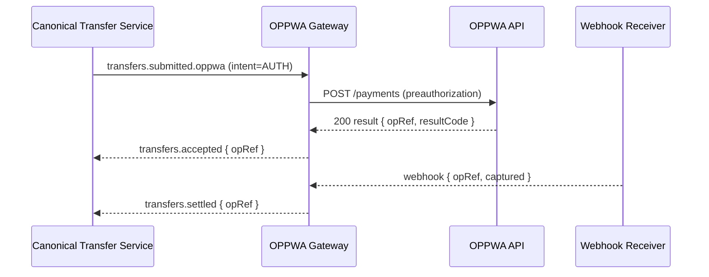

# Rail Gateway — OPPWA (Card / Tokenized Payments)

The **OPPWA Gateway** adapts Stalela canonical transfers to OPPWA (Open Payment Platform) APIs used by acquirers/processors (e.g., for Zimswitch card-present/tokenized flows). It validates payloads, transforms to OPPWA request formats, handles webhooks, and emits domain events.

---

## 🎯 Purpose
- Translate canonical transfers into **OPPWA REST** calls (payments, preauth/capture, refunds).
- Enforce **strict validation** of amounts, currencies, tokens/PAN surrogates, and 3DS/SDK data.
- Handle **sync responses** and **async webhooks** to finalize state.
- Emit **accepted/settled/returned/failed** events with mapped reason codes.
- Persist raw requests/responses (redacted) for audit and reconciliation.

---

## 🛠 Responsibilities
- Subscribe to `transfers.submitted.oppwa`.
- Map intents:
  - `AUTH` → OPPWA `preauthorization`
  - `CAPTURE` → OPPWA `capture`
  - `PUSH/PULL` (rare for cards) → treated as `debit`/`credit` where supported
- Build requests using merchant credentials / entity routing.
- Receive webhooks (`/webhooks/oppwa`) and correlate to transfers.
- Emit events and store artifacts; support retries and idempotency keys.

---

## 🔌 Interfaces

### Events (consume)
- `transfers.submitted.oppwa`
  - `{ transferId, tenantId, amount, currency, payer, payee, intent, metadata{ token, threeDS, merchantRef } }`

### Events (emit; envelope `v=1`)
- `transfers.accepted` → `{ transferId, rail:"oppwa", opRef, resultCode }`
- `transfers.settled` → `{ transferId, rail:"oppwa", opRef, captured:true, settlementDate? }`
- `transfers.returned` → `{ transferId, rail:"oppwa", opRef, reasonCode }`
- `transfers.failed` → `{ transferId, rail:"oppwa", reason, details }`

### HTTP
- `POST /webhooks/oppwa` (verify signature, parse, correlate)
- Admin: `GET /live`, `GET /ready`, `GET /metrics`, `GET /version`

---

## 🗄 Data Model
- **table: `oppwa_ops`**
  - `id` (pk), `transferId`, `tenantId`
  - `merchantId`, `entityId` (per-tenant/route), `opRef`
  - `intent` (AUTH|CAPTURE|REFUND), `amountMinor`, `currency`
  - `status` (INIT|ACCEPTED|CAPTURED|RETURNED|FAILED)
  - `resultCode`, `reasonCode`, `riskScore` (nullable)
  - `createdAt`, `updatedAt`
- **table: `outbox_gateway`** – for events
- **blob**: redacted request/response JSON snapshots (encrypted), webhook payloads

---

## 🔁 Transform & Validation
- **Currency/amount** → use minor units; reject > 2 dp amounts for fiat.
- **Tokenization** → require network token / OPPWA token; **never** store PAN.
- **3DS** → include 3DS server results when present; pass-through fields via metadata.
- **Idempotency** → set OPPWA idempotency keys using `{tenantId}:{transferId}`.
- **Reason mapping** → maintain mapping table from OPPWA result/return codes → Stalela `reason` enums.
- **Auth/Capture** split → only capture after explicit command or webhook indicating capture.

---

## 📐 Sequence (Auth → Capture)

---

## 🚨 Failure Modes
- **DoS/429** from OPPWA → backoff + retry; escalate if sustained
- **Invalid token / expired** → `transfers.failed{reason:"TOKEN_INVALID"}`
- **Chargeback/return** → emit `transfers.returned` with reason mapping
- **Signature mismatch on webhook** → reject + alert
- **Currency not supported** for merchant entity → fail fast

---

## 📊 Observability
- Metrics: request latency, success rate by intent, webhook processing lag
- Error buckets by `resultCode` / `reasonCode`
- DLQ depth for failed webhooks / submissions

---

## 🔐 Security
- Verify webhook signatures; rotate secrets
- Redact PAN-like fields aggressively; tokenize everything
- Encrypt blobs at rest; least-privileged access to merchant credentials
- PCI scope: keep CTS and Ledger **out** of PAN scope; gateway isolates card data

---

## ⚙️ Config
- `OPPWA_BASE_URL`, per-tenant `ENTITY_ID`, `MERCHANT_ID`, `API_KEY`
- `WEBHOOK_SECRET`, `IDEMPOTENCY_PREFIX`
- `TIMEOUT_MS`, `RETRY_MAX`, `BACKOFF`
- `REASON_CODE_MAP` (versioned), `CURRENCY_ALLOWLIST`

---

## 🧭 Runbooks
- **High 401/403 rates**: check API key rotation, entity mapping
- **Webhook gaps**: verify public endpoint, firewall, signature; replay from OPPWA portal if available
- **Frequent declines**: inspect 3DS setup and tokenization source; check risk engine outcomes

---

> See also: [Rail Gateway — Template](./rail-gateway-template.md) and Reason Code mappings in [../20-specs/error-codes.md](../20-specs/error-codes.md)
