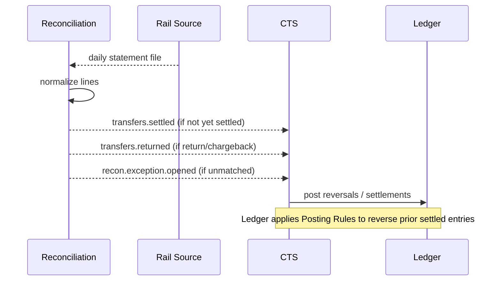

# Reconciliation & Returns Service

The **Reconciliation & Returns Service** ensures Stalela’s books stay aligned with rail statements and handles disputes/returns as first-class flows.

---

## 🎯 Purpose
- Ingest statements/settlement files from rails.  
- Match against canonical transfers.  
- Emit settlement or return events.  
- Queue unmatched items for operator review.  
- Model returns/disputes as state transitions.

---

## 🛠 Responsibilities
- Scheduled pull/ingest of rail statements (files, APIs, on-chain events).  
- Normalize to internal `StatementLine` model.  
- Match to existing transfers (composite keys).  
- Emit `transfers.settled` (late confirm) or `transfers.returned`.  
- Push unmatched → exception queue for Operator Console.  
- Support manual raise of returns.

---

## 🔌 Interfaces

### Events (consume)
- `recon.statement.ingested`

### Events (emit)
- `transfers.settled`  
- `transfers.returned`  
- `recon.exception.opened`  

### HTTP
- `POST /returns` (manual raise)  
- Admin: `GET /live`, `GET /ready`, `GET /metrics`, `GET /version`

---

## 🗄 Data Model
- `statements` (rail, fileId, source, importedAt)  
- `statement_lines` (id, statementId, externalRef, amount, currency, date, type, reason?)  
  - Matching keys (per rail) typically include: `{ externalRef | (acqRef,authCode) | txId } + amount + date window`.  
- `matches` (lineId, transferId, matchedAt)  
- `exceptions` (id, lineId, status, resolvedAt, operatorId?)  
- `outbox_recon`  

---

## 📄 File Specifications (per rail)
- EFT (Bankserv): settlement and return record layouts, cutoffs, T+N windows.
- PayShap: real-time exceptions/returns mapping to `StatementLine`.
- ZIPIT/RTGS: daily statements and chargeback reason codes.

---

## 📐 Sequence

---

## 🚨 Failure Modes
- **File ingest failed** → pause, retry, operator alert.  
- **Hash mismatch** → reject, re-request file.  
- **High unmatched rate** → escalate ops, inspect Directory/CTS config.  

---

## 📊 Observability
- Metrics: match rate, unmatched backlog, return rates.  
- Logs: structured with transferId, lineId, fileId.  

---

## 🔐 Security
- Encrypt raw statement files.  
- Least privilege on file source credentials.  

---

## 🧭 Runbooks
- **Unmatched backlog** → operator assigns manually.  
- **High return rate** → throttle merchant, investigate risk.  
- **File delivery gap** → contact partner, reconcile manually.  

---
