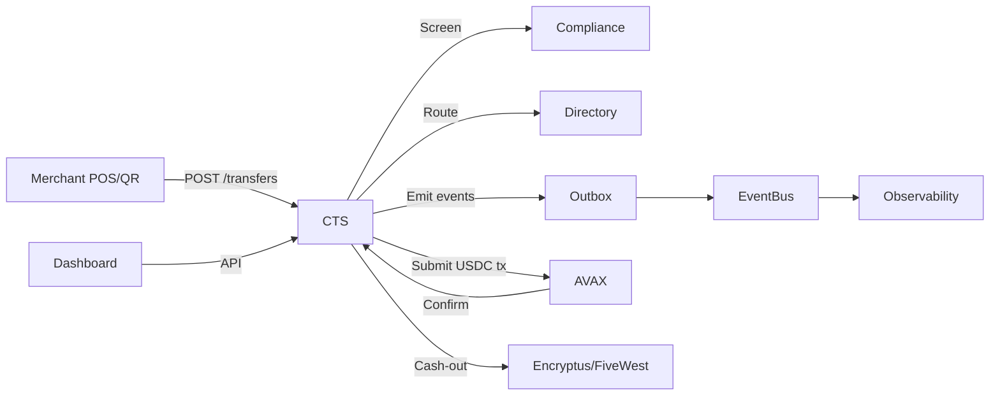

# 📦 Stalela MVP – Pilot with 20 Merchants

## 🎯 Goal

Demonstrate the end-to-end viability of Stalela’s Canonical Transfer Service (CTS) and POS/payment ecosystem in a **controlled pilot** with 20 merchants. The MVP validates:

* Unified transfer orchestration (CTS front-door)
* USDC-based merchant acceptance (POS / wallet QR)
* Compliance + routing flows in production conditions
* Idempotency, event publishing, and state tracking
* Merchant onboarding, cash-out, and reporting

---

## 🔑 Scope

* **In scope**:

  * CTS API (create & fetch transfers)
  * Compliance screening before submission
  * Directory & Routing service integration
  * POS App (Android, QR/NFC) for 20 merchants
  * Merchant Dashboard (basic web + WhatsApp notif)
  * Off-ramp partner (Encryptus/FiveWest) for cash-out
  * Event streaming (`transfers.*`) into observability

* **Out of scope** (future):

  * Card issuance (Visa/Mastercard rails)
  * Advanced inventory module
  * Credit lines/float management

---

## 🏗 Architecture (MVP slice)

* **Clients**: Merchant POS app (Sunmi/PAX devices) + Merchant Dashboard
* **Core**: Canonical Transfer Service (CTS)

  * Deduplication + normalization
  * Pre-screening (Compliance)
  * Routing (Directory)
  * Outbox pattern for event publishing
* **Rails**: USDC over AVAX chain (custodial wallets, relayer)
* **Partners**: Encryptus API for fiat cash-out
* **Observability**: metrics (latency, transfer states), logs, tracing

---

## 📲 Merchant Pilot Experience

* 20 merchants onboarded with custodial USDC wallets.
* Accept customer payments via QR or NFC.
* Merchant app shows real-time settlement state (`INITIATED → SUBMITTED → SETTLED`).
* Option to:

  * Retain USDC for restocking with suppliers.
  * Cash out to ZAR via off-ramp (real-time, small fees).

---

## 🗄 Data Model (MVP)

* `transfers`, `transfer_events`, `outbox_transfers` tables as per CTS design.
* Merchant registry: `{merchantId, walletAddr, POS_deviceId, tenantId}`.
* Off-ramp logs: `{merchantId, transferId, fiatAmount, provider}`.

---

## 📊 KPIs for Pilot

* **Throughput**: ≥ 100 transfers/day across 20 merchants.
* **Latency**: p95 < 2.5s from POS → state=SUBMITTED.
* **Reliability**: ≥ 99% transfers reach SETTLED or FAILED with event trail.
* **Merchant NPS**: qualitative feedback on usability, cash-out, reporting.

---

## 📘 Runbook (Pilot-Specific)

* If POS device fails → replace via spare pool (20% buffer).
* If compliance service down → fail-safe: reject submissions.
* If AVAX relayer gas issues → auto-fund hot wallet from treasury.
* If off-ramp unavailable → queue cash-outs, notify merchants.

---

## 🚀 Next Steps after Pilot

1. Expand to 100 merchants.
2. Add card issuance (USDC debit card).
3. Layer inventory/B2B module.
4. Explore credit line + float minimization strategy.
