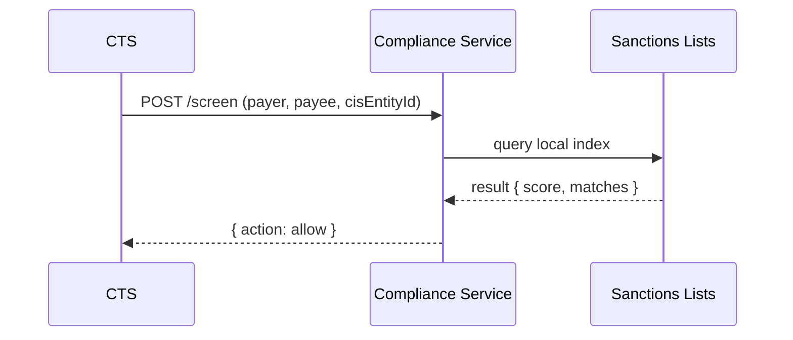

# Compliance Screening Service

The **Compliance Screening Service** protects Stalela by screening entities (payer, payee) against sanctions and risk lists before transfers are submitted to rails. It ensures **fast, local allow/deny decisions** and continuous re-screening as lists update.

---

## 🎯 Purpose
- Enforce **pre-submit screening** of entities against sanctions lists.  
- Perform **delta re-screens** when lists update.  
- Cache results for performance.  
- Emit **entity flagged events** for operator review.  
- Provide a simple, auditable `/screen` API.

---

## 🛠 Responsibilities
- Ingest official sanctions/watchlists (OFAC, UN, EU, SA FIC).  
- Normalize and index names, aliases, DOBs, countries.  
- Accept **CIS-verified identity data** (`cisEntityId`, `idNumber`) for screening — [CIS](../../15-identity/index.md) verifies the entity first, then Compliance screens the verified entity.
- Provide low-latency API for CTS screening.  
- Emit alerts when existing entities match new list entries.  
- Store results with versioned list references for audit.

> Local sources: SA PEPs/adverse media (vendor feeds), ZW FIU advisories; define update SLAs and checksum validation.

---

## 🔌 Interfaces

### HTTP
- `POST /screen`
  - body: `{ name, dob?, country?, idNumber?, cisEntityId? }`
  - returns: `{ action: allow|deny, score, matches[], listVersion }`

> When `cisEntityId` is provided, the screening service can retrieve the full CIS-verified profile (name, DOB, nationality, ID documents) to improve matching accuracy.

### Events (emit)
- `compliance.entity.flagged`
  - `{ entityId, transferId?, score, listVersion, matches[] }`

### Admin
- `GET /live`, `GET /ready`, `GET /metrics`, `GET /version`

---

## 🗄 Data Model
- `lists_raw` (source files)  
- `lists_index` (normalized searchable index)  
- `entity_screenings` (entityId, transferId, result, listVersion, createdAt)  
- `outbox_compliance`  

---

## 📐 Sequence

---

## 🚨 Failure Modes
- **List download failed** → keep prior index, raise alert.  
- **Timeout** → CTS fails safe (deny).  
- **False positive** → escalate via Operator Console.  
- **Stale index** → emit compliance.service.stale event.

---

## 📊 Observability
- Metrics: screening latency, match rate, stale index age.  
- Logs: structured with entityId, listVersion.  
- Alerts on stale index > 24h.

---

## 🔐 Security
- Encrypt raw list data at rest.  
- PII redaction in logs.  
- Access control to screening API by internal services only.

---

## 🧭 Runbooks
- **New list version failed ingest** → re-run job manually, validate checksums.  
- **High false positives** → adjust fuzzy matching thresholds, add alias list.  
- **Operator override** → freeze/unfreeze entity in Operator Console.

---
