# Directory & Routing Service

The **Directory & Routing Service** is Stalela’s authoritative source of rails metadata. It ensures transfers are routed deterministically to the correct rail endpoints, institutions, and fee structures.

---

## 🎯 Purpose
- Maintain authoritative directory of **institutions, BINs, fees, settlement windows**.  
- Provide fast lookups for CTS routing decisions.  
- Refresh data periodically from external sources.  
- Support effective-dated changes (versioning).

---

## 🛠 Responsibilities
- Store and expose institution metadata.  
- Expose routing lookups (`/routes?bin=...`) for CTS.  
- Apply per-rail/per-tenant fees and cutoffs.  
- Circuit-breaker fallback to cached versions.  
- Version data for audit and rollback.  
- Maintain ZA bank codes and PayShap proxy rules (cell/email/id) for resolution.  

> **PayShap proxy validation**: When resolving a PayShap proxy (cell number, email, or national ID) the Directory Service calls CIS to confirm the proxy is bound to a verified identity (`cisEntityId`). This prevents transfers to unverified recipients. See [Identity (CIS)](../../15-identity/index.md).

- Publish settlement calendars (ZA/ZW) and cutoffs for consumers.

---

## 🔌 Interfaces

### HTTP
- `GET /routes?bin|memberId|rail=...`  
  → `{ endpoint, fees, settlementWindow, constraints }`

Examples:

`GET /routes?bin=438742`
```json
{
  "endpoint": "https://api.processor.example/payments",
  "fees": { "type": "percentage", "value": 0.02 },
  "settlementWindow": { "cutoff": "16:30", "timezone": "Africa/Johannesburg" },
  "constraints": { "currencies": ["ZAR","USD"], "limitsMinor": { "max": 10000000 } }
}
```

- `GET /institutions/:id`  
  → `{ id, name, rail, endpoint, fees, windows }`

- `GET /calendars/:region`  
  → `{ region: "ZA"|"ZW", holidays: [...], timezone }`

Example:
```json
{
  "region": "ZA",
  "timezone": "Africa/Johannesburg",
  "holidays": ["2025-01-01","2025-03-21","2025-04-18"]
}
```

### Events (emit)
- `directory.version.updated`  
  - `{ versionId, effectiveFrom, source, checksum }`

Example:
```json
{
  "eventId": "018f3e00-2222-7f00-b1e3-7a7f5d3b9b10",
  "type": "directory.version.updated",
  "v": 1,
  "occurredAt": "2025-08-27T08:00:00Z",
  "tenantId": "system",
  "payload": {
    "versionId": "dir_v2025-08-27_01",
    "effectiveFrom": "2025-08-27T09:00:00+02:00",
    "source": "bank-codes+fees-portal",
    "checksum": "sha256:abcd..."
  }
}
```

---

### Admin & Time (via Platform/Base)
- Admin: `GET /live`, `GET /ready`, `GET /metrics`, `GET /version`.
- Time helpers: banking-day logic and cutoffs use Platform/Base calendars (`Africa/Johannesburg`, `Africa/Harare`).


## 🗄 Data Model
- `institutions` (id, name, rail, endpoint, status)  
- `bins` (bin, institutionId, effectiveFrom/to)  
- `fees` (tenantId, rail, feeType, value, effectiveFrom/to)  
- `windows` (rail, cutoffTimes, timezone)  
- `bank_codes` (ZA code, institutionId)  
- `proxy_rules` (type, constraints, effectiveFrom/to)  
- `calendars` (region, date, description)  
- `directory_versions`  
- `outbox_directory`  

---

## 📐 Sequence

```mermaid
sequenceDiagram
  participant CTS
  participant DR as Directory
  participant EXT as External Source

  CTS->>DR: GET /routes?bin=438742
  DR->>DR: lookup BIN → institution → endpoint
  DR-->>CTS: { endpoint, fees, window }
  DR->>EXT: scheduled refresh (daily)
  EXT-->>DR: new version
  DR-->>CTS: directory.version.updated
```


---

## 🚨 Failure Modes
- **Unknown BIN** → return error `ROUTE_NOT_FOUND`.  
- **Source unavailable** → keep prior version, alert ops.  
- **Fee mismatch** → reconciliation alerts via Operator Console.

---

## 📊 Observability
- Metrics: lookup latency, cache hit rate, version age.  
- Logs: institutionId, versionId.  
- Alerts: stale version > SLA.

---

## 🔐 Security
- Access control: only CTS and gateways query directory.  
- Version artifacts signed and checksummed.

---

## 🧭 Runbooks
- **Stale directory** → re-run refresh job.  
- **Incorrect fee** → override with effectiveFrom and patch ADR.  
- **BIN not routing** → add mapping, redeploy version.

---
