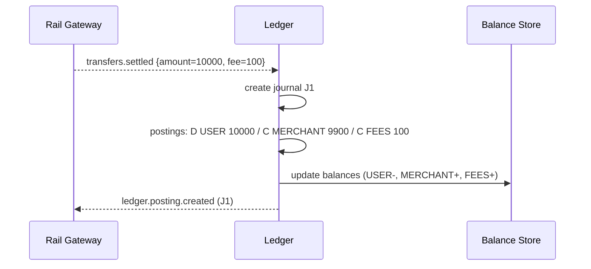

# Ledger Service

The **Ledger Service** is Stalela’s **book of record**. It maintains double‑entry journals, computes balances, exposes statements, and guarantees that every money movement is represented by a **balanced set of postings**. If it isn’t posted here, it didn’t happen.

---

## 🎯 Purpose

- Enforce **double‑entry accounting** for all transfers across rails.  
- Provide **authoritative balances** and **auditable journals**.  
- Support **authorization → capture → reversal/return** lifecycles.  
- Handle **multi‑currency** with explicit FX conversion and P&L.  
- Export **partner statements** (BAI2‑like) and support reconciliation.

---

## 🛠 Responsibilities

- **Consume domain events** and apply **posting rules**:
  - `transfers.accepted` (hold / memo postings where applicable)
  - `transfers.settled` (final postings)
  - `transfers.returned` (reversal postings)
- Maintain derived **balances** (by account, currency).  
- Emit `ledger.balance.updated` and `ledger.posting.created`.  
- Provide **read APIs**: balances, journals, statements.  
- Guard rails: **append‑only** journals; reversals via new entries only.

---

## 🔌 Interfaces

### Events (consume; envelope `v=1`)
- `transfers.accepted`
- `transfers.settled`
- `transfers.returned`

> Dedupe per Events spec: see [../specs/events.md](../specs/events.md) (consumer idempotency by `eventId`, lifecycle uniqueness for `(transferId,type)`).

### Events (emit; envelope `v=1`)
- `ledger.posting.created`
- `ledger.balance.updated`

### HTTP (read‑only)
- `GET /balances?accountId=...&currency=...`
- `GET /journal?transferId=...` or `?accountId=...&from=...&to=...`
- `GET /statements?accountId=...&from=...&to=...&format=bai2|json`

### Admin (via Platform/Base)
- `GET /live`, `GET /ready`, `GET /metrics`, `GET /version` provided by Platform/Base and adopted by Ledger.

> **Write access** is event‑driven only. Manual adjustments are rare and must go through the Operator Console using explicit adjustment events with approvals/audit.

---

## 🗄 Data Model

**tables**
- `accounts`  
  - `accountId` (pk), `type` (USER|MERCHANT|LIQUIDITY|FEES|FX|SETTLEMENT|RESERVE|NOSTRO|VOSTRO), `tenantId?`, `currency?` (nullable if multi‑currency), `status`, `createdAt`
- `journals` *(immutable)*  
  - `journalId` (pk), `transferId`, `eventType`, `occurredAt`, `memo`, `exchangeControlRef?`
- `postings` *(append‑only)*  
  - `postingId` (pk), `journalId` (fk), `debitAccountId`, `creditAccountId`, `amountMinor`, `currency`, `memo`
- `balances` *(materialized)*  
  - `accountId`, `currency`, `balanceMinor`, `asOf`
- `outbox_ledger` – for emitted events

**blobs (encrypted)**  
- optional statement snapshots; export artifacts

---

## 🧮 Posting Rules (canonical)
See: [../specs/posting-rules.md](../specs/posting-rules.md)

All amounts are in **minor units** (e.g., cents). Examples assume a customer pays a merchant 100.00 with a 1.00 fee.

### 1) Accepted (authorization / hold) — *rails that support AUTH/CAPTURE*
Create **memo/hold** journal (off‑balance or flagged):
- Debit: `USER_AUTH_HOLD` (memo) — 10000  
- Credit: `LIQUIDITY_AUTH_PENDING` (memo) — 10000

> If the rail has no auth concept (e.g., USDC push), **no accepted postings** are created.

### 2) Settled (final funds move)
Core settlement postings:
- **Debit**: `USER` — 10000  
- **Credit**: `MERCHANT` — 9900  
- **Credit**: `FEES` — 100   (Stalela take rate)

If FX occurs (payer USD → merchant ZAR), split legs:
- **Debit**: `USER` — 10000 USD  
- **Credit**: `LIQUIDITY` — 10000 USD  
- **Debit**: `LIQUIDITY` — 180000 ZAR  
- **Credit**: `MERCHANT` — 180000 ZAR  
- **Credit**/**Debit**: `FX_PNL` — difference from quoted vs realized

> Cross‑border flows may include legs to/from `NOSTRO`/`VOSTRO` accounts to reflect settlement with external banks.

### VAT on Fees (ZA)
- When fees are vatable, split into `FEES_NET` and `FEES_VAT` credits as per `20-specs/tax-vat.md`.

### 3) Returned / Chargeback (reverse prior settled)
Post the **exact contra** of the settlement set, preserving original currency:
- **Debit**: `MERCHANT` — 9900  
- **Debit**: `FEES` — 100   *(or use `FEES_REVERSAL` to separate)*  
- **Credit**: `USER` — 10000

> For partial returns, amounts reflect the returned portion; keep link to original journal via `relatedJournalId` (in `journals.memo`).

### 4) Fees & Surcharges
- Percentage fees applied at settlement time as separate credit to `FEES` account.  
- Per‑rail surcharges (e.g., OPPWA) post to `FEES_PARTNER` account and are netted in reconciliation.

### 5) Rounding
- Use **banker’s rounding** when converting decimals → minor units.  
- Any rounding residual posts to `FX_PNL_ROUNDING` (must be near‑zero).

---

## 📐 Diagrams

### Event → Posting pipeline
```mermaid
flowchart LR
  EV[transfers.* event] --> PR[Posting Rules]
  PR --> JR[Create Journal]
  JR --> PT[Append Postings (balanced)]
  PT --> BL[Update Balances]
  PT --> OE[Emit ledger.posting.created]
  BL --> BE[Emit ledger.balance.updated]
```

### Settlement example (no FX)


---

## 🧱 Invariants

- **Balanced**: sum(debits) == sum(credits) per journal.  
- **Append‑only**: no deletes; corrections via new journals.  
- **Idempotent**: journal key = hash(`transferId`,`eventType`,`sequence`); duplicates ignored.  
- **Temporal**: `occurredAt` from event; do not rewrite history.

> Consumer idempotency: dedupe inbound events by `eventId`, and enforce lifecycle uniqueness `(transferId,eventType)` to avoid double-posting.

---

## 🚨 Failure Modes & Retries

- **Duplicate event** → ignored via idempotency key.  
- **Currency mismatch** (account vs posting) → reject and raise operator alert.  
- **Negative balance constraints** (if configured) → block posting and raise exception.  
- **Outbox publish failure** → retry with backoff; no partial commits (journal + outbox in same txn).

---

## 📊 Observability

- Metrics: `journals/sec`, `postings/sec`, balance update latency, idempotency drop rate.  
- Gauges: outstanding reversal backlog, FX_PNL daily total.  
- Logs: structured with `transferId`, `journalId`, `accountId`, `currency`.  
- Traces: span across event reception → journal write → outbox publish.

---

## 🔐 Security

- Least privilege DB role; **append‑only** constraints at the schema level if possible.  
- PII: account metadata stored outside postings; journals contain IDs only.  
- Statement exports signed + timestamped; encrypt artifacts at rest.  
- Admin endpoints behind service mesh authN/Z; metrics unauthenticated *readiness only*.

---

## ⚙️ Config

- `LEDGER_BASE_CURRENCY` (reporting), supported currencies.  
- `NEGATIVE_BALANCE_POLICY` (ALLOW|BLOCK|WARN).  
- `FX_QUOTE_SOURCE` (provider, TTL).  
- `STATEMENT_FORMATS` (bai2,json), `STATEMENT_TIMEZONE`.  
- `IDEMPOTENCY_SALT` for journal keys.

---

## 📘 Runbooks

- **Balances off vs partner** → run T+0/T+1 reconciliation; inspect unmatched queue; verify posting rules version.  
- **FX_PNL spikes** → check quote source latency; ensure correct pair & decimals.  
- **Reversal backlog** → confirm returns events being emitted; investigate gateway DLQs.  
- **Throughput degradation** → check DB contention on `balances`; consider batched/materialized updates.

---

## 📏 SLOs

- Posting latency (P99) ≤ **1s** after `transfers.settled`.  
- Idempotency duplicate acceptance rate ≤ **0.1%**.  
- Balance read latency (P99) ≤ **200 ms**.  
- Statement generation ≤ **60 s** for 100k postings.

---

## 🧪 Test Matrix (essentials)

- Round‑trip: accepted → settled → returned (full & partial).  
- Multi‑currency settlement with FX & rounding residuals.  
- Idempotency under concurrent duplicates.  
- Negative balance policy enforcement.  
- Statement export byte‑for‑byte determinism for a fixed fixture.

---

## Example: Journal & Posting payloads

**Journal (emitted event payload)**
```json
{
  "journalId": "jrnl_01HZX...",
  "transferId": "tr_01HZY...",
  "eventType": "transfers.settled",
  "occurredAt": "2025-08-26T10:15:01Z",
  "memo": "settlement zimswitch batch 8341",
  "exchangeControlRef": "ec_ABC123"
}
```

**Posting (emitted event payload)**
```json
{
  "postingId": "pst_01HZ...",
  "journalId": "jrnl_01HZX...",
  "debitAccountId": "acct_user_123",
  "creditAccountId": "acct_merchant_987",
  "amountMinor": 9900,
  "currency": "ZAR",
  "memo": "net to merchant"
}
```

---

**Bottom line:** The Ledger turns messy rail realities into **deterministic, balanced, auditable facts**. Everything else in Stalela depends on this discipline.
