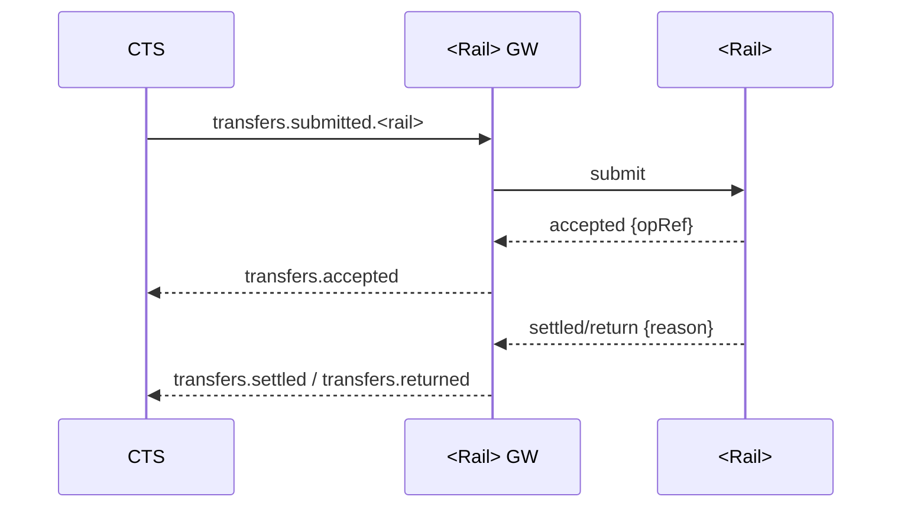

# Rail Gateway — Template

Use this template when creating a new rail gateway component doc.

## Purpose  
Adapt canonical transfers to the rail; strict schema validation; webhooks/file ingest; emit events.

## Responsibilities
- Consume `transfers.submitted.<rail>`.
- Initiate/submit payment and handle callbacks/files.
- Map reason/return codes; emit `accepted/settled/returned/failed`.
- Persist artifacts (redacted) for audit/recon; use outbox for events.

## Interfaces
### Inputs
- Events: `transfers.submitted.<rail>`
- HTTP/Webhooks or Files as per rail

### Outputs
- Events (envelope `v=1`): `transfers.accepted`, `transfers.settled`, `transfers.returned`, `transfers.failed`

## Data Model
- `<rail>_ops` (transferId, tenantId, opRef, amountMinor, currency, status, reasonCode?)
- `outbox_gateway`, encrypted blobs for requests/responses

## Transform & Validation
- Strict validation of identifiers, amounts, currencies.
- Idempotency: `{tenantId}:{transferId}` partner reference.
- Reason mapping → Stalela enums (see `docs/20-specs/error-codes.md`).

## Diagrams (example)

## Failure Modes & Retries
- Submission failure → backoff/retry; DLQ for poison payloads.
- Timeout → emit `failed` or `returned` per scheme rules.

## Observability & Security
- Metrics: submit/settle latency, returns rate; DLQ depth.
- Webhook signature verification / PII redaction.
