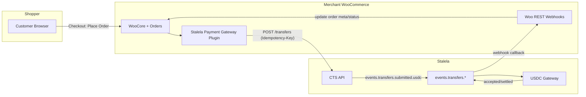
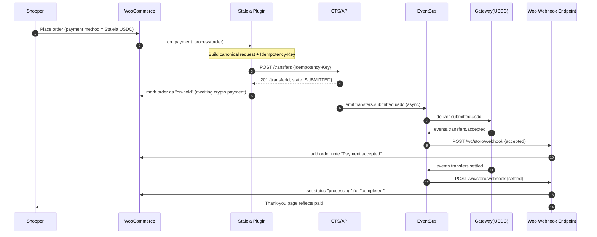
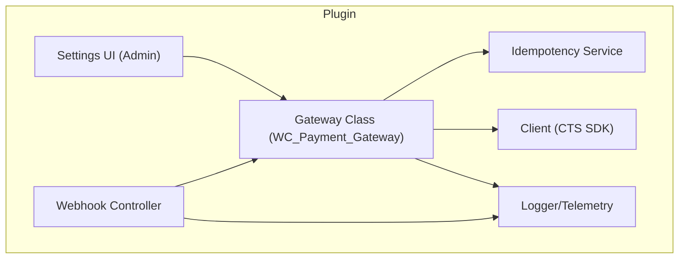
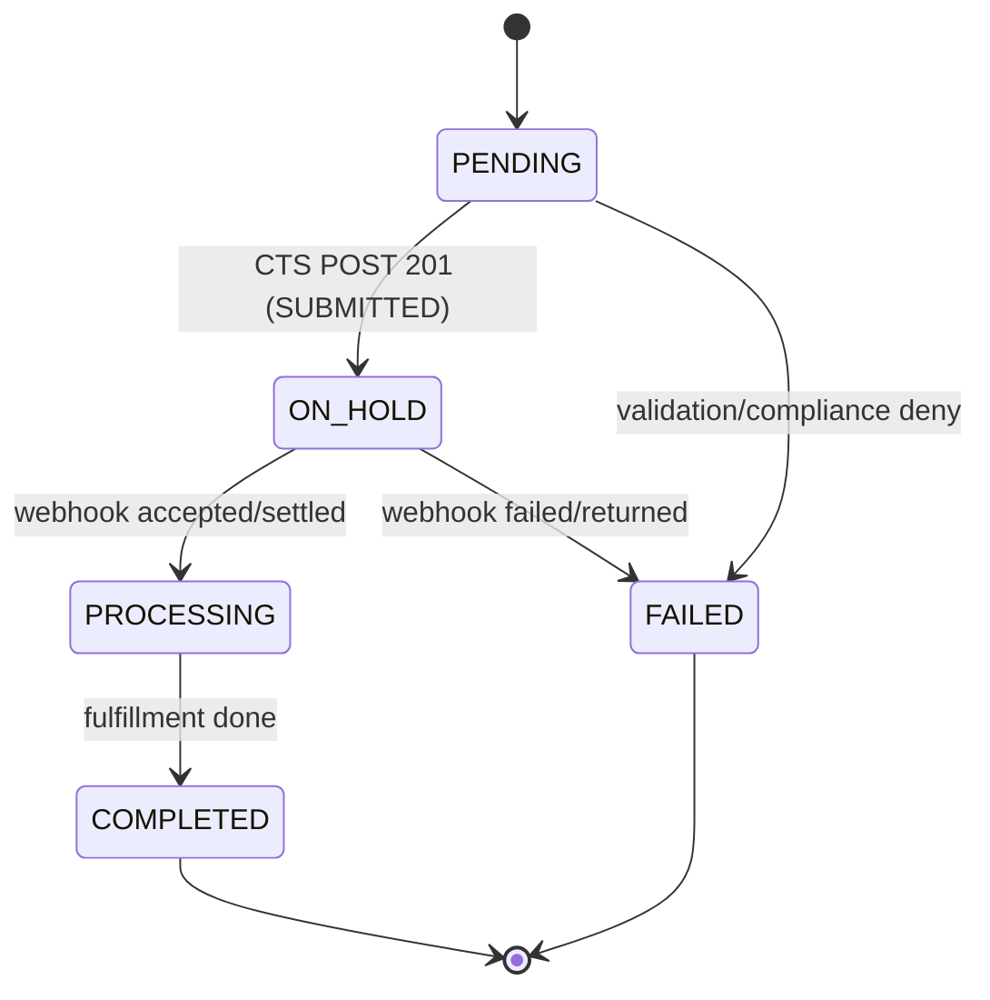
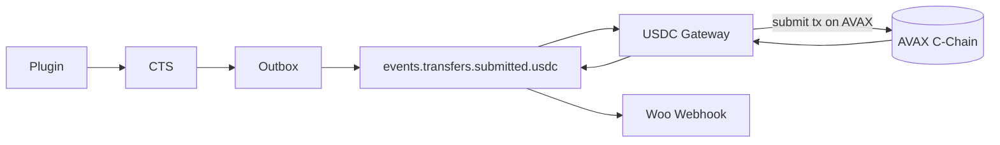

# WooCommerce ↔️ Stalela CTS Plugin (USDC Example)

This document describes a production‑ready WooCommerce plugin that connects a merchant’s store to **Stalela’s Canonical Transfer Service (CTS)** to accept **USDC** (AVAX) payments. It covers integration flows, mapping, idempotency, and operational concerns with **Mermaid** diagrams.

---

## 1) Objectives

* Let WooCommerce merchants accept **USDC** at checkout using Stalela CTS.
* Keep the **storefront UX native** (Woo buttons, order notes, refunds) while offloading payment orchestration to CTS.
* Ensure **idempotency**, observability, and clear failure handling.

---

## 2) High‑Level Architecture



---

## 3) Checkout Sequence (Happy Path, non‑blocking settlement)



**Key points**

* The **plugin returns the shopper immediately** after CTS persists & returns `SUBMITTED`.
* **Order remains On‑Hold** until `accepted`/`settled` webhook updates it.

---

## 4) Data Mapping (Woo ↔️ CTS)

| Woo Source                         | CTS Target                         | Notes                                                               |
| ---------------------------------- | ---------------------------------- | ------------------------------------------------------------------- |
| `order_id`                         | `externalRef`                      | Stable reference from Woo to CTS                                    |
| `order_total`                      | `amount.value` / `amount.currency` | Currency can be `USD` for USDC 1:1; FX rules configurable           |
| `billing_email`/`user_id`          | `payer`                            | PII encrypted server‑side; plugin sends IDs, not PII, when possible |
| Merchant USDC dest (wallet/tenant) | `payee`                            | Provisioned during plugin onboarding                                |
| `Idempotency-Key`                  | Header + `bodyHash`                | e.g., `woocommerce:<storeId>:order:<orderId>`                       |
| `payment_method_title`             | `metadata.gateway`                 | e.g., `storo-usdc`                                                  |

**Canonical request (example)**

```json
{
  "tenantId": "tnt_demo",
  "intent": "PUSH",
  "amount": { "value": "49.99", "currency": "USD" },
  "payer": { "type": "WALLET", "id": "shopper-123" },
  "payee": { "type": "WALLET", "provider": "USDC_AVAX", "id": "0xMERCHANT..." },
  "externalRef": "woo_100045",
  "metadata": { "platform": "woocommerce", "plugin_version": "1.0.0" }
}
```

---

## 5) Plugin Components



**Responsibilities**

* **Settings UI**: API keys, merchant wallet, network (AVAX), test mode, webhook secret.
* **Gateway Class**: Implements `process_payment`, order status transitions, thank‑you handling.
* **CTS Client**: Retries, timeouts, schema version header, `Idempotency-Key`.
* **Webhook Controller**: Verifies signature; updates order status on `accepted`/`settled`/`returned`/`failed`.
* **Idempotency Service**: Stable key generation + replay safety on Woo retries.
* **Logger**: Structured logs with `order_id`, `transferId`, `tenantId` (no PII fields).

---

## 6) Order State Machine (Woo + CTS)



**Notes**

* If `accepted` arrives first, move to **Processing**, then to **Completed** on `settled`.
* If `returned/failed`, move to **Failed** and expose reason in order notes.

---

## 7) Webhook Contract (from Stalela → Woo)

**Endpoint**: `POST https://merchant.store/wc/storo/webhook`

**Headers**: `X-Stalela-Signature`, `X-Stalela-Timestamp`, `X-Request-Id`

**Body (accepted)**

```json
{
  "type": "events.transfers.accepted",
  "transferId": "tr_123",
  "externalRef": "woo_100045",
  "occurredAt": "2025-08-28T12:34:56Z",
  "envelope": {"v":1},
  "metadata": {"rail":"usdc"}
}
```

**Body (settled)** is identical with `type = events.transfers.settled`.

**Webhook handler behavior**

1. Verify signature → 401 if invalid.
2. Lookup `order_id` via `externalRef`.
3. Idempotent update of order status; add note with timestamp + `transferId`.

---

## 8) USDC Flow (rails specifics)



* Gateway uses a **relayer** to handle gas; merchant receives USDC on their AVAX address.
* CTS does **not** block Woo checkout waiting for settlement.

---

## 9) Errors & Retries

| Situation               | Source                | Plugin Behavior                                                                              |
| ----------------------- | --------------------- | -------------------------------------------------------------------------------------------- |
| **Compliance deny**     | CTS sync response 422 | Fail payment; order → **Failed**; show friendly error                                        |
| **Routing unavailable** | CTS 502               | Keep order **Pending**; show retry button; exponential backoff client‑side                   |
| **Webhook missed**      | Network issue         | Admin action: “Re‑deliver last 24h” button; plugin can poll `GET /transfers/:id` as fallback |
| **Duplicate checkout**  | Shopper retries       | Same Idempotency‑Key → plugin handles 200/201 idempotently                                   |

---

## 10) Configuration & Onboarding

> **CIS merchant onboarding prerequisite**: Before a WooCommerce merchant can obtain API keys and activate the plugin, they must complete KYB verification through CIS. The onboarding flow is: CIS registration → KYB document upload → CIS verification → `cisEntityId` + tenant provisioned → API key issued. See [Merchant Onboarding](../../15-identity/howtos/onboard-merchant.md).

* **API Keys**: Tenant-scoped key issued by CIS after KYB verification.
* **Merchant Wallet (USDC)**: Provided during onboarding; validated against network.
* **Webhook Secret**: Rotate via plugin UI; validate on each callback.
* **Test Mode**: Sandboxed CTS tenant & USDC test network.

---

## 11) Observability

* **Order Notes** include transfer lifecycle markers.
* **Admin Dashboard Widget**: last 50 events, settlement latency p95, failure counts.
* **Logging**: Structured (order\_id, transferId, tenantId, type). No PII.

---

## 12) Example Admin Runbook

1. Order stuck **On‑Hold** > 10 min → check webhook delivery logs.
2. If missing, press **Re‑deliver** in Stalela Console or poll `GET /transfers/:id`.
3. If `returned/failed`, contact customer; optionally retry new payment method.

---

## 13) Security

* HMAC‑signed webhooks; 5‑minute timestamp window.
* Least‑privilege API key; rotate every 90 days.
* PII never stored in plugin; only references & IDs.

---

## 14) Future Enhancements

* **Refunds**: Map Woo refunds → `transfers.pull` or reversal flow.
* **Partial Payments**: Split shipments → multiple transferIds.
* **Multi‑rail fallback**: If USDC unavailable, offer Zimswitch card or M‑Pesa.
