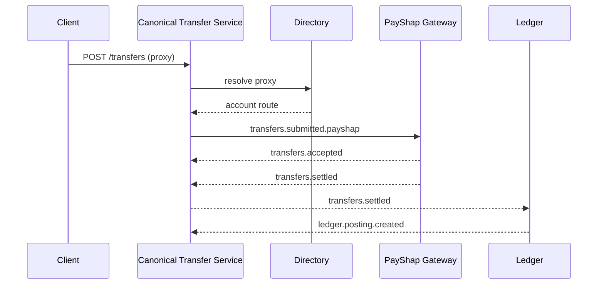

# Sequence: Submit PayShap

```mermaid
sequenceDiagram
  participant Client
  participant CTS as Canonical Transfer Service
  participant DR as Directory
  participant GW as PayShap Gateway
  participant L as Ledger

  Client->>CTS: POST /transfers (proxy)
  CTS->>DR: resolve proxy
  DR-->>CTS: account route
  CTS->>GW: transfers.submitted.payshap
  GW-->>CTS: transfers.accepted
  GW-->>CTS: transfers.settled
  CTS-->>L: transfers.settled
  L-->>CTS: ledger.posting.created
```
