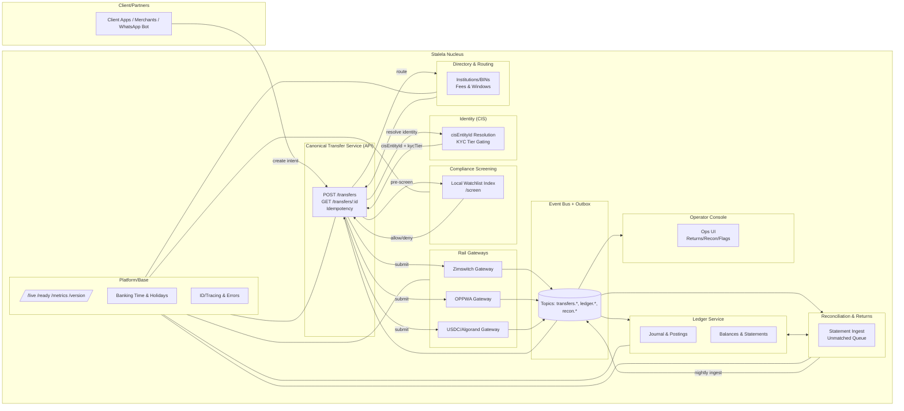
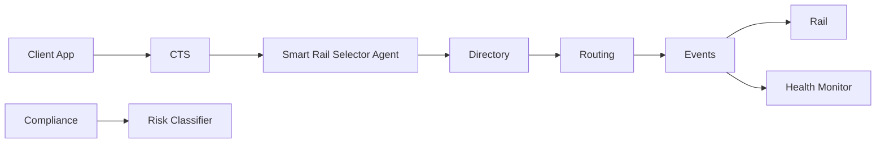
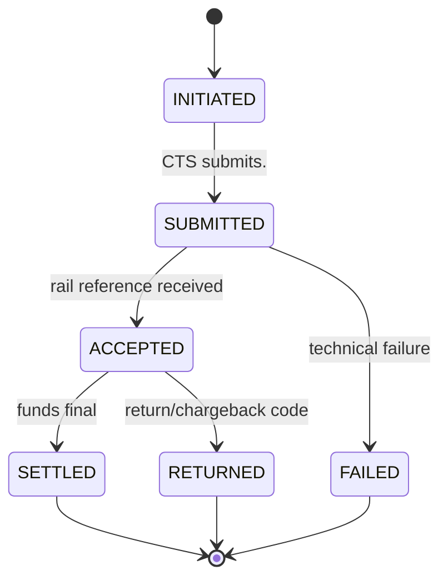

# Stalela Nucleus

The **Stalela nucleus** is the boring, strict, event-driven core of the platform.  
It orchestrates all money movement across rails (USDC/Algorand, Zimswitch/OPPWA, EFT, mobile money) while enforcing compliance, ledger discipline, and reconciliation.

---

## 🎯 Purpose

The nucleus exists to:
- Provide a **single canonical model** for all transfers.  
- Keep rail-specific logic isolated in **gateways**.  
- Guarantee **double-entry correctness** via the ledger.  
- Ensure **compliance and reconciliation** are first-class, not bolted on.  
- Emit **domain events** so every change is observable and auditable.  

---

## 🧩 Components at a Glance

- **Canonical Transfer Service (CTS)** → orchestrates transfer lifecycle, idempotency, emits events.  
- **Rail Gateways** → adapters for each rail, strict spec validation, submit & emit rail outcomes.  
- **Ledger Service** → double-entry postings, balances, statements.  
- **Compliance Screening** → fast local allow/deny; pre-submit & delta re-screens.  
- **Identity (CIS)** → identity resolution, KYC tier gating, `cisEntityId` enrichment. See [Identity (CIS)](../../15-identity/index.md).  
- **Directory & Routing** → institutions, BINs, fees, settlement windows.  
- **Reconciliation & Returns** → ingest statements, match transfers, manage returns/exceptions.  
- **Event Bus + Outbox** → exactly-once event delivery; glue between services.  
- **Platform/Base** → shared utilities (admin, time, IDs, error handling, migrations).  
- **Operator Console** → human control surface for exceptions, flags, returns.  

---

## 🏗️ Component Diagram



---

## AI-Enhanced Orchestration Layer

The Nucleus architecture now includes a dynamic orchestration layer that leverages AI agents to optimize transaction flows in real time.

This layer works alongside our existing Directory, Routing, and Compliance modules — not as replacements, but as **intelligent decision advisors** that enhance behavior based on transaction context, user risk, and infrastructure state.

### Capabilities Introduced

- **Smart Rail Selector Agent** — ranks and selects the optimal route across mobile money, bank, card, voucher, or crypto, based on historical performance, cost, latency, and user profile.
- **Dynamic Risk Classifier** — applies real-time fraud and identity risk scoring to determine appropriate compliance tiering.
- **Rail Health Monitor Agent** — observes system-wide metrics (e.g., failure rate, latency, uptime) and dynamically adjusts available routing paths.
- **Orchestration Copilot** — exposes orchestration decisions and performance to devs and operators via CLI or natural language assistant.

### Architectural Changes



Each AI agent is **stateless**, invoked via microservice or function call, and emits traceable events like:

* `route.selected.via_ai`
* `risk.assessed.via_model`
* `rail.flagged.degraded`

## 🔄 Transfer Lifecycle (State Machine)



---

## 📡 Event Model

The nucleus continues to emit canonical events for lifecycle transitions, ledger postings, and reconciliation outcomes. With the AI-enhanced orchestration layer, additional signals improve observability, feedback loops, and operator insight.

### New Events

| Event Name                     | Payload                                        | Triggered By                         |
|-------------------------------|-----------------------------------------------|--------------------------------------|
| `route.selected.via_ai`       | {path, score, features used}                  | Smart Rail Selector Agent            |
| `risk.tier.assigned`          | {user_id, risk_score, compliance_level}       | Dynamic Risk Classifier              |
| `rail.flagged.degraded`       | {rail_id, health_metrics, timestamp}          | Rail Health Monitor Agent            |
| `orchestration.fallback.used` | {original_path, fallback_path, reason}        | CTS fallback handler                 |

These events land on the existing bus and follow the same envelope structure and retention policies as the rest of the domain model. They provide downstream services and operators with the rationale behind AI-guided actions, enabling rapid tuning, auditing, and simulation.

## 📜 Contracts

### Event Envelope
```json
{
  "eventId": "uuid",
  "type": "transfers.settled",
  "occurredAt": "2025-08-26T10:15:01Z",
  "transferId": "tr_12345",
  "tenantId": "tn_67890",
  "payload": { "amount": { "value": 100, "currency": "ZAR" }, "rail": "zimswitch" }
}
```

### Canonical Transfer
```json
{
  "transferId": "tr_12345",
  "tenantId": "tn_67890",
  "payer": { "accountId": "acct_001" },
  "payee": { "accountId": "acct_999" },
  "amount": { "value": 1000, "currency": "USD" },
  "rail": "usdc-algo",
  "intent": "PUSH",
  "externalRef": "ext_abc123",
  "metadata": { "invoiceId": "inv_555" },
  "state": "SUBMITTED"
}
```

### Posting
```json
{
  "postingId": "pst_001",
  "transferId": "tr_12345",
  "debitAccountId": "acct_001",
  "creditAccountId": "acct_999",
  "amount": { "value": 1000, "currency": "USD" },
  "memo": "Payment settlement",
  "occurredAt": "2025-08-26T10:15:01Z"
}
```

---

## ✅ Non-Negotiables

- Strict validation at rail gateways (no malformed messages pass).  
- Exactly-once events (via outbox + idempotent consumers).  
- Double-entry always balanced.  
- Compliance pre-screen mandatory before submission.  
- Reconciliation nightly, exceptions reviewed before books close.  
- Operator console required for human resolution.  

---

## 📈 SLOs

- API latency (P99, `POST /transfers`): ≤ 250 ms (excluding rail response).  
- Event publish lag (P99): ≤ 1 s.  
- Ledger posting latency (P99): ≤ 1 s after `settled`.  
- Reconciliation match rate: ≥ 99.8% same day, 100% by T+1.  
- Idempotency collision rate: 0%.  

---

**Next step:** See [../components/canonical-transfer-service.md](../components/canonical-transfer-service.md) for detailed pages on each service.
