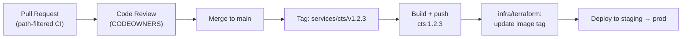

# Monorepo Architecture (Stalela)

> All Stalela services — Payments Nucleus, Fiscal Platform, apps, shared libs, and infra — live in a single `stalela` repository with independent deployability per service.

---

## Why a Monorepo

| Problem (multi-repo) | Solution (monorepo) |
|---|---|
| 15+ repos to clone to understand a flow | Single clone, full picture immediately |
| Contracts drift between spec repo and service repos | `libs/specs/` is co-located — CI enforces conformance atomically |
| Dependency graph across repos is implicit | Directory tree makes it explicit and computable |
| Cross-cutting changes (rename a field) require N PRs | One PR, one review, one merge — verified end-to-end |
| Context-switching between repo CI configs | Unified GitHub Actions with path filters per package |

**Key promise kept:** services remain independently deployable. The monorepo is a source management decision, not a deployment coupling.

---

## Repository Layout

```
stalela/
├── .github/
│   ├── copilot-instructions.md         ← AI coding agent context
│   ├── agents/                         ← Copilot agents
│   ├── prompts/                        ← Reusable prompts
│   ├── instructions/                   ← Instruction files (auto-applied by pattern)
│   ├── skills/                         ← Agent skills (git-commit, gh-cli, …)
│   ├── cookbook/                       ← Ralph Loop SDK + recipes
│   └── workflows/
│       ├── affected.yml                ← Detect changed packages → dispatch
│       ├── service-ci.yml              ← Reusable: lint → test → build → push
│       └── docs.yml                    ← MkDocs build + Vercel deploy
│
├── docs/                               ← Documentation site (MkDocs Material)
│   ├── mkdocs.yml
│   └── docs/
│
├── services/                           ← Stateful backend microservices
│   ├── cts/                            ← Canonical Transfer Service
│   ├── ledger/                         ← Double-entry, append-only ledger
│   ├── compliance/                     ← Compliance screening (watchlists)
│   ├── directory/                      ← Institutions, BINs, fees, settlement windows
│   ├── recon/                          ← Reconciliation & returns
│   ├── fiscal-signing/                 ← Cloud Signing Service (HSM-backed)
│   ├── fiscal-ledger/                  ← Fiscal Ledger (hash-chained, append-only)
│   └── tax-authority-sync/             ← Tax Authority Sync Agent (DGI + future)
│
├── gateways/                           ← Thin payment rail adapters
│   ├── oppwa/
│   ├── zimswitch/
│   ├── usdc-algo/
│   ├── ecocash/
│   ├── mtn-momo/
│   ├── airtel-momo/
│   ├── payshap/
│   ├── eft/
│   └── rtgs/
│
├── apps/                               ← User-facing applications
│   ├── operator-console/               ← Internal ops UI (Next.js + TypeScript)
│   ├── fiscal-dashboard/               ← Merchant-facing fiscal dashboard
│   └── fiscal-sdk/                     ← Public SDK (TypeScript + Python clients)
│
├── libs/                               ← Shared libraries — NO runtime compute
│   ├── specs/                          ← Event schemas (JSON Schema), OpenAPI, fixtures ★
│   ├── platform/                       ← Domain types, RBAC helpers, business calendars
│   ├── outbox/                         ← Transactional outbox (idempotency, retry/backoff)
│   └── otel/                           ← OpenTelemetry setup helpers
│
├── infra/
│   ├── terraform/                      ← AWS resources, IAM, secrets
│   └── cdk/                            ← Serverless (Lambda, API GW, SQS/SNS)
│
├── tools/
│   ├── devstack/                       ← Docker Compose for local development
│   └── scripts/                        ← Codegen, migration helpers, build utilities
│
├── AGENTS.md                           ← Ralph Loop / agent instructions
├── IMPLEMENTATION_PLAN.md              ← Current task queue (Ralph Loop state)
├── CODEOWNERS                          ← Team ownership per directory
└── memory-bank/                        ← AI memory bank (context across sessions)
```

> ★ `libs/specs/` is the single source of truth for all event schemas and API contracts. Services reference it via local module paths. CI validates conformance on every PR.

---

## Directory Ownership (CODEOWNERS)

```
# .github/CODEOWNERS

# Platform team
/libs/                  @stalela/platform
/services/cts/          @stalela/platform
/.github/               @stalela/platform

# Payments Core
/services/ledger/       @stalela/payments-core
/services/recon/        @stalela/payments-core
/gateways/              @stalela/rails

# Fiscal Platform
/services/fiscal-signing/     @stalela/fiscal
/services/fiscal-ledger/      @stalela/fiscal
/services/tax-authority-sync/ @stalela/fiscal

# Risk & Compliance
/services/compliance/   @stalela/risk

# Infrastructure
/infra/                 @stalela/sre

# Apps
/apps/operator-console/ @stalela/ops
/apps/fiscal-dashboard/ @stalela/fiscal
/apps/fiscal-sdk/       @stalela/platform
```

---

## Package Classification

| Directory | Type | Owns runtime | Notes |
|---|---|---|---|
| `services/*` | Service | Yes | Each has its own Postgres DB, containerized |
| `gateways/*` | Gateway service | Yes | Thin rail adapters; stateless or minimal state |
| `apps/operator-console` | Web app | Yes | Next.js, SSO/RBAC, no Lambdas in repo |
| `apps/fiscal-dashboard` | Web app | Yes | Merchant-facing portal |
| `apps/fiscal-sdk` | Library + CLI | No | Published to npm/PyPI; no server-side runtime |
| `libs/*` | Library | **No** | Imported locally; never ship a server process |
| `infra/*` | IaC | N/A | Defines/deploys compute, does not run it |
| `tools/devstack` | Dev tooling | No | Docker Compose only |

**Rule:** `libs/` directories must never contain Lambda handlers or HTTP servers. If you need runtime, promote to `services/` or `apps/`.

---

## Contracts-First: `libs/specs/`

`libs/specs/` is the authoritative source for all inter-service contracts:

```
libs/specs/
├── events/                 ← JSON Schema per event type (versioned)
│   ├── transfers.submitted.v1.json
│   ├── transfers.settled.v1.json
│   └── ...
├── api/                    ← OpenAPI 3.1 specs
│   ├── cts.yaml            ← POST /v1/transfers
│   ├── fiscal-signing.yaml
│   └── ...
└── fixtures/               ← Golden JSON examples validated in CI
```

**Rules:**
- Services import schemas via local Go module paths (e.g., `stalela/libs/specs`) or TS path aliases.
- CI runs schema validation (`ajv`) against all fixtures on every push to `libs/specs/`.
- Breaking changes (new required field, removed field) require a new schema version (`v2`), not a mutation of `v1`. Dual-publish during migration.
- Additive changes (new optional field) are non-breaking: minor schema `$comment` bump, no version change.

---

## Invariants (Inherited — Do Not Break)

These rules apply regardless of monorepo structure:

- **No cross-service DB access.** All inter-service communication is via events (SQS/SNS) or APIs.
- **Outbox required.** State change + event emission must be in the same DB transaction.
- **Ledger is append-only.** No UPDATE on financial rows; corrections are new events.
- **Compliance must pass before submission.** Stale lists → deny by policy.
- **Fiscal numbering is monotonic.** The `Monotonic Counter Manager` in `fiscal-signing` enforces strict per-outlet ordering.
- **Canonical payload field order preserved.** See `libs/specs/api/fiscal-signing.yaml`.

---

## Versioning & Release

- **Each service is independently releasable.** A tag `services/ledger/v1.2.3` triggers only the `ledger` build pipeline.
- **Tag format:** `{path}/v{semver}` — e.g., `services/cts/v0.4.1`, `gateways/oppwa/v1.0.0`, `libs/specs/v2.1.0`.
- **`libs/specs` versioning:** additive = minor bump, breaking = major bump + dual-publish period.
- **Docker images:** tagged `{service}:{semver}` and `{service}:latest` (latest only on main). `infra/terraform/` pins the image tag per environment.
- **Deprecation policy:** announce, dual-run ≥ 2 releases, remove only after all consumers migrated.



---

## Environments & Secrets

- Environments: **dev**, **staging**, **prod** (separate AWS accounts, separate Terraform workspaces under `infra/terraform/envs/`).
- Secrets in AWS Secrets Manager; IAM is least-privilege per service role.
- Business timezone: **Africa/Johannesburg**; holiday calendars in `libs/platform/calendars/`.

---

## Safety Rails (Enforced in CI)

| Check | Enforced by | When |
|---|---|---|
| Schema conformance (events + APIs) | `ajv` + `spectral` | Every PR touching `libs/specs/` or services |
| No cross-DB imports (static analysis) | Custom lint rule | Every service PR |
| Ledger append-only (no UPDATE on financial tables) | Migration linter | Every service with DB migrations |
| Fiscal payload field order | Schema CI | Every fiscal-signing PR |
| Monotonic counter integration test | Service test suite | Every fiscal-signing PR |
