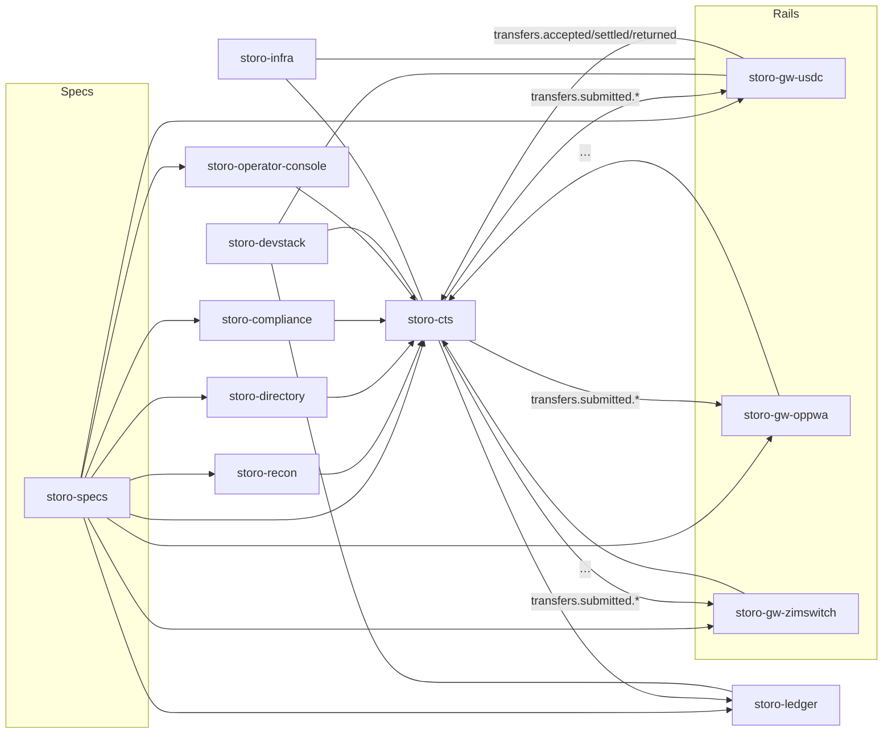

# Multi‑Repo Architecture (Stalela)

> How Stalela’s nucleus is organized across independent repositories so multiple teams can ship fast without stepping on each other.

This document defines **which repos exist**, **who owns them**, **how they interoperate (contracts-first)**, and **how you develop locally** without a monorepo. It also sets **versioning rules**, **release flows**, and **deprecation discipline**.

---

## Goals & Non‑Goals

**Goals**
- Independent deployability and ownership per service.
- Contract‑first interoperability (events & APIs) with machine‑verifiable schemas.
- Clear local dev story: run *one* service locally while the rest run as containers.
- Locked‑down release & rollback process per service.

**Non‑Goals**
- A single build system for everything (keep repos simple).
- Tight coupling via shared DBs (no cross‑service DB calls).

---

## Repository Map (source of truth)

| Repo | Purpose | Tech | Owners | Notes |
|---|---|---|---|---|
| **storo-specs** | Event schemas (JSON Schema), APIs (OpenAPI), golden fixtures, codegen | JSON/YAML, Node scripts | Platform | Publishes `@storo/specs` (npm) and `github.com/storo/specs-go` (Go) |
| **storo-cts** | Canonical Transfer Service (API + orchestration) | Go, Postgres, SQS/SNS | Payments Core | Emits `transfers.submitted.<rail>` |
| **storo-gw-usdc** | USDC/Algorand rail gateway | Go, Postgres, SQS/SNS | Rails Team | Strict transform + event emission |
| **storo-gw-oppwa** | OPPWA gateway | Go | Rails Team | Webhooks verified & signed |
| **storo-gw-zimswitch** | Zimswitch/ISO8583 gateway | Go | Rails Team | ISO fixtures + golden tests |
| **storo-ledger** | Double‑entry, append‑only ledger | Go, Postgres | Finance Eng | Consumes `transfers.*` → postings |
| **storo-compliance** | Local watchlist index + screening | Go | Risk/Compliance | Ingests OFAC/UN/EU/SA lists |
| **storo-directory** | Institutions, BINs, fees, settlement windows | Go | Platform | Versioned datasets |
| **storo-recon** | Statement ingest + matching + returns | Go | Finance Ops | Emits `transfers.settled/returned` |
| **storo-operator-console** | Internal UI (timeline, exceptions, flags) | Next.js/TS | Ops | Auth via SSO/RBAC |
| **storo-devstack** | Local docker compose / Tilt to run the fleet | Compose/Tilt | DX | Lets each dev swap a single local service |
| **storo-infra** | Terraform + env config (dev/stage/prod) | Terraform | Infra | Controls image tags, secrets, IAM |
| **storo-observability** | Dashboards, alert rules | Grafana/Prom | SRE | Golden signals and SLOs |

> Ownership is explicit. Each repo has CODEOWNERS and a simple `Makefile`/`Taskfile` so onboarding is fast.

---

## Repo classification and naming conventions

**Convention**
- Libraries and shared packages MUST use the `-lib` suffix and contain no Lambdas.
- Services and gateways (no `-lib` suffix) may include Lambdas where serverless is beneficial (webhooks, async processors, scheduled jobs).
- Infra repos do not themselves contain Lambdas but define/deploy them.

| Repo | Type | Lambdas | Description |
|---|---|---|---|
| storo-specs | Contracts source (publishes libs) | N/A | Source of truth for event and API schemas; publishes `@storo/specs` (TS) and `storo-specs-go-lib` (Go). |
| storo-specs-go-lib | Library | No | Generated Go types/validators from `storo-specs`. |
| storo-platform-lib | Library | No | Shared domain types, business time/holiday calendars, RBAC helpers. |
| storo-outbox-lib | Library | No | Outbox helpers: transactional writes, idempotency keys, retry/backoff, metrics. |
| storo-otel-lib | Library | No | OpenTelemetry setup, logging, tracing, metrics helpers. |
| storo-cts | Service | Yes | Canonical Transfer Service API/orchestration; may run webhook or async processors as Lambdas. |
| storo-gw-usdc | Gateway Service | Yes | USDC/Algorand rail gateway; webhook handlers and async processors as Lambdas. |
| storo-gw-oppwa | Gateway Service | Yes | OPPWA gateway; signed webhooks and callbacks as Lambdas. |
| storo-gw-zimswitch | Gateway Service | Possible | ISO8583 processing; primarily containerized, Lambdas possible for specific async tasks. |
| storo-ledger | Service | No | Double-entry ledger; stateful DB workers; not expected to use Lambdas. |
| storo-compliance | Service | Possible | Screening; may use Lambdas for list ingestion/refresh, core service containerized. |
| storo-directory | Service | Possible | Reference datasets; may use Lambdas for scheduled imports; core reads are containerized. |
| storo-recon | Service | Possible | Statement ingest/matching; may use Lambdas for schedulers/extractors. |
| storo-operator-console | UI/Web | No | Internal Next.js app for ops; no Lambdas in repo (hosting may use edge/serverless runtime). |
| storo-devstack | Dev tooling | No | Local docker compose/Tilt; no Lambdas. |
| storo-infra | Infra | N/A | Terraform for environments, images, IAM, secrets; deploys container workloads. |
| storo-cdk-infra | Infra | N/A | CDK for serverless components (Lambda, API Gateway, SQS/SNS bindings) for serverless use-cases. |
| storo-observability | Observability | N/A | Dashboards and alert rules (Grafana/Prometheus). |

Notes
- Gateways and CTS are the primary candidates to include Lambdas (webhooks, async enrich/emit, scheduled maintenance).
- Libraries never ship compute. If a repo might own runtime code, it should not carry the `-lib` suffix.
- `storo-cdk-infra` is introduced to manage serverless stacks alongside `storo-infra` (Terraform) for containerized infrastructure.

## Contracts‑First (single source of truth)

### storo‑specs
- **Events**: JSON Schemas under `events/` with version fields (e.g., `"v": 1`).  
- **APIs**: OpenAPI under `api/` (CTS `/v1/transfers`, Ledger reads, etc.).  
- **Fixtures**: Golden JSON examples validated in CI.  
- **Codegen**: Publishes on tag:
  - Go types/validators → `github.com/storo/specs-go` (semantic versioned)
  - TS types/clients → `@storo/specs` (npm semver)

**Rule:** Service repos **pin** a specific tag and validate in CI that all in/out payloads conform.

---

## Event & API Versioning

- **Additive changes** (new optional field): minor bump in `storo-specs`, no event version change required.
- **Breaking changes**: introduce **new event version** (e.g., `transfers.settled v2`) and **dual‑publish** during migration; consumers add support then deprecate v1.
- **HTTP APIs**: path versioning (`/v1/...`). Breaking change ⇒ add `/v2` and run both until cutover.
- **Deprecation policy**: announce, dual‑run ≥ 2 releases, remove only after consumers are migrated.

---

## Local Development (no monorepo pain)

Use **storo-devstack** to run the fleet with released images + infrastructure (Postgres, LocalStack, Prometheus, Grafana). Then **swap one service** for a local build.

### Workflow
1. `git clone storo-devstack && docker compose up -d`  
2. `git clone storo-gw-usdc && make dev` (runs the gateway on your machine)
3. In `storo-devstack/docker-compose.override.yml`, map the gateway’s **host port** to the fleet and disable the container for that service.
4. Iterate with hot reload (air/reflex). The rest of the system keeps using released images.

**Why this works:** Contracts are pinned. Your local service talks to Live Postgres & LocalStack queues created by devstack, so flows are realistic.

---

## CI/CD per Service

**Pipeline (GitHub Actions)**  
1. `lint` (golangci‑lint / eslint)  
2. `test` (unit + fixtures)  
3. `contract-validate` (AJV vs `@storo/specs`; or `specs-go` validate)  
4. `build` (Docker)  
5. `publish` (`svc:X.Y.Z` + `svc:X`)  
6. (optional) **Chart** publish (Helm)  

**storo-infra** references image tags per env. Deploy is a tag flip (dev → stage → prod).

---

## Environments & Secrets

- Envs: **dev**, **staging**, **prod** (separate AWS accounts).  
- Secrets in **AWS Secrets Manager**; IAM least privilege per service.  
- Business timezone is **Africa/Johannesburg**; holiday calendars bundled in `platform-base`.

---

## Observability & SLOs

- OpenTelemetry on all services. Prometheus metrics scraped by devstack & prod.  
- Golden signals per ADR/observability doc: API latency, outbox backlog, consumer lag, ledger posting latency, recon match rate.  
- Alert rules live in `storo-observability` repo and are applied by Infra.

---

## Data & Safety Rails

- **No cross‑service DB access**. Only APIs/events.  
- **Outbox required** (ADR‑0001). State change + event in the same txn.  
- **Ledger** is **double‑entry, append‑only** (ADR‑0002).  
- **Compliance** must pass for submission; stale lists ⇒ deny by policy.  
- **Recon** must close exceptions before end‑of‑day books close.

---

## Branching & Releases

- Trunk‑based with short‑lived PRs.  
- CI gates: unit, contract, migrations dry‑run.  
- Release by tagging (`vX.Y.Z`) → image publish.  
- Rollback: revert image tag in `storo-infra` (no code revert required).

---

## Repository Templates (consistency)

Each Go service repo includes:
- `/cmd/service/main.go` with `/live`, `/ready`, `/metrics`, `/version`  
- `/internal/` (handlers, consumers, posting rules)  
- `/migrations/` (embedded)  
- **Outbox** & optional **Inbox (dedupe)** tables  
- `Makefile` / `Taskfile.yml`  
- `.github/workflows/ci.yml` (pipeline above)  
- `docs/README.md` (local dev, env vars, example payloads)  

---

## Mermaid Map (repos & flows)

---

## Deprecation & Migration Playbook

1. Propose change → write/update ADR in **storo-specs** PR.  
2. Add schema change (new event version or additive field).  
3. Publish new `specs-go` / `@storo/specs` tags.  
4. Update **providers** first (emit both versions if breaking).  
5. Update **consumers** to accept new version; ship.  
6. Remove old version after ≥2 releases and a green prod window.

---

## Security & Compliance Notes

- PAN/PCI scope stays **inside gateways**; no PAN in CTS/Ledger events.  
- PII minimized; raw rail payloads stored **encrypted** in blob store with TTL per policy.  
- Audit logs on the Operator Console; 4‑eyes for returns & freezes.

---

## Actionable Next Steps (docs‑only)

- Create repo stubs (empty READMEs) for all repos listed.  
- Add this doc under `docs/50-repo-structure/multi-repo-architecture.md`.  
- Draft `release-strategy.md` (semver details, dual‑publish patterns, deprecation checklist).  
- Draft `local-dev.md` (devstack usage + override examples).  
- Draft `ci-cd.md` (standard CI template + required checks).

Once these docs exist, teams can start coding **without waiting on a monorepo setup** and with contracts locked by `storo-specs`.
