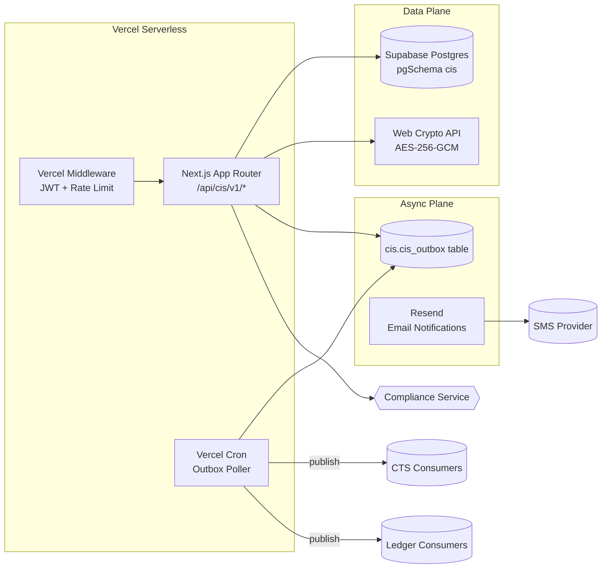

## CIS Container View

---

## Notes

- **Outbox poller** — A Vercel Cron job polls `cis.cis_outbox` and dispatches events to downstream consumers (CTS, Ledger) via HTTP callbacks or shared Postgres notify channels.
- The API service calls the Compliance Service synchronously for identity screening (`/api/cis/v1/identities/screen`).
- Events are written to the outbox table within the same database transaction as domain state changes, then published asynchronously.
- Verification workflows are orchestrated by a domain-layer state machine — no external workflow engine required.
- PII encryption uses Web Crypto API (AES-256-GCM) with environment-configured keys rather than an external KMS.
