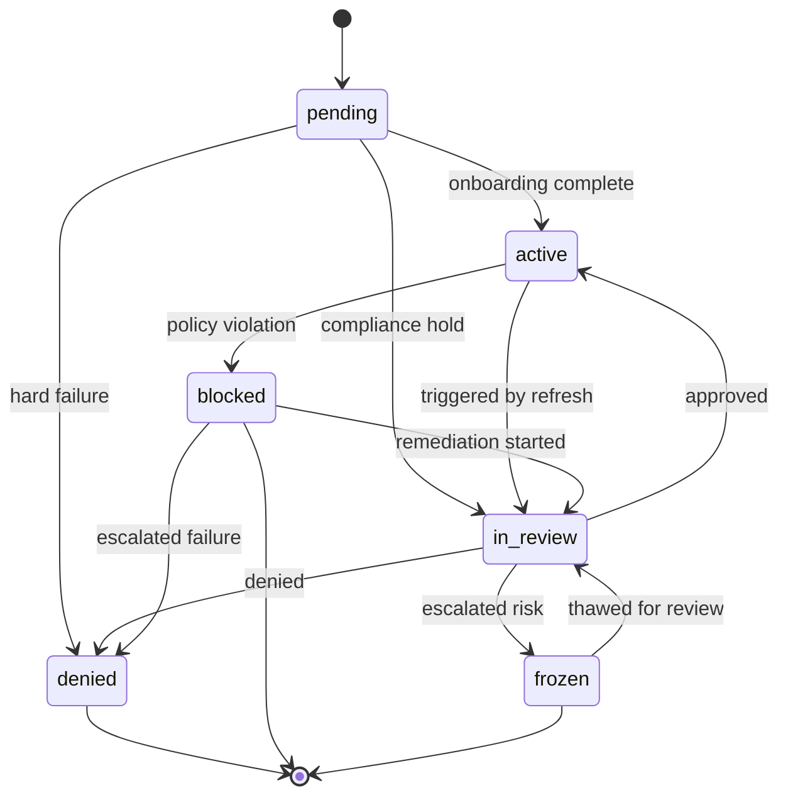
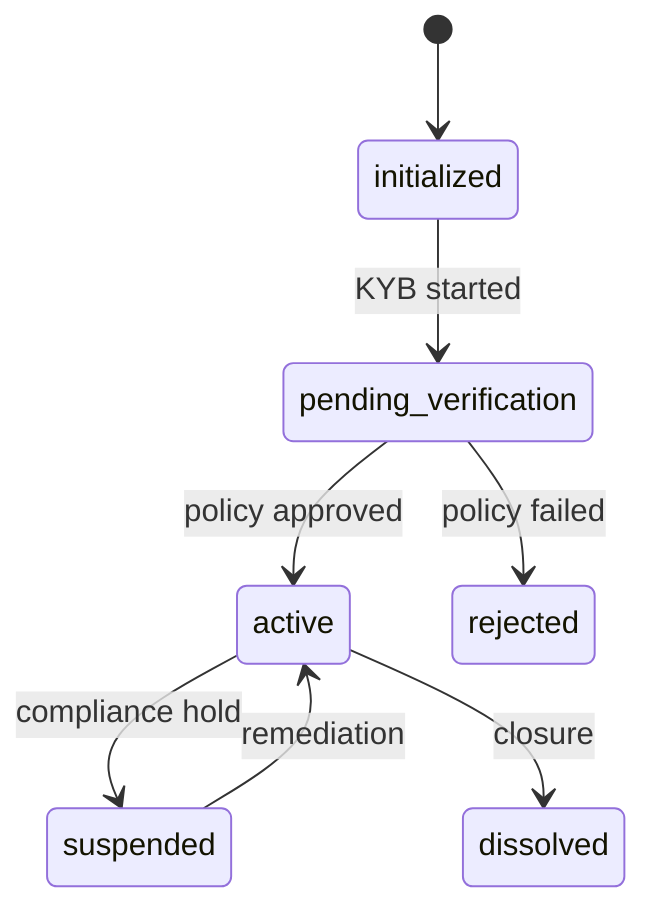
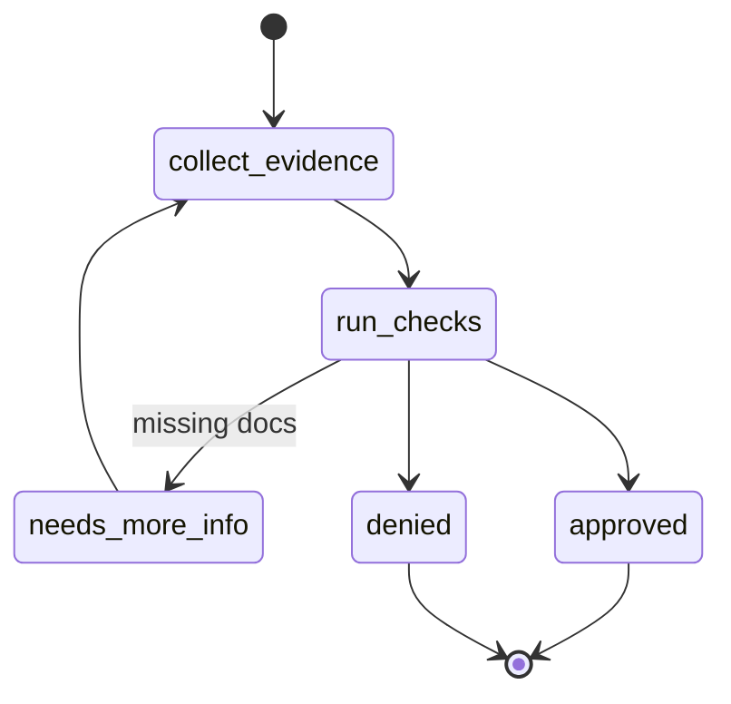

State machines coordinate identity and organization lifecycles alongside verification workflows.

## Identity State Machine

- Domain transaction `handleUpdateIdentityStatus` enforces allowed transitions.
- Compliance refreshes may transition identities automatically when the outcome changes (`ALLOW`, `REVIEW`, `DENY`).
- Every change records a `status_history` entry with `comment` and `actorId` metadata.

---

## Organization State Machine

---

## Verification Workflow

- `collect_evidence` uses secure upload URLs; evidence encrypted immediately.
- `run_checks` fans out to provider integrations with retries and fallback providers.
- Transitions emit events via the transactional outbox with reason codes for observability.
