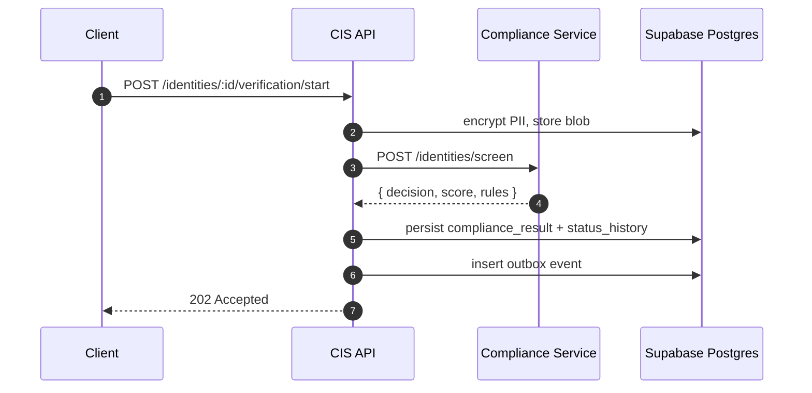

CIS orchestrates Know-Your-Customer (KYC) and Know-Your-Business (KYB)
verification through a shared five-step pipeline.

---

## Shared Steps

1. **Encrypt & screen** — CIS encrypts PII with Web Crypto
   (AES-256-GCM) and triggers the Compliance Service
   (`POST /api/cis/v1/identities/:id/compliance/screen`) during
   onboarding.
2. **Evaluate decision** — The Compliance Service responds with
   `ALLOW`, `REVIEW`, or `DENY` along with score and matched-rule
   metadata.
3. **Persist & record** — CIS persists the decision in
   `compliance_results`, updates the identity status, and records a
   `status_history` entry.
4. **Periodic refresh** — Scheduled refreshes call the screen endpoint
   again (via `PUT /api/cis/v1/identities/:id/compliance/refresh`)
   and may auto-transition the identity back to `IN_REVIEW` or
   `DENIED`.
5. **Emit events** — Events (`identity.status.changed`,
   `identity.compliance.screened`) are published via the transactional
   outbox for downstream systems.

## Manual Review

Manual review flows rely on policy-driven verification workflows.
Analysts can push identities into or out of `IN_REVIEW` using the
status endpoint (`PATCH /api/cis/v1/identities/:id/status`).

## KYC vs KYB Differences

| Aspect | KYC (Individual) | KYB (Organisation) |
|--------|-------------------|--------------------|
| Policy | `KYC_ZA_BASIC`, `KYC_ZW_STANDARD` | `KYB_ZA_STANDARD`, `KYB_ZW_STANDARD` |
| Documents | National ID, proof of address | Registration cert, share register |
| Beneficial ownership | N/A | Required for all directors > 25 % |
| Refresh cadence | Annual | Annual + event-driven |

## Sequence

