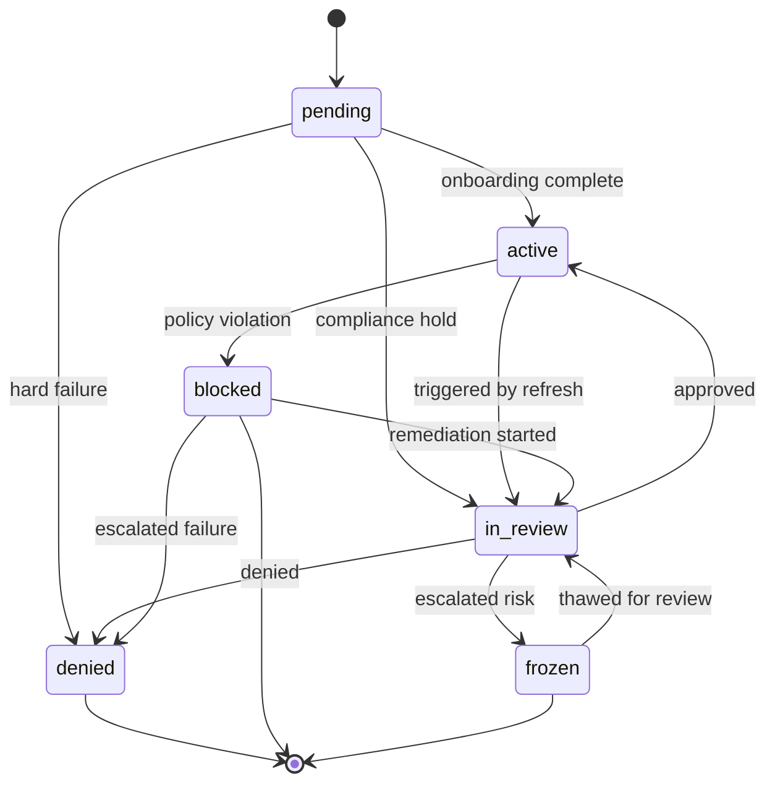

## Identity Lifecycle

An **Identity** is the canonical record for any person interacting with the Stalela platform — end-users, staff, developers, or merchant administrators.

## State lifecycle

---

## Attributes

| Namespace | Description | Storage |
| --- | --- | --- |
| `profile` | Public profile attributes (display name, avatar, preferred language) | `identities` table |
| `pii` | Encrypted JSON containing legal name, DOB, SSN, etc. | `identities.pii` (AES-256-GCM via Web Crypto API) |
| `metadata` | Tenant-defined key/value pairs (e.g., CRM IDs, segmentation flags) | `identities.metadata` JSONB (validated on write) |
| `status_history` | Immutable audit trail of lifecycle transitions | `status_history` table |
| `compliance_results` | Historical outcomes from the compliance service | `compliance_results` table |
| `addresses` | Postal addresses linked to the identity | `addresses` table (soft delete) |
| `phones` | Phone numbers linked to the identity | `phones` table (soft delete) |

---

## Key Principles

- **PII encryption** — Sensitive fields are encrypted before persisting in Postgres using Web Crypto API (AES-256-GCM). Repositories never return decrypted data; transaction handlers explicitly decrypt when required.
- **Lifecycle auditability** — Each status change is persisted to `status_history` with comment + actor metadata and emits an outbox event.
- **Compliance-driven workflows** — Initial onboarding and periodic refreshes call the compliance service. Outcomes can auto-transition identities (`ACTIVE → IN_REVIEW` / `DENIED`).
- **Adjunct data** — Addresses and phones are managed through dedicated repositories/transactions and support soft deletion to preserve historical context.
- **Metadata governance** — Metadata writes are validated (≤ 100 keys, ≤ 1 000 characters per value) to keep payloads predictable and cheap to index.

!!! tip "Identity handles"
    Use the immutable `identityId` as the stable reference across CTS, Ledger, and third-party integrations. Attributes like email or phone can change and must not be used as primary keys.
