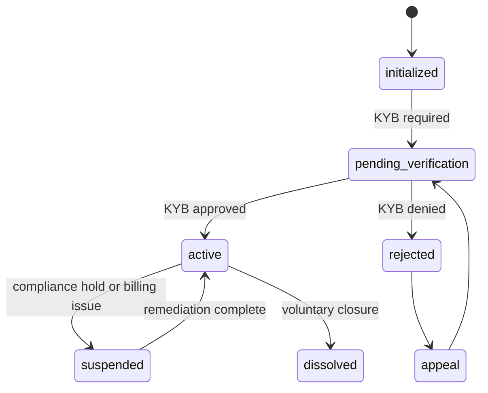

Organizations model merchants, partners, or internal teams. CIS tracks lifecycle, membership, and hierarchical relationships with full audit trails.

## Org Lifecycle

---

## Structure

- **Root org** — Top-level entity per tenant with governance scopes.
- **Child orgs** — Optional hierarchical children for multi-brand or region-specific operations.
- **Memberships** — Each identity can belong to multiple orgs with roles.
- **Roles** — Org-specific roles (e.g., `OWNER`, `FINANCE_ADMIN`, `SUPPORT_AGENT`).

---

## Membership Model

| Field | Description |
| --- | --- |
| `orgId` | Canonical identifier for the organization. |
| `identityId` | Member identity identifier. |
| `role` | Assigned role slug. Multiple roles allowed per membership. |
| `scopes` | Derived API scopes attached to issued tokens. |
| `status` | `PENDING`, `ACTIVE`, `REVOKED`. |
| `invitedBy` | Identity who initiated invitation. |
| `expiresAt` | Optional TTL for temporary access. |

---

## Governance Controls

- **Quorum policies** — High-risk operations require multiple approvals (policy engine).
- **Org secrets** — API keys stored encrypted; rotation tracked in audit log.
- **Data boundaries** — Org data segregated by tenant and region with RLS enforcement.

!!! warning "Membership hygiene"
    Always revoke memberships for departed staff and rotate API keys. CIS exposes runbooks and automation hooks to help organizations stay compliant.
