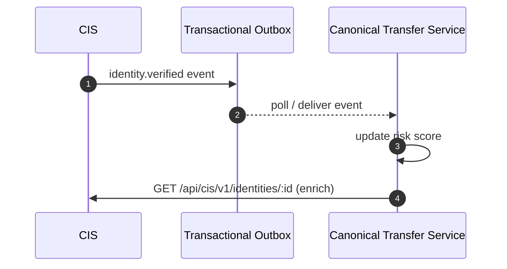

Connect CIS identities and organisations to the Canonical Transfer
Service (CTS).

---

1. **Ensure identity / org exists** — Use CIS APIs to create and
   verify actors.
2. **Propagate identifiers** — When creating merchants in CTS,
   include `identityId` and `orgId` from CIS.
3. **Subscribe to events** — Consume `identities.verified` and
   `orgs.verified` to update CTS risk scores.
4. **Enforce scopes** — CTS tokens should only include CIS-derived
   scopes relevant to payments.
5. **Handle erasure** — When CIS publishes `identities.deleted`,
   remove references in CTS promptly.

!!! note "Shared glossary"
    Use the [glossary](../overview/glossary.md) to align naming
    conventions between CIS and CTS teams.

## Integration Sequence

