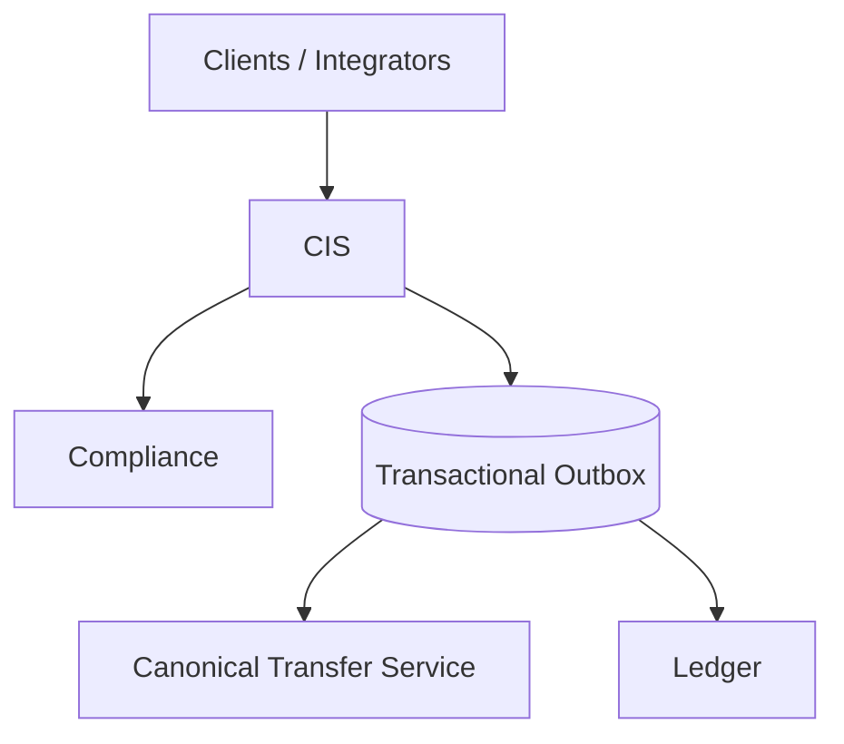

## Canonical Identity Service (CIS)

Stalela's Canonical Identity Service is the single place where every human or machine actor in the platform is anchored. CIS resolves identity, organization membership, and authorization policies so downstream systems (payments, compliance, ledger) can assume a single, consistent identity vocabulary.

**CIS owns:**

- Identity lifecycle, multi-factor auth, org membership, consent proofs, canonical schemas

**CIS delegates:**

- Core payments risk (CTS), ledger postings, compliance adjudication, notification delivery

**CIS guarantees:**

- Strong PII controls, replay-safe events, policy-driven verification orchestration

!!! note "Purpose"
    CIS ensures a single, canonical view of who is acting (identity), on behalf of which collective (organization), with what level of trust (verification + policy), and under what authority (roles, scopes, consent).

---

## Platform Context

- **Clients / Integrators** authenticate against CIS using passwords, passkeys, or device-bound factors.
- CIS stores minimal PII, applies policy logic, and publishes normalized events via the transactional outbox.
- Downstream services (CTS, Ledger) consume events and rely on CIS identifiers (`identityId`, `orgId`).

---

## What CIS Owns

1. **Identity lifecycle** — registration, verification, credential management, recovery.
2. **Organization graph** — hierarchical organizations, memberships, invitations, RBAC policies.
3. **Authentication surfaces** — session tokens, factor challenges, device posture assertions.
4. **Consent and policy engine** — JSON-Logic rules describing what verification or consent is required per tenant.
5. **Event outbox** — exactly-once event publishing with durability guarantees via the Postgres transactional outbox.

## What CIS Delegates

- **Compliance adjudication** to the Compliance Service, which returns pass/fail decisions and justifications.
- **Transactional risk scoring** to CTS (Canonical Transfer Service) that uses CIS identity trust levels.
- **Ledgering** to the Ledger Service, which references CIS identifiers when recording financial events.

!!! warning "PII Discipline"
    Only store the minimum personally identifiable information required for policy evaluation. Keep sensitive attributes in the encrypted PII store and avoid duplication in logs or analytics.

!!! tip "Exactly-Once Publishing"
    CIS uses a transactional outbox table within Supabase Postgres. Each message carries an idempotency key (`eventId`) and partition key to guarantee ordered delivery per identity or organization.

---

## Environment Alignment

- **Tenancy** — CIS is multi-tenant by design; every API requires `X-Tenant-Id`.
- **Regions** — Data residency rules apply per tenant. PII storage is region-aware.
- **Versioning** — APIs and schemas follow semantic versioning. Major version updates require new routes.

---

## Next Steps

- Deep dive into [architecture](overview/architecture.md) for deployment topology.
- Compare responsibilities with the [Canonical Transfer Service](overview/cis-vs-cts.md).
- Explore the [glossary](overview/glossary.md) for vocabulary shared across teams.
