# CIS Platform Integration Map

**Purpose** — Single-page reference showing every point where the
Customer Identity Service (CIS) integrates with other Stalela
platform components.

---

## Platform Integration Diagram

```mermaid
flowchart TD
  CIS["**CIS**<br/>Customer Identity Service"]

  subgraph Payments["Payments Nucleus"]
    CTS["CTS<br/>Identity resolution<br/>KYC tier gating"]
    CS["Compliance Screening<br/>Entity verification feeds"]
    DIR["Directory & Routing<br/>Proxy ownership validation"]
    RECON["Reconciliation<br/>Tier reassessment triggers"]
    OC["Operator Console<br/>Entity panel, freeze/unfreeze"]
    AI["AI Agents<br/>KYC features for risk"]
    REG["Regulatory Reporting<br/>Identity data for STR/CTR"]
    LED["Ledger<br/>Account ↔ entity lifecycle"]
  end

  subgraph Fiscal["Fiscal Platform"]
    FP["Fiscal Core<br/>Merchant KYB, outlet auth"]
    CASH["Cashier Identity<br/>POS authentication"]
    DOT["Delegated Offline Token<br/>Credential issuance"]
    CLIENT["Client Identity<br/>NIF resolution"]
  end

  CIS -->|"cisEntityId + kycTier"| CTS
  CIS -->|"verification data"| CS
  CIS -->|"proxy ownership"| DIR
  CIS <-->|"tier review"| RECON
  CIS <-->|"freeze/unfreeze"| OC
  CIS -->|"KYC features"| AI
  CIS -->|"identity attributes"| REG
  CIS -->|"entity lifecycle"| LED
  CIS -->|"org.verified"| FP
  CIS -->|"cashier auth"| CASH
  CIS -->|"credential issue"| DOT
  CIS -->|"NIF lookup"| CLIENT

  style CIS fill:#4AB7E5,color:#fff,stroke:#333
```

---

## API Dependency Matrix

Services that call CIS endpoints at runtime:

| Consumer | CIS Endpoint | Method | Purpose | Latency Target |
|----------|-------------|--------|---------|---------------|
| CTS | `/cis/v1/identities/resolve` | GET | Resolve payer/payee by reference | ≤ 200 ms (cached) |
| CTS | JWT `kycTier` claim | — | Tier-gated transfer submission | — (in-token) |
| Compliance | `/cis/v1/identities/:id/verification` | GET | Screening input enrichment | ≤ 200 ms |
| Directory | `/cis/v1/identities/:id/proxies` | GET | PayShap proxy ownership check | ≤ 200 ms |
| Operator Console | `/cis/v1/identities/:id` | GET | Entity detail panel | ≤ 500 ms |
| Operator Console | `/cis/v1/identities/:id/status` | PUT | Freeze / unfreeze entity | ≤ 1 s |
| Fiscal Platform | `/cis/v1/orgs/:id` | GET | Merchant verification status | ≤ 200 ms |
| Fiscal Platform | `/cis/v1/auth/verify` | POST | Cashier PIN authentication | ≤ 500 ms |
| Regulatory Reporting | `/cis/v1/identities/:id` | GET | Identity attributes for STR/CTR | ≤ 500 ms |
| AI Agents | `/cis/v1/identities/:id/risk-signals` | GET | KYC features for risk model | ≤ 200 ms |

---

## Event Subscription Matrix

CIS-emitted events and their subscribers:

| CIS Event | CTS | Compliance | Fiscal | Operator Console | Ledger |
|-----------|-----|-----------|--------|-----------------|--------|
| `identity.verified` | ✓ | | ✓ (CASHIER) | | |
| `identity.tier.changed` | ✓ | | | | |
| `identity.suspended` | ✓ | ✓ | ✓ (CASHIER) | ✓ | |
| `identity.blocked` | ✓ | ✓ | | ✓ | ✓ |
| `identity.unblocked` | ✓ | | | ✓ | |
| `org.verified` | | | ✓ | | |
| `org.suspended` | | | ✓ | ✓ | |
| `org.outlet.created` | | | ✓ | | |
| `consent.granted` | | | ✓ | | |
| `consent.revoked` | | | ✓ | | |

Events that other services emit **to** CIS:

| Source | Event | Purpose |
|--------|-------|---------|
| Reconciliation | `identity.tier.review_requested` | High return rate triggers tier reassessment |
| Compliance | `compliance.flag.raised` | Suspicious entity flagged for CIS review |
| Operator Console | `entity.freeze.requested` | Manual freeze propagated to CIS |

---

## Data Ownership Boundaries

| Data Element | Owner | Consumers (Read-Only) |
|-------------|-------|----------------------|
| Identity record (name, national ID, address, DoB) | **CIS** | Regulatory Reporting, Operator Console |
| `cisEntityId` | **CIS** | All services (reference only) |
| `kycTier` | **CIS** | CTS, Compliance, AI Agents |
| Verification status & documents | **CIS** | Operator Console |
| Consent records | **CIS** | Fiscal Platform |
| Organisation / merchant record | **CIS** | Fiscal Platform, CTS |
| Transfer record | **CTS** | Ledger, Recon, Reporting |
| Fiscal invoice record | **Fiscal** | Reporting |
| Compliance screening result | **Compliance** | CTS, Operator Console |
| Ledger postings & balances | **Ledger** | Recon, Reporting |

> **Principle**: CIS is the single source of truth for identity
> data. Other services store only `cisEntityId` references, never
> raw PII. When identity attributes are needed (e.g., for regulatory
> filings), services query CIS at runtime.

---

## Integration Patterns

### Synchronous (Request/Response)
- Identity resolution during transfer submission
- Cashier PIN verification at POS
- Operator Console entity lookups

### Asynchronous (Events)
- Tier changes propagated to CTS cache
- Organisation verification triggers fiscal provisioning
- Freeze/suspend propagated across all pillars

### Cached
- `kycTier` embedded in JWT claims (short-lived)
- CTS caches identity resolution with event-driven invalidation
- Directory caches proxy ownership with TTL

---

## Related Documentation

- [CIS → Payments Integration](../../30-integration/identity-to-payments.md)
- [CIS → Fiscal Integration](../../30-integration/identity-to-fiscal.md)
- [Identity (CIS) Overview](../index.md)
- [CIS API — Identities](../api/identities.md)
- [CIS Architecture](../architecture/container.md)
