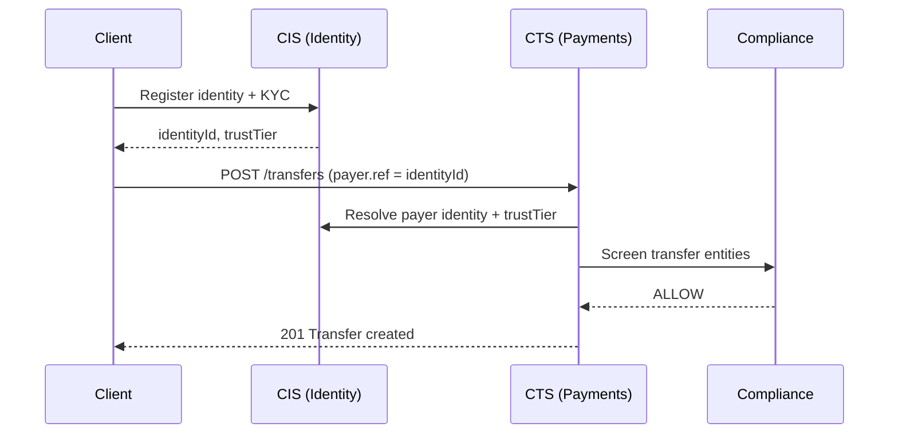

## CIS vs CTS — Responsibility Boundaries

The Canonical Identity Service (CIS) and the Canonical Transfer Service (CTS) are complementary pillars of the Stalela platform. This page clarifies what each owns and how they interact.

| Dimension | CIS (Identity) | CTS (Payments) |
| --- | --- | --- |
| **Primary concern** | Who is acting | What is being transferred |
| **Core entity** | Identity, Organization | Transfer |
| **Lifecycle** | Identity registration → verification → active → suspension | Transfer initiated → submitted → accepted → settled |
| **KYC/KYB** | Owns verification workflows and trust tier assignment | Consumes trust tier to gate transfer limits |
| **Authentication** | Issues and validates JWT tokens with identity claims | Accepts CIS-issued tokens via `middleware.ts` |
| **Compliance** | Screens identity PII at onboarding and refresh | Screens transfer entities at submission time |
| **Events emitted** | `identities.*`, `orgs.*`, `auth.*` | `transfers.*` |
| **Data store** | `pgSchema('cis')` — identities, factors, consents, orgs | `pgSchema('payments')` — transfers, idempotency keys |
| **Outbox** | `cis.cis_outbox` | `payments.outbox` |
| **PII handling** | Encrypts and stores PII (AES-256-GCM) | References `cisEntityId` — never stores raw PII |

---

## How They Interact

---

## Key Principle

> CIS is the **authority** for identity. CTS **consumes** identity data but never mutates it. If CTS needs to know an entity's KYC tier, it reads from CIS (or from a cached JWT claim) — it never assigns tiers itself.

See also:

- [CIS API Reference](../api/identities.md)
- [CTS System Design](../../10-payments-nucleus/components/canonical-transfer-service.md)
- [Identity-to-Payments Integration](../../30-integration/merchant-identity.md)
